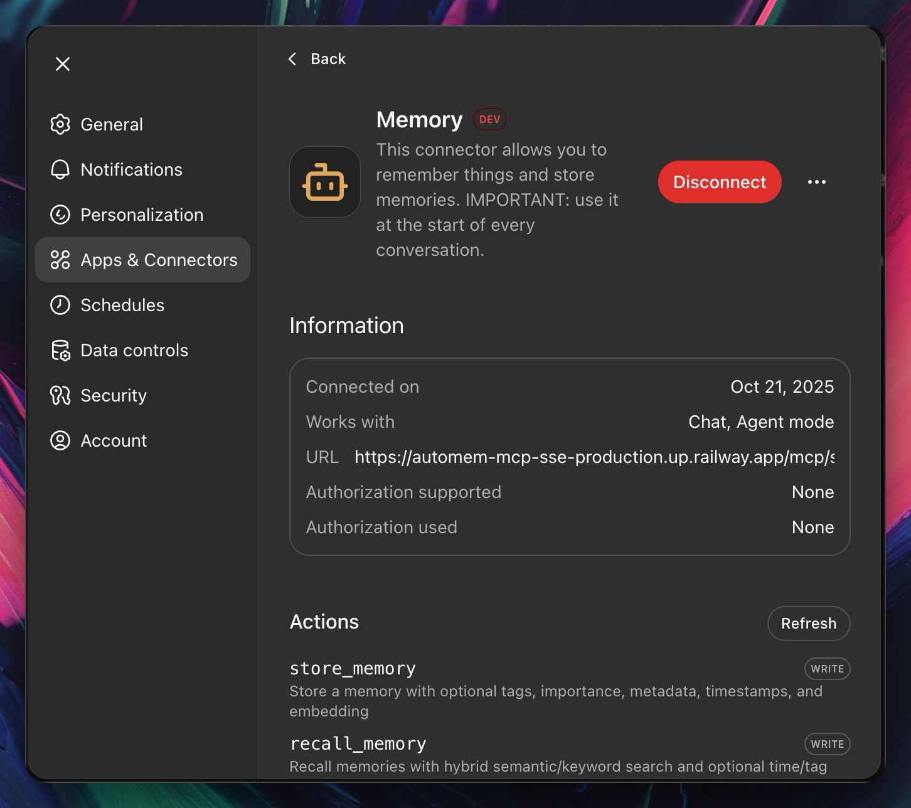
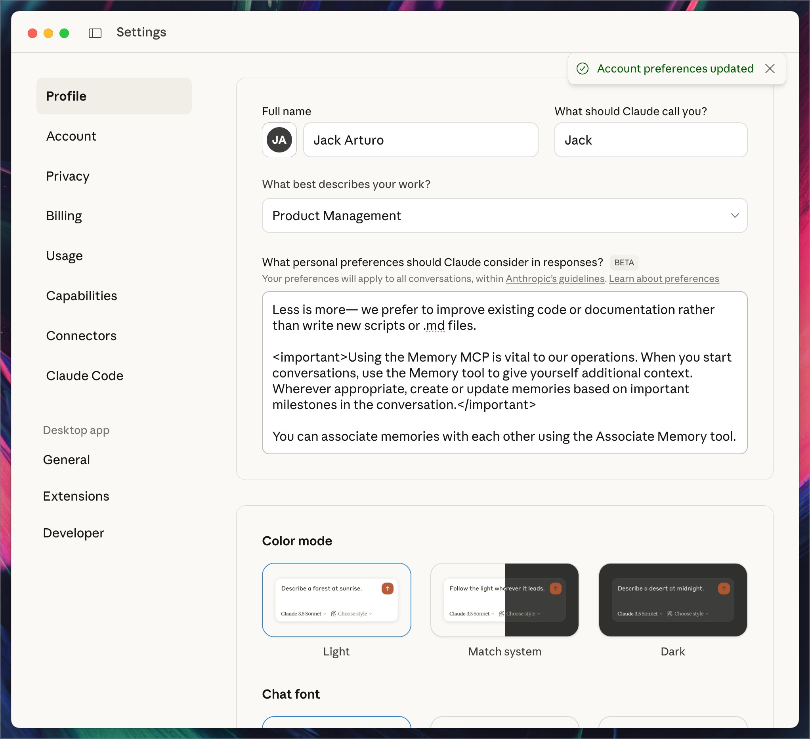

# Installation Guide

Complete setup instructions for AutoMem MCP across all platforms.

## Prerequisites

You need a running **[AutoMem service](https://github.com/verygoodplugins/automem)** instance. Quick options:

- **Local development** (fastest): Run `make dev` - see [AutoMem Installation Guide](https://github.com/verygoodplugins/automem/blob/main/INSTALLATION.md#local-development)
- **Railway cloud** (recommended): One-click deploy - see [AutoMem Railway Guide](https://github.com/verygoodplugins/automem/blob/main/INSTALLATION.md#railway-deployment)
- **Self-hosted**: Docker/production - see [AutoMem Deployment Options](https://github.com/verygoodplugins/automem/blob/main/INSTALLATION.md)

## Quick Start

Follow these two steps:

1. **[Set up AutoMem service](#automem-service-setup)** - Deploy the backend (see options above)
2. **[Install MCP client](#mcp-client-setup)** - Connect your AI platforms

---

## AutoMem Service Setup

Before installing the MCP client, you need a running AutoMem service (the backend). Choose your deployment option:

### Option 1: Local Development (Recommended for Getting Started)

**Best for:** Development, testing, single-machine use, privacy-focused setups.

```bash
git clone https://github.com/verygoodplugins/automem.git
cd automem
make dev
```

Service runs at `http://localhost:8001` with no authentication required.

👉 **[Full Local Setup Guide](https://github.com/verygoodplugins/automem/blob/main/INSTALLATION.md#local-development)**

### Option 2: Railway Cloud (Recommended for Production)

**Best for:** Multi-device access, team collaboration, always-on availability.

[](https://railway.com/deploy/automem-ai-memory-service?referralCode=VuFE6g&utm_medium=integration&utm_source=template&utm_campaign=generic)

One-click deploy with $5 free credits. Typical cost: ~$0.50-1/month.

👉 **[Full Railway Deployment Guide](https://github.com/verygoodplugins/automem/blob/main/INSTALLATION.md#railway-deployment)**

### Option 3: Self-Hosted Production

**Best for:** Enterprise deployments, custom infrastructure, air-gapped environments.

Deploy via Docker Compose, Kubernetes, or any container platform.

👉 **[Deployment Options](https://github.com/verygoodplugins/automem/blob/main/INSTALLATION.md#deployment-options)**

---

## MCP Client Setup

Now that your AutoMem service is running, install and configure the MCP client to connect your AI platforms.

**Supported Platforms:**

- [Claude Desktop](#claude-desktop) - Desktop AI assistant
- [Cursor IDE](#cursor-ide) - AI-powered code editor
- [Claude Code](#claude-code) - Terminal coding assistant with automation hooks
- [OpenAI Codex](#openai-codex) - CLI, IDE, and cloud agent

---

## Remote MCP via HTTP (Sidecar)

Use this option to connect AutoMem to cloud products that support remote MCP via **Streamable HTTP** (recommended) or **SSE** transport, including ChatGPT (Developer Mode), Claude.ai on the web, Claude Mobile (iOS/Android), and ElevenLabs Agents.

### When to use the remote MCP sidecar

- You want AutoMem in ChatGPT's Developer Mode connectors
- You use Claude.ai on the web or the Claude mobile app
- You integrate with ElevenLabs real‑time Agents
- You need an HTTPS endpoint instead of a local process

### Deploy the remote MCP sidecar

Deploy the AutoMem remote MCP sidecar on Railway (one‑click) or any Docker platform. It supports both **Streamable HTTP** (recommended) and **SSE** transports, proxies MCP over HTTPS, and connects to your AutoMem service.

- Guide: [Remote MCP Sidecar](https://github.com/verygoodplugins/automem/blob/main/docs/MCP_SSE.md) (AutoMem service repo)

Required env vars for the sidecar:

- `AUTOMEM_ENDPOINT` — URL to your AutoMem service (prefer internal URL on Railway, e.g. `http://memory-service.railway.internal:8001`)
- `AUTOMEM_API_TOKEN` — Token for your AutoMem service (if enabled)

Sidecar endpoints:

- `POST /mcp` — Streamable HTTP (recommended) — full-duplex MCP-over-HTTP
- `GET /mcp/sse` — SSE stream (legacy) — server → client events
- `POST /mcp/messages?sessionId=<id>` — SSE client → server JSON-RPC (legacy)
- `GET /health` — Health probe

### Configure platforms

#### ChatGPT (Developer Mode)

1. Enable Developer Mode → Settings → Connectors → Advanced
2. Add a custom MCP server with this URL:
   - **Streamable HTTP** (recommended): `https://<your-mcp-domain>/mcp?api_token=<AUTOMEM_API_TOKEN>`
   - **SSE** (legacy): `https://<your-mcp-domain>/mcp/sse?api_token=<AUTOMEM_API_TOKEN>`
3. Save and test: ask ChatGPT to "Check the health of the AutoMem service".


_Configure ChatGPT Developer Mode with your MCP endpoint (HTTP or SSE)_


_ChatGPT showing the custom connector enabled_


_ChatGPT using AutoMem tools via remote MCP_

Notes:

- ChatGPT requires URL‑based auth for custom connectors → include `?api_token=...` in the URL

#### Claude.ai (Web)

- **Streamable HTTP** (recommended): `https://<your-mcp-domain>/mcp?api_token=<AUTOMEM_API_TOKEN>`
- **SSE** (legacy): `https://<your-mcp-domain>/mcp/sse?api_token=<AUTOMEM_API_TOKEN>`
- Then chat with Claude on the web; ask it to recall or store memories.


_Claude.ai connected to AutoMem via remote MCP_

#### Claude Mobile (iOS/Android)

- **Streamable HTTP** (recommended): `https://<your-mcp-domain>/mcp?api_token=<AUTOMEM_API_TOKEN>`
- **SSE** (legacy): `https://<your-mcp-domain>/mcp/sse?api_token=<AUTOMEM_API_TOKEN>`
- Open the Claude mobile app and add the remote MCP connector.


_Claude mobile app connected to AutoMem via remote MCP_

#### ElevenLabs Agents

Use either header‑based auth (recommended) or URL token:

- **Streamable HTTP** (recommended):
  - Server URL: `https://<your-mcp-domain>/mcp`
  - Header: `Authorization: Bearer <AUTOMEM_API_TOKEN>`
  - Or use URL token: `https://<your-mcp-domain>/mcp?api_token=<AUTOMEM_API_TOKEN>`
- **SSE** (legacy):
  - Server URL: `https://<your-mcp-domain>/mcp/sse`
  - Header: `Authorization: Bearer <AUTOMEM_API_TOKEN>`
  - Or use URL token: `https://<your-mcp-domain>/mcp/sse?api_token=<AUTOMEM_API_TOKEN>`

### Troubleshooting (Remote MCP)

Common fixes from the sidecar guide:

- Ensure your memory service listens on `PORT=8001`
- On Railway, prefer internal DNS: `http://memory-service.railway.internal:8001`
- Check sidecar logs for errors (e.g., `railway logs --service automem-mcp-sse`)
- As a fallback, set `AUTOMEM_ENDPOINT` to the public URL of your memory service

For deeper details, see the AutoMem service docs linked above.

### Guided Setup Wizard

After deploying the AutoMem service, use the setup wizard to configure your MCP client:

```bash
npx @verygoodplugins/mcp-automem setup
```

**The wizard will:**

- Prompt for your AutoMem endpoint (`http://localhost:8001` or Railway URL)
- Prompt for API key (if using Railway)
- Create/update `.env` file in current directory
- Print config snippets for your platform
- Validate connection to AutoMem service

**Example:**

```bash
$ npx @verygoodplugins/mcp-automem setup
? AutoMem Endpoint: http://localhost:8001
? API Key (optional): [leave blank for local]
✓ Connection successful!
✓ Config saved to .env
✓ Claude Desktop config snippet generated
```

---

## Claude Desktop

### 1. Install MCP Server

Add AutoMem to your Claude Desktop configuration:

**macOS**: `~/Library/Application Support/Claude/claude_desktop_config.json`  
**Windows**: `%APPDATA%\Claude\claude_desktop_config.json`  
**Linux**: `~/.config/Claude/claude_desktop_config.json`

```json
{
  "mcpServers": {
    "memory": {
      "command": "npx",
      "args": ["-y", "@verygoodplugins/mcp-automem"],
      "env": {
        "AUTOMEM_ENDPOINT": "https://your-automem-instance.railway.app",
        "AUTOMEM_API_KEY": "your-api-key-if-required"
      }
    }
  }
}
```

**For local development:**

```json
{
  "mcpServers": {
    "memory": {
      "command": "npx",
      "args": ["-y", "@verygoodplugins/mcp-automem"],
      "env": {
        "AUTOMEM_ENDPOINT": "http://127.0.0.1:8001"
      }
    }
  }
}
```

### 2. Restart Claude Desktop

Restart Claude Desktop to load the MCP server.

### 3. Verify Installation

In Claude Desktop, ask:

```
Check the health of the AutoMem service
```

You should see connection status for FalkorDB and Qdrant.

### 4. Configure Custom Instructions (Optional but Recommended)

Enable automatic memory usage by adding custom instructions to Claude Desktop.

**How to add Custom Instructions:**

1. Open Claude Desktop
2. Click the **Settings** icon (gear) in the bottom-left corner
3. Select **Custom Instructions** from the menu
4. Add the following to your instructions:

```markdown
<important>
The Memory MCP is vital to our operations and should be used strategically.

AT CONVERSATION START:

- Always recall memories for context about recent work and ongoing topics
- Check for relevant decisions, preferences, or patterns
- Skip memory for trivial questions or simple factual queries

BEFORE CREATING CONTENT:

- Check memories for style preferences and past corrections
- Review relevant patterns from previous interactions
- Look for any established conventions or preferences

CREATE/UPDATE MEMORIES FOR:

- Important decisions and milestones (importance: 0.85+)
- Observed patterns and preferences (importance: 0.75+)
- Corrections you make to my outputs (these are critical style signals)
- Significant outcomes from our conversations

SKIP MEMORY FOR:

- Simple edits or basic questions
- Routine operations
- Already well-documented information

When creating substantial content, briefly note which memories informed the approach. Use associations to connect related memories when appropriate.
</important>
```


_Add memory instructions to Custom Instructions_

5. Click **Save**
6. Restart Claude Desktop

**How this works:**

This prompt solves three core problems:

_Prompt design inspired by [James Kemp](https://x.com/jamesckemp)_

1. **Prevents over-fetching**: Without clear triggers, Claude either recalls memory constantly (slow) or randomly (inconsistent). The prompt defines exactly when to recall: conversation start for context, before creating content for style/patterns, but skip for trivial queries.

2. **Importance scoring prevents noise**: Generic "store important things" leads to database bloat. The thresholds (0.85+ for decisions, 0.75+ for patterns) create a hierarchy:

   - **High importance (0.85+)**: Architectural decisions, major milestones - stuff you'll reference months later
   - **Medium importance (0.75+)**: Patterns, preferences - useful across projects
   - **Skip**: Bug fixes, simple edits - clutters search results

3. **Corrections as style signals**: This is the key insight. When you correct Claude's output (formatting, tone, structure), that's a strong signal about your preferences. Storing these as memories prevents Claude from making the same mistake twice.


_Claude automatically using memory tools with custom instructions_

**Example behavior:**

_Without the prompt:_

```bash
User: "Add auth to the API"
Claude: [Generates generic JWT implementation]
```

_With the prompt:_

```bash
User: "Add auth to the API"
Claude: [Recalls: "User prefers bcrypt + JWT", "Express middleware pattern"]
       [Generates implementation matching your established patterns]
       [Stores: "Added JWT auth to ProjectX API (importance: 0.85)"]
```

The "briefly note which memories informed" part ensures transparency - you'll see what context Claude is using, making it easier to spot when memories are outdated or wrong.

---

## Cursor IDE

### 1. One-Click Install (Fastest)

Click to install AutoMem MCP server in Cursor:

[](cursor://anysphere.cursor-deeplink/mcp/install?name=memory&config=eyJlbnYiOnsiQVVUT01FTV9FTkRQT0lOVCI6Imh0dHA6Ly8xMjcuMC4wLjE6ODAwMSIsIkFVVE9NRU1fQVBJX0tFWSI6InlvdXItYXBpLWtleS1pZi1yZXF1aXJlZCJ9LCJjb21tYW5kIjoibnB4IC15IEB2ZXJ5Z29vZHBsdWdpbnMvbWNwLWF1dG9tZW0ifQ%3D%3D)

**What this does:**

- Automatically adds AutoMem MCP server to Cursor's configuration
- No manual JSON editing required!

**After installation:**

- Update `AUTOMEM_ENDPOINT` with your AutoMem instance URL in `~/.cursor/mcp.json`
- Optionally set `AUTOMEM_API_KEY` if using authentication
- Restart Cursor to load the server

### 2. Add Memory Rule (Recommended)

Install the `automem.mdc` rule file to teach Cursor how to use memory:

```bash
npx @verygoodplugins/mcp-automem cursor
```

This will:

- Auto-detect your project name and description
- Create `.cursor/rules/automem.mdc` with memory-first instructions
- Check for MCP server configuration and provide setup guidance if missing

**Options:**

```bash
# Specify project details manually
npx @verygoodplugins/mcp-automem cursor --name my-project --desc "My awesome project"

# Preview changes without modifying files
npx @verygoodplugins/mcp-automem cursor --dry-run

# Custom target directory
npx @verygoodplugins/mcp-automem cursor --dir .cursor/rules
```

### 3. Global User Rules (Optional)

For memory-first behavior across **ALL** Cursor projects, add this to `Cursor Settings > General > Rules for AI`:

<details>
<summary>Click to expand: Global Memory-First Rules for Cursor</summary>

## Memory-First Development

### Smart Recall Strategy

At the start of EVERY conversation, use contextual recall:

```javascript
// Parallel recall for comprehensive context
const [projectContext, recentWork, userPrefs] = await Promise.all([
  mcp_memory_recall_memory({
    query: "<describe the user's current task or question>",
    tags: ["<project-name>", "cursor"],
    limit: 5,
  }),
  mcp_memory_recall_memory({
    tags: ["<project-name>"],
    time_query: "today",
    limit: 3,
  }),
  mcp_memory_recall_memory({
    query: "user preferences coding style",
    tags: ["<project-name>"],
    limit: 2,
  }),
]);
```

### Enhanced Storage Patterns

During conversation, store discoveries with rich metadata:

```javascript
// Architectural decisions (importance: 0.9)
mcp_memory_store_memory({
  content:
    "[DECISION] Chose PostgreSQL over MongoDB. Need ACID compliance. Impact: Data consistency guaranteed.",
  tags: [
    "<project-name>",
    "cursor",
    "decision",
    "architecture",
    "<current-month>",
  ],
  importance: 0.9,
  metadata: {
    type: "decision",
    alternatives_considered: ["MongoDB", "DynamoDB"],
    deciding_factors: ["ACID", "relationships", "team_expertise"],
  },
});

// Bug fixes with patterns (importance: 0.8)
mcp_memory_store_memory({
  content:
    "[BUG-FIX] Auth timeout on slow connections. Root: Missing retry logic. Solution: Exponential backoff.",
  tags: ["<project-name>", "cursor", "bug-fix", "auth", "<current-month>"],
  importance: 0.8,
  metadata: {
    error_signature: "TimeoutError: Authentication request timed out",
    solution_pattern: "exponential-backoff-retry",
    files_modified: ["src/auth/client.ts"],
  },
});
```

### Association Patterns

**Always link related memories** to build a knowledge graph:

```javascript
// After storing a memory, associate it with related ones
const bugFix = mcp_memory_store_memory({
  content: "[BUG-FIX] Auth token expiring too quickly. Increased TTL to 24h.",
  tags: ["<project-name>", "cursor", "bug-fix", "auth", "<current-month>"],
  importance: 0.8,
});

// Find and link to related memories
const related = mcp_memory_recall_memory({
  query: "authentication JWT token",
  tags: ["<project-name>"],
  limit: 5,
});

// Associate with original feature
mcp_memory_associate_memories({
  memory1_id: bugFix.id,
  memory2_id: related[0].id,
  type: "RELATES_TO",
  strength: 0.9,
});

// Associate with decision it modifies
mcp_memory_associate_memories({
  memory1_id: bugFix.id,
  memory2_id: related[1].id,
  type: "EVOLVED_INTO", // Updates the original decision
  strength: 0.8,
});
```

**Common association patterns:**

- Bug fix → Original feature (`RELATES_TO`)
- New feature → Architecture decision (`DERIVED_FROM`)
- Pattern → Implementation example (`EXEMPLIFIES`)
- New decision → Old decision (`EVOLVED_INTO`, `INVALIDATED_BY`)
- Sequential work → Previous work (`LEADS_TO`, `OCCURRED_BEFORE`)

**Association types:** `RELATES_TO`, `LEADS_TO`, `EVOLVED_INTO`, `DERIVED_FROM`, `EXEMPLIFIES`, `CONTRADICTS`, `REINFORCES`, `INVALIDATED_BY`, `OCCURRED_BEFORE`, `PART_OF`, `PREFERS_OVER`

### Proactive Patterns

- **Error Learning**: When debugging, always check for similar past issues first
- **Pattern Reuse**: Before implementing, recall established patterns in the codebase
- **Impact Analysis**: For refactoring, understand historical decisions and their rationale

Always use the current project's name in tags for organization.

</details>

This enables basic memory recall/storage globally. For full agent features (priority, automatic tool selection), use project-level installation.

---

## Claude Code

Claude Code integration uses a simple approach: **MCP permissions + memory rules**. Claude has direct MCP access and can judge what's worth storing better than automated hooks.

### 1. Configure MCP Server

Add AutoMem to `~/.claude.json`:

```json
{
  "mcpServers": {
    "memory": {
      "command": "npx",
      "args": ["-y", "@verygoodplugins/mcp-automem"],
      "env": {
        "AUTOMEM_ENDPOINT": "http://127.0.0.1:8001",
        "AUTOMEM_API_KEY": "your-api-key-if-required"
      }
    }
  }
}
```

### 2. Add Permissions (Optional)

Run the setup to add MCP tool permissions:

```bash
npx @verygoodplugins/mcp-automem claude-code
```

This merges permissions into `~/.claude/settings.json` so Claude can use memory tools without asking.

Or manually add to `~/.claude/settings.json`:

```json
{
  "permissions": {
    "allow": [
      "mcp__memory__store_memory",
      "mcp__memory__recall_memory",
      "mcp__memory__associate_memories",
      "mcp__memory__update_memory",
      "mcp__memory__delete_memory",
      "mcp__memory__check_database_health"
    ]
  }
}
```

### 3. Add Memory Rules

Append memory instructions to `~/.claude/CLAUDE.md`:

```bash
cat templates/CLAUDE_MD_MEMORY_RULES.md >> ~/.claude/CLAUDE.md
```

This teaches Claude when to recall (session start, before decisions) and what to store (decisions, patterns, insights).

### 4. Verify Installation

Ask Claude Code:

```
Check the health of the AutoMem service
```

See **[Claude Code Integration Guide](templates/CLAUDE_CODE_INTEGRATION.md)** for more details.

---

## GitHub Copilot coding agent (GitHub.com)

GitHub Copilot coding agent on GitHub.com supports MCP servers configured per repository.

### Plans and availability

- **Copilot Pro / Pro+**: Copilot coding agent is enabled by default.
- **Copilot Business / Enterprise**: Copilot coding agent and third-party MCP servers are disabled by default and must be enabled by an admin (policies: **Copilot coding agent** and **MCP servers on GitHub.com**).

References:

- [Copilot coding agent access management](https://docs.github.com/en/copilot/concepts/agents/coding-agent/access-management)
- [Add Copilot coding agent to an organization](https://docs.github.com/en/copilot/managing-copilot/managing-github-copilot-in-your-organization/adding-copilot-coding-agent-to-organization)
- [Extend Copilot coding agent with MCP](https://docs.github.com/en/copilot/how-tos/use-copilot-agents/coding-agent/extend-coding-agent-with-mcp)

### 1. Create a Copilot environment secret (recommended)

For API keys, use the repository's `copilot` environment secrets (instead of pasting secrets into JSON). GitHub Copilot MCP configuration supports passing secrets to a local MCP server via environment variables.

Create an environment secret named `COPILOT_MCP_AUTOMEM_API_KEY` with your AutoMem API key.

### 2. Add the MCP configuration to your repository

In your GitHub repository: **Settings → Copilot → Coding agent → MCP configuration**, paste:

```json
{
  "mcpServers": {
    "memory": {
      "type": "local",
      "tools": ["*"],
      "command": "npx",
      "args": ["-y", "@verygoodplugins/mcp-automem"],
      "env": {
        "AUTOMEM_ENDPOINT": "https://xxxx.up.railway.app",
        "AUTOMEM_API_KEY": "COPILOT_MCP_AUTOMEM_API_KEY"
      }
    }
  }
}
```

**Notes:**

- `AUTOMEM_ENDPOINT` must be reachable from GitHub's hosted environment (so `localhost` typically won't work).
- GitHub Copilot coding agent supports MCP **tools** (not resources/prompts), and supports MCP server types `"local"`, `"http"`, and `"sse"`.

### Optional: organization/enterprise-level setup (custom agents)

GitHub also supports organization/enterprise-level custom agents stored in a `.github-private` repository (with agent profiles in an `agents/` directory). Organization/enterprise owners can configure MCP servers in those agents via YAML front matter (`mcp-servers`), while repository-level agents (in the `.github/agents/` directory — note: `.github` is intentionally lowercase) can only use MCP servers configured in the repository settings above.

### Optional: connect via remote MCP (HTTP/SSE “bridge”)

If you deploy the optional remote MCP sidecar (see “Remote MCP via HTTP” in the README), you can connect Copilot to it via `"http"` (Streamable HTTP) or `"sse"`.

Example (Streamable HTTP):

```json
{
  "mcpServers": {
    "memory": {
      "type": "http",
      "url": "https://<your-mcp-domain>/mcp",
      "tools": ["*"],
      "headers": {
        "Authorization": "$COPILOT_MCP_AUTOMEM_AUTH_HEADER"
      }
    }
  }
}
```

Create a `COPILOT_MCP_AUTOMEM_AUTH_HEADER` environment secret with the full header value (for example: `Bearer <AUTOMEM_API_TOKEN>`).

## OpenAI Codex

OpenAI Codex is an AI coding assistant with CLI, IDE, and cloud agent support. AutoMem enables Codex to remember project context, coding patterns, and past decisions.

### 1. Install Codex CLI

If you haven't already, install Codex:

```bash
# Using npm
npm install -g @openai/codex

# Or using Homebrew (macOS)
brew install codex
```

### 2. Authenticate

```bash
codex
# Sign in with your ChatGPT account when prompted
# Requires ChatGPT Plus, Pro, Team, Edu, or Enterprise
```

### 3. Configure MCP Server

Add AutoMem to your Codex configuration file.

**Config location:** `~/.codex/config.toml`

Add the following to your `config.toml`:

```toml
[mcp_servers.memory]
command = "npx"
args = ["-y", "@verygoodplugins/mcp-automem"]

[mcp_servers.memory.env]
AUTOMEM_ENDPOINT = "https://your-automem-instance.railway.app"
AUTOMEM_API_KEY = "your-api-key-if-required"
```

**For local development:**

```toml
[mcp_servers.memory]
command = "npx"
args = ["-y", "@verygoodplugins/mcp-automem"]

[mcp_servers.memory.env]
AUTOMEM_ENDPOINT = "http://127.0.0.1:8001"
```

**Using local build (for development):**

```toml
[mcp_servers.memory]
command = "/opt/homebrew/bin/node"  # or "/usr/bin/node" on Linux
args = ["/path/to/mcp-automem/dist/index.js"]

[mcp_servers.memory.env]
AUTOMEM_ENDPOINT = "https://your-automem-instance.railway.app"
AUTOMEM_API_KEY = "your-api-key"
```

### 3.5. Add Memory Rules (Optional but recommended)

Install memory-first rules into your project so Codex proactively recalls and stores context:

```bash
npx @verygoodplugins/mcp-automem codex
```

This creates or updates `AGENTS.md` with an AutoMem section tailored to your project.

### 4. Restart Codex

Restart the Codex CLI or reload your IDE extension to load the MCP server.

### 5. Verify Installation

Ask Codex:
```text
Check the health of the AutoMem service
```

You should see connection status for FalkorDB and Qdrant.

### How to Use with Codex

**In the CLI:**
```bash
cd ~/Projects/my-app

# Ask Codex to use memory
codex "What were the key decisions made in this project last week?"
```

**In the IDE:**

- Open Codex panel in your editor
- Ask questions that leverage memory
- Codex will automatically use AutoMem tools when relevant

**In Cloud Agent:**

- Launch tasks from [chatgpt.com/codex](https://chatgpt.com/codex)
- Codex has access to stored memories across environments
- Memories sync between CLI, IDE, and cloud agent

### Memory Best Practices for Codex

**Tag memories with project context:**

```javascript
mcp__memory__store_memory({
  content: "Implemented OAuth flow using NextAuth.js in my-app",
  tags: ["my-app", "codex", "auth", "nextauth", "<YYYY-MM>"],
  importance: 0.8,
});
```

**Store architectural decisions:**

```javascript
mcp__memory__store_memory({
  content:
    "Decided to use server components for data fetching in Next.js 14. Reason: Better performance and SEO.",
  tags: ["my-app", "codex", "architecture", "nextjs", "<YYYY-MM>"],
  importance: 0.9,
});
```

**Recall context when switching projects:**

```javascript
mcp__memory__recall_memory({
  query: "setup instructions deployment process",
  tags: ["my-app", "codex"],
  limit: 5,
});
```

### Integration with GitHub

Since Codex integrates with GitHub repositories:

- Memories persist across branches
- Track decisions made during PRs
- Remember why code was written a certain way
- Recall past discussions about implementations

**Example workflow:**

1. Codex analyzes PR and stores key decisions
2. Future coding sessions recall those decisions
3. Consistent implementation across team members

### Cross-Platform Memory Sync

Memories stored in Codex are available in:

- Cursor IDE (via AutoMem MCP)
- Claude Code (via AutoMem MCP)
- Claude Desktop (via AutoMem MCP)

Use consistent project names and tags across platforms.

---

## Installation Methods

### Option 1: Using NPX (Recommended)

No installation required:

```bash
# For Claude Desktop (in config)
"command": "npx",
"args": ["-y", "@verygoodplugins/mcp-automem"]

# For Claude Code
claude mcp add memory "npx -y @verygoodplugins/mcp-automem"
```

### Option 2: Global Installation

Install once, use anywhere:

```bash
# Install globally
npm install -g @verygoodplugins/mcp-automem

# For Claude Code
claude mcp add memory "mcp-automem"
```

### Option 3: Local Development

For contributing or customization:

```bash
git clone https://github.com/verygoodplugins/mcp-automem.git
cd mcp-automem
npm install
npm run build
```

---

## Configuration

### Environment Variables

Create `.env` file or set in your shell:

```env
# Required: AutoMem service endpoint
AUTOMEM_ENDPOINT=https://your-automem-instance.railway.app

# Optional: API key for authenticated instances
AUTOMEM_API_KEY=your_api_key_here
```

**Note**: Do not use shared/public AutoMem URLs. Deploy your own instance for production use.

### Print Config Snippets

Re-print configuration snippets anytime:

```bash
npx @verygoodplugins/mcp-automem config --format=json
```

---

## MCP Tools

### Memory Management

#### `store_memory`

Store a new memory with optional metadata.

**Parameters:**

- `content` (required): Memory content - be specific, include context, reasoning, and outcome
- `tags` (optional): Array of tags for categorization (e.g., `["project-name", "bug-fix", "auth"]`)
- `importance` (optional): Score 0-1 (0.9+ critical, 0.7-0.9 patterns/bugs, 0.5-0.7 minor notes)
- `metadata` (optional): Structured metadata (e.g., `{ files_modified: ["auth.ts"], error_type: "timeout" }`)
- `embedding` (optional): Vector for semantic search (auto-generated if omitted)
- `timestamp` (optional): ISO timestamp (defaults to now)

**Example:**

```javascript
store_memory({
  content:
    "Chose PostgreSQL over MongoDB for user service. Need ACID for transactions.",
  tags: ["my-project", "architecture", "database"],
  importance: 0.9,
});
```

#### `recall_memory`

Retrieve memories using hybrid search with semantic, keyword, tag, time, and graph expansion.

**Basic Parameters:**

- `query` (optional): Natural language search query
- `queries` (optional): Array of queries for broader recall (deduplicated server-side)
- `limit` (optional): Max results (default: 5, max: 50)
- `tags` (optional): Filter by tags (e.g., `["slack", "slack/channel-ops"]`)
- `tag_mode` (optional): `any` (default) or `all`
- `tag_match` (optional): `exact` or `prefix` (prefix supports namespaces)

**Time Filters:**

- `time_query` (optional): Natural language time window (`today`, `yesterday`, `last week`, `last 30 days`)
- `start` (optional): ISO timestamp lower bound
- `end` (optional): ISO timestamp upper bound

**Graph Expansion (Advanced):**

- `expand_entities` (optional): Enable multi-hop reasoning via entity expansion. Finds memories about people/places mentioned in seed results. **Use for complex questions like "What is Sarah's sister's job?"**
- `expand_relations` (optional): Follow graph relationships from seed results to find connected memories
- `auto_decompose` (optional): Auto-extract entities and topics from query to generate supplementary searches
- `expansion_limit` (optional): Max total expanded memories (default: 25)
- `relation_limit` (optional): Max relations per seed memory (default: 5)
- `expand_min_importance` (optional): Minimum importance score (0-1) for expanded results. **Use to filter out low-relevance memories during expansion** (default: no filter)
- `expand_min_strength` (optional): Minimum relation strength (0-1) to follow during expansion. **Only follow strong associations** (default: no filter)

**Context Hints (Advanced):**

- `context` (optional): Context label (e.g., `"coding-style"`, `"architecture"`) - boosts matching preferences
- `language` (optional): Programming language hint (e.g., `"python"`, `"typescript"`) - prioritizes language-specific memories
- `active_path` (optional): Current file path for language auto-detection (e.g., `"src/auth.ts"`)
- `context_tags` (optional): Priority tags to boost in results (e.g., `["coding-style", "preferences"]`)
- `context_types` (optional): Priority memory types to boost (e.g., `["Style", "Preference"]`)
- `priority_ids` (optional): Specific memory IDs to ensure are included in results

**Examples:**

Basic recall:

```javascript
recall_memory({
  query: "database architecture decisions",
  tags: ["my-project"],
  limit: 5,
});
```

Multi-query recall:

```javascript
recall_memory({
  queries: ["auth patterns", "login flow", "JWT tokens"],
  limit: 10,
});
```

Time-filtered recall:

```javascript
recall_memory({
  tags: ["bug-fix"],
  time_query: "last 30 days",
  limit: 5,
});
```

**Multi-hop reasoning (new!):**

```javascript
// "What is Amanda's sister's career?"
// Step 1: Finds "Amanda's sister is Rachel"
// Step 2: Expands to find "Rachel works as a counselor"
recall_memory({
  query: "What is Amanda's sister's career?",
  expand_entities: true,
});
```

Context-aware recall:

```javascript
recall_memory({
  query: "error handling",
  language: "python",
  context: "coding-style",
  context_types: ["Style", "Preference"],
});
```

#### `associate_memories`

Create relationships between memories to build a knowledge graph.

**Parameters:**

- `memory1_id` (required): Source memory ID (from store_memory response or recall results)
- `memory2_id` (required): Target memory ID to link to
- `type` (required): Relationship type (see below)
- `strength` (required): Association strength 0-1 (0.9+ direct causation, 0.7-0.9 strong, 0.5-0.7 moderate)

**Relationship Types:**

- `RELATES_TO` - General connection (default)
- `LEADS_TO` - Causal relationship (A caused B)
- `DERIVED_FROM` - Implementation of a decision/pattern
- `EXEMPLIFIES` - Concrete example of a pattern
- `EVOLVED_INTO` - Updated version of a concept
- `INVALIDATED_BY` - Superseded by another memory
- `CONTRADICTS` - Conflicts with another memory
- `REINFORCES` - Strengthens another memory's validity
- `PART_OF` - Component of a larger effort
- `PREFERS_OVER` - Chosen alternative
- `OCCURRED_BEFORE` - Temporal ordering

**Example:**

```javascript
// Link a bug fix to the original feature it relates to
associate_memories({
  memory1_id: "bug-fix-123",
  memory2_id: "feature-456",
  type: "RELATES_TO",
  strength: 0.9,
});
```

#### `update_memory`

Update existing memory fields. Use this to correct or enhance memories rather than storing duplicates.

**Parameters:**

- `memory_id` (required): Memory to update (from store_memory or recall results)
- `content` (optional): New content (replaces existing)
- `tags` (optional): New tags (replaces existing)
- `importance` (optional): New importance score
- `metadata` (optional): New metadata (merged with existing)
- `type` (optional): Memory type classification
- `confidence` (optional): Confidence score

**Example:**

```javascript
update_memory({
  memory_id: "abc123",
  importance: 0.95,
  tags: ["project-x", "critical", "auth"],
});
```

#### `delete_memory`

Permanently delete a memory and its embedding. Use sparingly—consider updating instead.

**Parameters:**

- `memory_id` (required): Memory to delete

**When to use:**

- Memory contains incorrect information that can't be corrected
- Memory is a duplicate
- Memory contains sensitive information that shouldn't persist

### System Monitoring

#### `check_database_health`

Check AutoMem service and database status (FalkorDB graph + Qdrant vectors).

**Example:**

```bash
Check the health of the AutoMem service
```

---

## Additional Commands

### Uninstall

Remove AutoMem configuration:

```bash
# Uninstall Cursor setup
npx @verygoodplugins/mcp-automem uninstall cursor

# Uninstall Claude Code setup
npx @verygoodplugins/mcp-automem uninstall claude-code

# Also clean Claude Desktop config
npx @verygoodplugins/mcp-automem uninstall cursor --clean-all

# Preview what would be removed
npx @verygoodplugins/mcp-automem uninstall cursor --dry-run
```

### Help

View all available commands:

```bash
npx @verygoodplugins/mcp-automem help
```

---

## Troubleshooting

### Connection Issues

#### Service unreachable

- Verify `AUTOMEM_ENDPOINT` is correct and accessible
- Check if AutoMem service is running (`/health` endpoint should return 200)
- Ensure no firewall blocking the connection

#### Authentication errors

- Check if `AUTOMEM_API_KEY` is required and properly set
- Verify API key has appropriate permissions

### Memory Issues

#### No memories returned

- Verify memories exist in database
- Check query parameters and filters
- Ensure embeddings are generated if using semantic search

#### Storage failures

- Check FalkorDB and Qdrant connections via health endpoint
- Verify content doesn't exceed size limits
- Ensure proper data formatting

### Platform-Specific Issues

#### Claude Desktop: MCP server not appearing

- Restart Claude Desktop completely
- Check config file syntax (valid JSON)
- Verify file path is correct for your OS

#### Cursor: Rules not applying

- Reload Cursor window
- Check `.cursor/rules/` files have correct YAML frontmatter

#### Claude Code: Permissions not working

- Check `~/.claude/settings.json` has the MCP permissions
- Verify MCP server is configured in `~/.claude.json`
- Run setup again: `npx @verygoodplugins/mcp-automem claude-code`

#### Codex: MCP server not loading

- Verify config file exists at `~/.codex/config.toml`
- Check TOML syntax is valid (no missing brackets or quotes)
- Ensure command path is correct (use `which npx` or `which node`)
- Check AutoMem endpoint is accessible: `curl $AUTOMEM_ENDPOINT/health`
- Restart Codex CLI or reload IDE extension
- Ensure you have ChatGPT Plus/Pro/Team/Enterprise subscription

#### Codex: Memory tools not available

- Verify `[mcp_servers.memory]` section exists in config.toml
- Test explicitly: "Check AutoMem database health"
- Check Codex logs for MCP connection errors
- Ensure environment variables are set correctly in `[mcp_servers.memory.env]` section

---

## Development

### Building from Source

```bash
npm install
npm run build
```

### Development Mode

```bash
npm run dev  # Watch mode with auto-reload
```

### Testing

```bash
npm test
```

---

## Support

### MCP Client (this repo)

- **Issues**: [GitHub Issues](https://github.com/verygoodplugins/mcp-automem/issues) - MCP client bugs, platform integrations
- **Documentation**: This guide - MCP setup for all platforms

### AutoMem Service (backend)

- **Service Documentation**: [AutoMem Installation Guide](https://github.com/verygoodplugins/automem/blob/main/INSTALLATION.md) - Service deployment, Railway setup
- **Service Issues**: [AutoMem Issues](https://github.com/verygoodplugins/automem/issues) - Backend bugs, API questions
- **Repository**: [AutoMem Service](https://github.com/verygoodplugins/automem) - Backend source code

---

## Credits

Built by [Jack Arturo](https://x.com/verygoodplugins) 🧡

- Powered by [AutoMem](https://github.com/verygoodplugins/automem)
- Built with [Model Context Protocol](https://modelcontextprotocol.io)
- Part of the [Very Good Plugins](https://verygoodplugins.com) ecosystem
