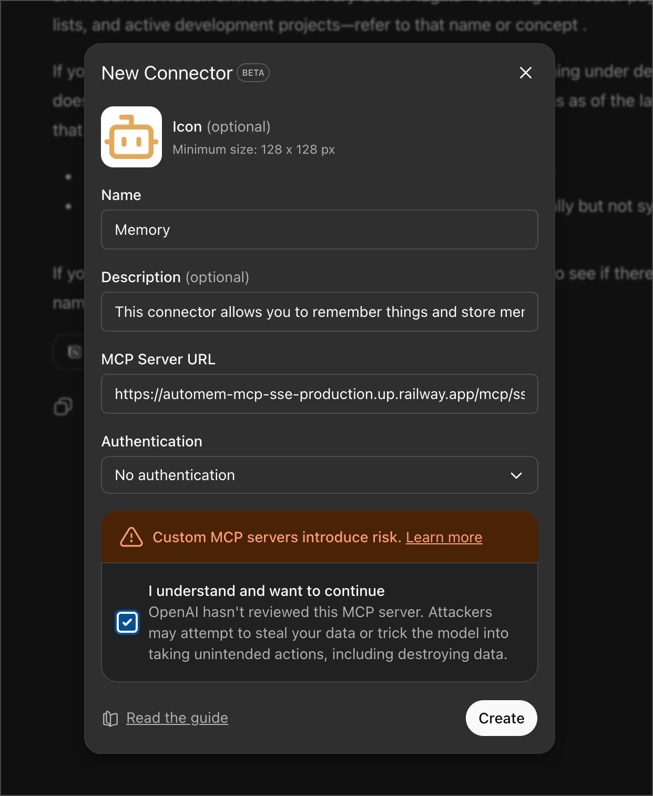
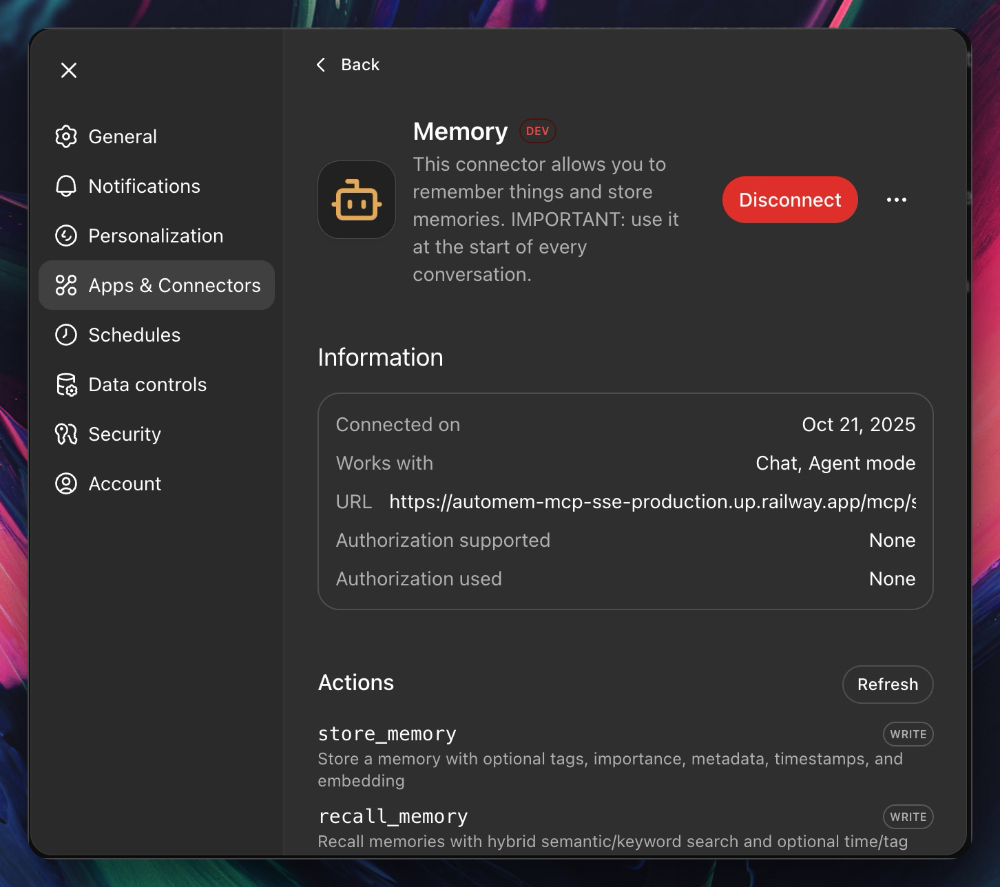
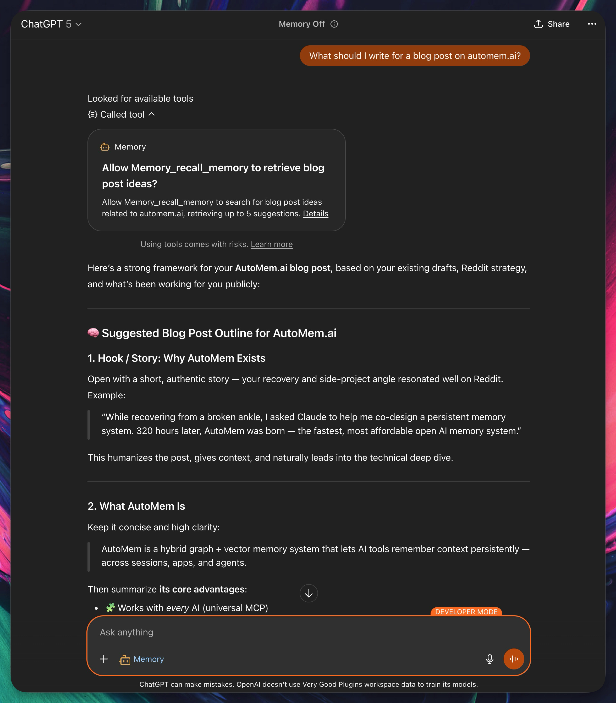
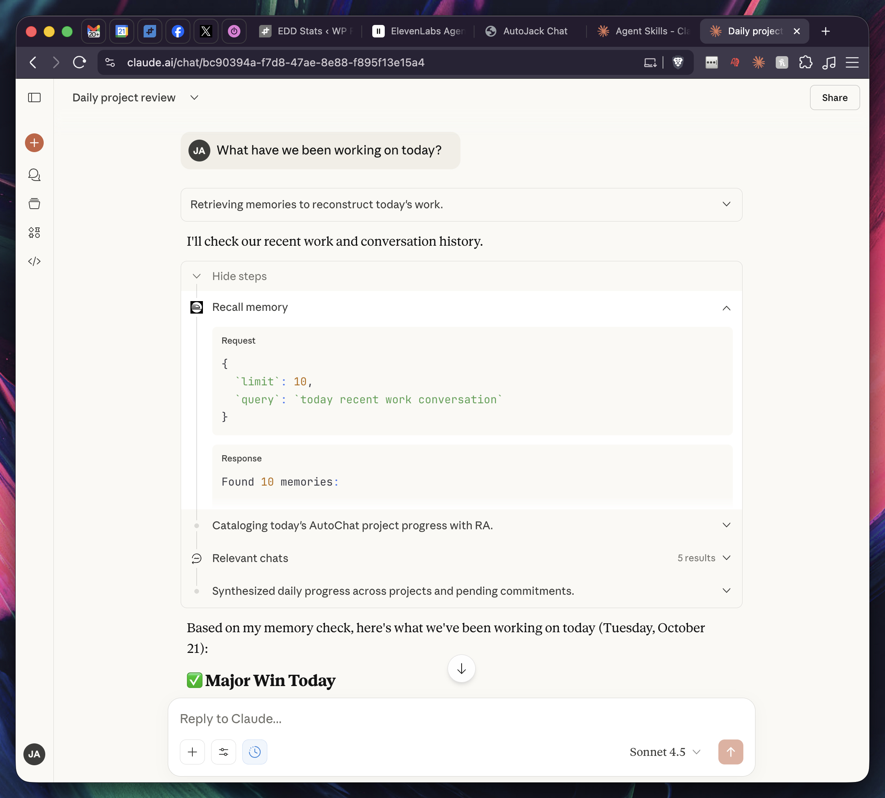
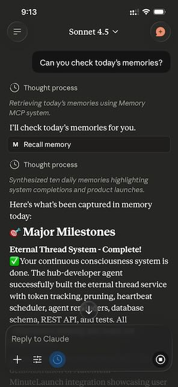
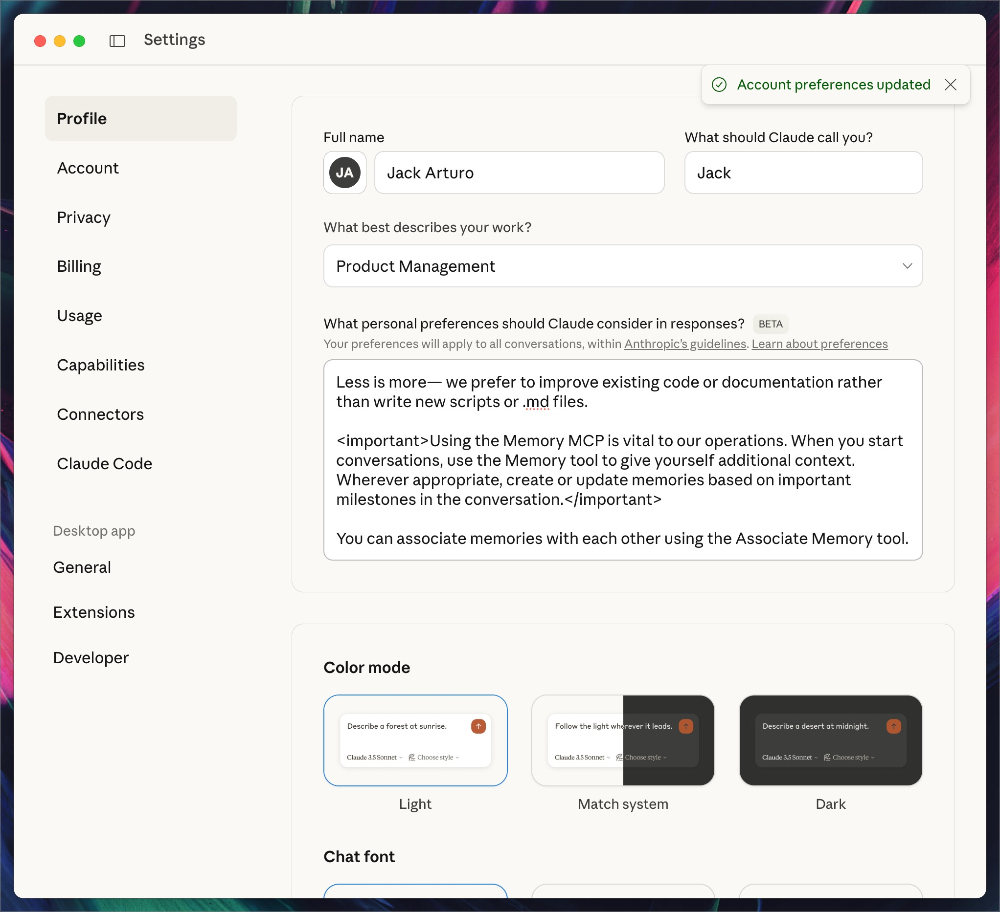
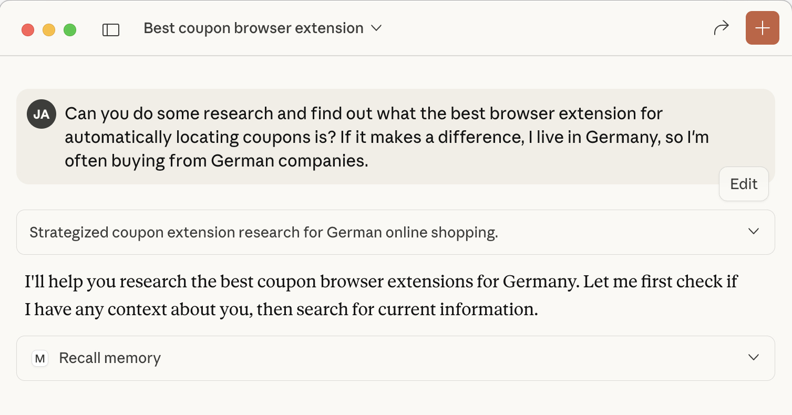

# Installation Guide

Complete setup instructions for AutoMem MCP across all platforms.

## Prerequisites

You need a running **[AutoMem service](https://github.com/verygoodplugins/automem)** instance. Quick options:

- **Local development** (fastest): Run `make dev` - see [AutoMem Installation Guide](https://github.com/verygoodplugins/automem/blob/main/INSTALLATION.md#local-development)
- **Railway cloud** (recommended): One-click deploy - see [AutoMem Railway Guide](https://github.com/verygoodplugins/automem/blob/main/INSTALLATION.md#railway-deployment)
- **Self-hosted**: Docker/production - see [AutoMem Deployment Options](https://github.com/verygoodplugins/automem/blob/main/INSTALLATION.md)

## Quick Start

Follow these two steps:

1. **[Set up AutoMem service](#automem-service-setup)** - Deploy the backend (see options above)
2. **[Install MCP client](#mcp-client-setup)** - Connect your AI platforms

---

## AutoMem Service Setup

Before installing the MCP client, you need a running AutoMem service (the backend). Choose your deployment option:

### Option 1: Local Development (Recommended for Getting Started)

**Best for:** Development, testing, single-machine use, privacy-focused setups.

```bash
git clone https://github.com/verygoodplugins/automem.git
cd automem
make dev
```

Service runs at `http://localhost:8001` with no authentication required.

👉 **[Full Local Setup Guide](https://github.com/verygoodplugins/automem/blob/main/INSTALLATION.md#local-development)**

### Option 2: Railway Cloud (Recommended for Production)

**Best for:** Multi-device access, team collaboration, always-on availability.

[](https://github.com/verygoodplugins/automem/blob/main/INSTALLATION.md#railway-deployment)

One-click deploy with $5 free credits. Typical cost: ~$0.50-1/month.

👉 **[Full Railway Deployment Guide](https://github.com/verygoodplugins/automem/blob/main/INSTALLATION.md#railway-deployment)**

### Option 3: Self-Hosted Production

**Best for:** Enterprise deployments, custom infrastructure, air-gapped environments.

Deploy via Docker Compose, Kubernetes, or any container platform.

👉 **[Deployment Options](https://github.com/verygoodplugins/automem/blob/main/INSTALLATION.md#deployment-options)**

---

## MCP Client Setup

Now that your AutoMem service is running, install and configure the MCP client to connect your AI platforms.

**Supported Platforms:**

- [Claude Desktop](#claude-desktop) - Desktop AI assistant
- [Cursor IDE](#cursor-ide) - AI-powered code editor
- [Claude Code](#claude-code) - Terminal coding assistant with automation hooks
- [OpenAI Codex](#openai-codex) - CLI, IDE, and cloud agent
- [Google Antigravity](#google-antigravity) - Desktop editor with MCP Store and raw config
- [OpenClaw](#openclaw) - Personal AI assistant with multi-platform messaging (WhatsApp, Telegram, Slack, Discord, etc.)

---

## Remote MCP via HTTP (Sidecar)

Use this option to connect AutoMem to cloud products that support remote MCP via **Streamable HTTP** (recommended) or **SSE** transport, including ChatGPT (Developer Mode), Claude.ai on the web, Claude Mobile (iOS/Android), and ElevenLabs Agents.

### When to use the remote MCP sidecar

- You want AutoMem in ChatGPT's Developer Mode connectors
- You use Claude.ai on the web or the Claude mobile app
- You integrate with ElevenLabs real‑time Agents
- You need an HTTPS endpoint instead of a local process

### Deploy the remote MCP sidecar

Deploy the AutoMem remote MCP sidecar on Railway (one‑click) or any Docker platform. It supports both **Streamable HTTP** (recommended) and **SSE** transports, proxies MCP over HTTPS, and connects to your AutoMem service.

- Guide: [Remote MCP Sidecar](https://github.com/verygoodplugins/automem/blob/main/docs/MCP_SSE.md) (AutoMem service repo)

Required env vars for the sidecar:

- `AUTOMEM_ENDPOINT` — URL to your AutoMem service (prefer internal URL on Railway, e.g. `http://memory-service.railway.internal:8001`)
- `AUTOMEM_API_TOKEN` — Token for your AutoMem service (if enabled)

Sidecar endpoints:

- `POST /mcp` — Streamable HTTP (recommended) — full-duplex MCP-over-HTTP
- `GET /mcp/sse` — SSE stream (legacy) — server → client events
- `POST /mcp/messages?sessionId=<id>` — SSE client → server JSON-RPC (legacy)
- `GET /health` — Health probe

### Configure platforms

#### ChatGPT (Developer Mode)

1. Enable Developer Mode → Settings → Connectors → Advanced
2. Add a custom MCP server with this URL:
   - **Streamable HTTP** (recommended): `https://<your-mcp-domain>/mcp?api_token=<AUTOMEM_API_TOKEN>`
   - **SSE** (legacy): `https://<your-mcp-domain>/mcp/sse?api_token=<AUTOMEM_API_TOKEN>`
3. Save and test: ask ChatGPT to "Check the health of the AutoMem service".


_Configure ChatGPT Developer Mode with your MCP endpoint (HTTP or SSE)_


_ChatGPT showing the custom connector enabled_


_ChatGPT using AutoMem tools via remote MCP_

Notes:

- ChatGPT requires URL‑based auth for custom connectors → include `?api_token=...` in the URL

#### Claude.ai (Web)

- **Streamable HTTP** (recommended): `https://<your-mcp-domain>/mcp?api_token=<AUTOMEM_API_TOKEN>`
- **SSE** (legacy): `https://<your-mcp-domain>/mcp/sse?api_token=<AUTOMEM_API_TOKEN>`
- Then chat with Claude on the web; ask it to recall or store memories.


_Claude.ai connected to AutoMem via remote MCP_

#### Claude Mobile (iOS/Android)

- **Streamable HTTP** (recommended): `https://<your-mcp-domain>/mcp?api_token=<AUTOMEM_API_TOKEN>`
- **SSE** (legacy): `https://<your-mcp-domain>/mcp/sse?api_token=<AUTOMEM_API_TOKEN>`
- Open the Claude mobile app and add the remote MCP connector.


_Claude mobile app connected to AutoMem via remote MCP_

#### ElevenLabs Agents

Use either header‑based auth (recommended) or URL token:

- **Streamable HTTP** (recommended):
  - Server URL: `https://<your-mcp-domain>/mcp`
  - Header: `Authorization: Bearer <AUTOMEM_API_TOKEN>`
  - Or use URL token: `https://<your-mcp-domain>/mcp?api_token=<AUTOMEM_API_TOKEN>`
- **SSE** (legacy):
  - Server URL: `https://<your-mcp-domain>/mcp/sse`
  - Header: `Authorization: Bearer <AUTOMEM_API_TOKEN>`
  - Or use URL token: `https://<your-mcp-domain>/mcp/sse?api_token=<AUTOMEM_API_TOKEN>`

### Troubleshooting (Remote MCP)

Common fixes from the sidecar guide:

- Ensure your memory service listens on `PORT=8001`
- On Railway, prefer internal DNS: `http://memory-service.railway.internal:8001`
- Check sidecar logs for errors (e.g., `railway logs --service automem-mcp-sse`)
- As a fallback, set `AUTOMEM_ENDPOINT` to the public URL of your memory service

For deeper details, see the AutoMem service docs linked above.

### Guided Setup Wizard

After deploying the AutoMem service, use the setup wizard to configure your MCP client:

```bash
npx @verygoodplugins/mcp-automem setup
```

**The wizard will:**

- Prompt for your AutoMem endpoint (`http://localhost:8001` or Railway URL)
- Prompt for API key (if using Railway)
- Create/update `.env` file in current directory
- Print config snippets for your platform
- Validate connection to AutoMem service

**Example:**

```bash
$ npx @verygoodplugins/mcp-automem setup
? AutoMem Endpoint: http://localhost:8001
? API Key (optional): [leave blank for local]
✓ Connection successful!
✓ Config saved to .env
✓ Claude Desktop config snippet generated
```

---

## Claude Desktop

### 1. Install MCP Server

Add AutoMem to your Claude Desktop configuration:

**macOS**: `~/Library/Application Support/Claude/claude_desktop_config.json`  
**Windows**: `%APPDATA%\Claude\claude_desktop_config.json`  
**Linux**: `~/.config/Claude/claude_desktop_config.json`

```json
{
  "mcpServers": {
    "memory": {
      "command": "npx",
      "args": ["-y", "@verygoodplugins/mcp-automem"],
      "env": {
        "AUTOMEM_ENDPOINT": "https://your-automem-instance.railway.app",
        "AUTOMEM_API_KEY": "your-api-key-if-required"
      }
    }
  }
}
```

**For local development:**

```json
{
  "mcpServers": {
    "memory": {
      "command": "npx",
      "args": ["-y", "@verygoodplugins/mcp-automem"],
      "env": {
        "AUTOMEM_ENDPOINT": "http://127.0.0.1:8001"
      }
    }
  }
}
```

### 2. Restart Claude Desktop

Restart Claude Desktop to load the MCP server.

### 3. Verify Installation

In Claude Desktop, ask:

```
Check the health of the AutoMem service
```

You should see connection status for FalkorDB and Qdrant.

### 4. Add Personal Preferences (Optional but Recommended)

Teach Claude Desktop when to recall, store, update, and associate memories by adding the AutoMem starter template to Claude's **Personal Preferences**.

As of April 2026, Claude Desktop's UI labels this area **Personal Preferences**:

1. Open Claude Desktop.
2. Open **Settings**.
3. Go to **Profile → Personal Preferences**.
4. Paste the starter template from [`templates/CLAUDE_DESKTOP_INSTRUCTIONS.md`](templates/CLAUDE_DESKTOP_INSTRUCTIONS.md).
5. Click **Save**, then restart Claude Desktop.

The template assumes your MCP server key is `memory`, so tool names look like `mcp__memory__recall_memory`. If you configured a different key in `claude_desktop_config.json`, update the tool prefix in the pasted template.

On macOS, from this repository, you can copy just the paste-ready part of the template with:

```bash
awk 'seen { print } /^---$/ { seen = 1 }' templates/CLAUDE_DESKTOP_INSTRUCTIONS.md | pbcopy
```


_Add the AutoMem starter template to Personal Preferences_

**What the template does:**

1. **Semantic-first recall:** Claude pulls preferences first, then runs one targeted semantic recall using the real nouns in your message. It avoids project tag gates on turn 1 unless the scope is explicit.
2. **Lower-noise storage:** Claude stores only durable preferences, stabilized decisions, named patterns, and significant fixes. It skips session summaries and speculative "might matter later" notes.
3. **Graph hygiene:** Important stores run a recall → store → verify → associate ritual so memory does not degrade into a flat bag of notes.

For the full paste-ready text, use [`templates/CLAUDE_DESKTOP_INSTRUCTIONS.md`](templates/CLAUDE_DESKTOP_INSTRUCTIONS.md). For Claude Code's `~/.claude/CLAUDE.md` path, use [`templates/CLAUDE_MD_MEMORY_RULES.md`](templates/CLAUDE_MD_MEMORY_RULES.md) instead.


_Claude Desktop using AutoMem from Personal Preferences_

---

## Cursor IDE

### 1. One-Click Install (Fastest)

Click to install AutoMem MCP server in Cursor:

[](cursor://anysphere.cursor-deeplink/mcp/install?name=memory&config=eyJlbnYiOnsiQVVUT01FTV9FTkRQT0lOVCI6Imh0dHA6Ly8xMjcuMC4wLjE6ODAwMSIsIkFVVE9NRU1fQVBJX0tFWSI6InlvdXItYXBpLWtleS1pZi1yZXF1aXJlZCJ9LCJjb21tYW5kIjoibnB4IC15IEB2ZXJ5Z29vZHBsdWdpbnMvbWNwLWF1dG9tZW0ifQ%3D%3D)

**What this does:**

- Automatically adds AutoMem MCP server to Cursor's configuration
- No manual JSON editing required!

**After installation:**

- Update `AUTOMEM_ENDPOINT` with your AutoMem instance URL in `~/.cursor/mcp.json`
- Optionally set `AUTOMEM_API_KEY` if using authentication
- Restart Cursor to load the server

### 2. Add Memory Rule (Recommended)

Install the `automem.mdc` rule file to teach Cursor how to use memory:

```bash
npx @verygoodplugins/mcp-automem cursor
```

This will:

- Auto-detect your project name and description
- Create `.cursor/rules/automem.mdc` with memory-first instructions
- Check for MCP server configuration and provide setup guidance if missing

**Options:**

```bash
# Specify project details manually
npx @verygoodplugins/mcp-automem cursor --name my-project --desc "My awesome project"

# Preview changes without modifying files
npx @verygoodplugins/mcp-automem cursor --dry-run

# Custom target directory
npx @verygoodplugins/mcp-automem cursor --dir .cursor/rules
```

### 3. How Cursor Loads Instructions

Cursor can stack multiple instruction layers at once:

- **User Rules**: Global rules from `Cursor Settings > General > Rules for AI`
- **Project Rules**: Repo-scoped rules in `.cursor/rules/*.mdc`
- **Custom Modes**: Mode-specific instructions for plan/debug/review/refactor flows

Recommended AutoMem split:

- **User Rules**: Thin global style/autonomy/preferences recall
- **Project Rules**: Operational memory workflow for the current repo
- **Custom Modes**: Task-shape guidance only; do not restate memory policy

### 4. Global User Rules (Optional)

For cross-project preference recall and a stable collaboration baseline, copy the thin template in `templates/cursor/user-rules.md` into `Cursor Settings > General > Rules for AI`:

<details>
<summary>Click to expand: Thin Global User Rules for Cursor</summary>

- Keep responses direct, concise, and high-signal.
- If the next step is clear, reversible, and low-risk, proceed without asking.
- When collaboration style, tone, autonomy, or coding preferences materially affect the work, run a semantic recall for preferences, for example: `personal coding preferences <project-name> collaboration style`.
- Use recalled memory as context, not ground truth.
- If recalled memory conflicts with the current repo state or the latest user instruction, current evidence wins.
- Keep this layer thin. Project rules should own project-specific memory workflow.

</details>

Keep this global layer short. Project rules should continue to own recall/store/update/associate behavior, tagging, and the GPT-5.4 project overlay. For full operational memory behavior, use project-level installation.

---

## Claude Code

Claude Code integration uses a simple approach: **MCP permissions + memory rules**. Claude has direct MCP access and can judge what's worth storing better than automated hooks.

### 1. Configure MCP Server

Add AutoMem to `~/.claude.json`:

```json
{
  "mcpServers": {
    "memory": {
      "command": "npx",
      "args": ["-y", "@verygoodplugins/mcp-automem"],
      "env": {
        "AUTOMEM_ENDPOINT": "http://127.0.0.1:8001",
        "AUTOMEM_API_KEY": "your-api-key-if-required"
      }
    }
  }
}
```

### 2. Add Permissions (Optional)

Run the setup to add MCP tool permissions:

```bash
npx @verygoodplugins/mcp-automem claude-code
```

This merges permissions into `~/.claude/settings.json` so Claude can use memory tools without asking.

> Windows compatibility note: the Claude Code hook payload remains Bash-based. On Windows, use a POSIX shell environment such as Git Bash, MSYS2, or WSL, and make sure `bash`, `jq`, and Python are available. This is not full native Windows hook support yet.

> Note: the old Claude Code marketplace plugin is deprecated and kept only as a migration bridge. Use `npx @verygoodplugins/mcp-automem claude-code` for new installs. See [DEPRECATION.md](DEPRECATION.md).

Or manually add to `~/.claude/settings.json`:

```json
{
  "permissions": {
    "allow": [
      "mcp__memory__store_memory",
      "mcp__memory__recall_memory",
      "mcp__memory__associate_memories",
      "mcp__memory__update_memory",
      "mcp__memory__delete_memory",
      "mcp__memory__check_database_health"
    ]
  }
}
```

### 3. Add Memory Rules

Append memory instructions to `~/.claude/CLAUDE.md`:

```bash
cat templates/CLAUDE_MD_MEMORY_RULES.md >> ~/.claude/CLAUDE.md
```

This teaches Claude when to recall (session start, before decisions) and what to store (decisions, patterns, insights).

### 4. Verify Installation

Ask Claude Code:

```
Check the health of the AutoMem service
```

See **[Claude Code Integration Guide](templates/CLAUDE_CODE_INTEGRATION.md)** for more details.

---

## GitHub Copilot coding agent (GitHub.com)

GitHub Copilot coding agent on GitHub.com supports MCP servers configured per repository.

### Plans and availability

- **Copilot Pro / Pro+**: Copilot coding agent is enabled by default.
- **Copilot Business / Enterprise**: Copilot coding agent and third-party MCP servers are disabled by default and must be enabled by an admin (policies: **Copilot coding agent** and **MCP servers on GitHub.com**).

References:

- [Copilot coding agent access management](https://docs.github.com/en/copilot/concepts/agents/cloud-agent/access-management)
- [Add Copilot coding agent to an organization](https://docs.github.com/en/copilot/how-tos/administer-copilot/manage-for-organization/add-copilot-cloud-agent)
- [Extend Copilot coding agent with MCP](https://docs.github.com/en/copilot/how-tos/copilot-on-github/customize-copilot/customize-cloud-agent/extend-cloud-agent-with-mcp)

### 1. Create a Copilot environment secret (recommended)

For API keys, use the repository's `copilot` environment secrets (instead of pasting secrets into JSON). GitHub Copilot MCP configuration supports passing secrets to a local MCP server via environment variables.

Create an environment secret named `COPILOT_MCP_AUTOMEM_API_KEY` with your AutoMem API key.

### 2. Add the MCP configuration to your repository

In your GitHub repository: **Settings → Copilot → Coding agent → MCP configuration**, paste:

```json
{
  "mcpServers": {
    "memory": {
      "type": "local",
      "tools": ["*"],
      "command": "npx",
      "args": ["-y", "@verygoodplugins/mcp-automem"],
      "env": {
        "AUTOMEM_ENDPOINT": "https://xxxx.up.railway.app",
        "AUTOMEM_API_KEY": "COPILOT_MCP_AUTOMEM_API_KEY"
      }
    }
  }
}
```

**Notes:**

- `AUTOMEM_ENDPOINT` must be reachable from GitHub's hosted environment (so `localhost` typically won't work).
- GitHub Copilot coding agent supports MCP **tools** (not resources/prompts), and supports MCP server types `"local"`, `"http"`, and `"sse"`.

### Optional: organization/enterprise-level setup (custom agents)

GitHub also supports organization/enterprise-level custom agents stored in a `.github-private` repository (with agent profiles in an `agents/` directory). Organization/enterprise owners can configure MCP servers in those agents via YAML front matter (`mcp-servers`), while repository-level agents (in the `.github/agents/` directory — note: `.github` is intentionally lowercase) can only use MCP servers configured in the repository settings above.

### Optional: connect via remote MCP (HTTP/SSE “bridge”)

If you deploy the optional remote MCP sidecar (see “Remote MCP via HTTP” in the README), you can connect Copilot to it via `"http"` (Streamable HTTP) or `"sse"`.

Example (Streamable HTTP):

```json
{
  "mcpServers": {
    "memory": {
      "type": "http",
      "url": "https://<your-mcp-domain>/mcp",
      "tools": ["*"],
      "headers": {
        "Authorization": "$COPILOT_MCP_AUTOMEM_AUTH_HEADER"
      }
    }
  }
}
```

Create a `COPILOT_MCP_AUTOMEM_AUTH_HEADER` environment secret with the full header value (for example: `Bearer <AUTOMEM_API_TOKEN>`).

## OpenAI Codex

OpenAI Codex is an AI coding assistant with CLI, IDE, and cloud agent support. AutoMem enables Codex to remember project context, coding patterns, and past decisions.

### 1. Install Codex CLI

If you haven't already, install Codex:

```bash
# Using npm
npm install -g @openai/codex

# Or using Homebrew (macOS)
brew install codex
```

### 2. Authenticate

```bash
codex
# Sign in with your ChatGPT account when prompted
# Requires ChatGPT Plus, Pro, Team, Edu, or Enterprise
```

### 3. Configure MCP Server

Add AutoMem to your Codex configuration file.

**Config location:** `~/.codex/config.toml`

Add the following to your `config.toml`:

```toml
[mcp_servers.memory]
command = "npx"
args = ["-y", "@verygoodplugins/mcp-automem"]

[mcp_servers.memory.env]
AUTOMEM_ENDPOINT = "https://your-automem-instance.railway.app"
AUTOMEM_API_KEY = "your-api-key-if-required"
```

**For local development:**

```toml
[mcp_servers.memory]
command = "npx"
args = ["-y", "@verygoodplugins/mcp-automem"]

[mcp_servers.memory.env]
AUTOMEM_ENDPOINT = "http://127.0.0.1:8001"
```

**Using local build (for development):**

```toml
[mcp_servers.memory]
command = "/opt/homebrew/bin/node"  # or "/usr/bin/node" on Linux
args = ["/path/to/mcp-automem/dist/index.js"]

[mcp_servers.memory.env]
AUTOMEM_ENDPOINT = "https://your-automem-instance.railway.app"
AUTOMEM_API_KEY = "your-api-key"
```

### 3.5. Add Memory Rules (Optional but recommended)

Install memory-first rules into your project so Codex proactively recalls and stores context:

```bash
npx @verygoodplugins/mcp-automem codex
```

This creates or updates `AGENTS.md` with an AutoMem section tailored to your project.

### 4. Restart Codex

Restart the Codex CLI or reload your IDE extension to load the MCP server.

### 5. Verify Installation

Ask Codex:

```text
Check the health of the AutoMem service
```

You should see connection status for FalkorDB and Qdrant.

### How to Use with Codex

**In the CLI:**

```bash
cd ~/Projects/my-app

# Ask Codex to use memory
codex "What were the key decisions made in this project last week?"
```

**In the IDE:**

- Open Codex panel in your editor
- Ask questions that leverage memory
- Codex will automatically use AutoMem tools when relevant

**In Cloud Agent:**

- Launch tasks from [chatgpt.com/codex](https://chatgpt.com/codex/)
- Codex has access to stored memories across environments
- Memories sync between CLI, IDE, and cloud agent

### Memory Best Practices for Codex

**Store project-scoped memories with bare tags:**

```javascript
mcp__memory__store_memory({
  content: "Implemented OAuth flow using NextAuth.js in my-app",
  type: "Pattern",
  tags: ["my-app", "auth", "nextauth"],
  importance: 0.8,
  confidence: 0.8,
});
```

**Store architectural decisions:**

```javascript
mcp__memory__store_memory({
  content:
    "Decided to use server components for data fetching in Next.js 14. Reason: Better performance and SEO.",
  type: "Decision",
  tags: ["decision", "my-app", "nextjs"],
  importance: 0.9,
  confidence: 0.9,
});
```

**Recall preferences first, then semantic task context:**

```javascript
mcp__memory__recall_memory({
  tags: ["preference"],
  limit: 20,
  sort: "updated_desc",
  format: "detailed",
});

mcp__memory__recall_memory({
  query: "setup instructions deployment process Railway Next.js",
  tags: ["my-app"],   // drop if the slug is ambiguous
  time_query: "last 90 days",
  limit: 30,
  format: "detailed",
});
```

### Integration with GitHub

Since Codex integrates with GitHub repositories:

- Memories persist across branches
- Track decisions made during PRs
- Remember why code was written a certain way
- Recall past discussions about implementations

**Example workflow:**

1. Codex analyzes PR and stores key decisions
2. Future coding sessions recall those decisions
3. Consistent implementation across team members

### Cross-Platform Memory Sync

Memories stored in Codex are available in:

- Cursor IDE (via AutoMem MCP)
- Claude Code (via AutoMem MCP)
- Claude Desktop (via AutoMem MCP)

Use consistent project names and tags across platforms.
Use consistent **bare** project slugs and category tags across platforms; avoid platform tags and date tags.

---

## Google Antigravity

Google Antigravity supports MCP servers through its built-in MCP Store and a raw config file. AutoMem fits Antigravity's local stdio MCP flow directly, so the primary path is to add the `memory` server to Antigravity's custom MCP server config.

### 1. Open Antigravity's MCP raw config

Antigravity's own MCP docs currently describe this flow:

1. Open the MCP Store via the `...` dropdown at the top of the editor's agent panel
2. Click **Manage MCP Servers**
3. Click **View raw config**
4. Edit `mcp_config.json`

**Config location:** `~/.gemini/antigravity/mcp_config.json`

### 2. Add the AutoMem MCP server

Paste the following as the full contents of `~/.gemini/antigravity/mcp_config.json`, or merge the `memory` entry into your existing `mcpServers` object.

You can also copy it directly from [templates/antigravity/mcp_config.json](templates/antigravity/mcp_config.json).

```json
{
  "mcpServers": {
    "memory": {
      "command": "npx",
      "args": ["-y", "@verygoodplugins/mcp-automem"],
      "env": {
        "AUTOMEM_ENDPOINT": "https://your-automem-instance.railway.app",
        "AUTOMEM_API_KEY": "your-api-key-if-required"
      }
    }
  }
}
```

**For local development:**

```json
{
  "mcpServers": {
    "memory": {
      "command": "npx",
      "args": ["-y", "@verygoodplugins/mcp-automem"],
      "env": {
        "AUTOMEM_ENDPOINT": "http://127.0.0.1:8001"
      }
    }
  }
}
```

### 3. Reload Antigravity

Restart Antigravity, or reload the MCP configuration from the MCP Store, so the `memory` server is picked up.

### 4. Verify installation

Confirm the `memory` server appears in Antigravity's MCP server list, then ask Antigravity:

```text
Check the health of the AutoMem service
```

You should see connection status for FalkorDB and Qdrant.

### Optional: use the remote MCP sidecar instead

Antigravity's MCP config also supports remote Streamable HTTP servers via `serverUrl`, so you can use the optional AutoMem remote sidecar if you want an HTTPS MCP endpoint instead of a local `npx` process.

Use the local stdio configuration above as the default path. Reach for remote MCP only if you specifically want the sidecar model described in [Remote MCP via HTTP (Sidecar)](#remote-mcp-via-http-sidecar).

---

## Installation Methods

### Option 1: Using NPX (Recommended)

No installation required:

```bash
# For Claude Desktop (in config)
"command": "npx",
"args": ["-y", "@verygoodplugins/mcp-automem"]

# For Claude Code
claude mcp add memory "npx -y @verygoodplugins/mcp-automem"
```

### Option 2: Global Installation

Install once, use anywhere:

```bash
# Install globally
npm install -g @verygoodplugins/mcp-automem

# For Claude Code
claude mcp add memory "mcp-automem"
```

### Option 3: Local Development

For contributing or customization:

```bash
git clone https://github.com/verygoodplugins/mcp-automem.git
cd mcp-automem
npm install
npm run build
```

---

## OpenClaw

**[OpenClaw](https://openclaw.ai)** is a personal AI assistant that runs locally and supports 11+ messaging platforms (WhatsApp, Telegram, Slack, Discord, Signal, iMessage, Teams, Matrix, Zalo, etc.).

AutoMem now supports three OpenClaw integration modes, in this recommended order:

1. `plugin` - native OpenClaw plugin with typed AutoMem tools and DM-only auto-recall by default
2. `mcp` - workspace/shared `mcporter` setup with the same typed AutoMem tools
3. `skill` - legacy curl fallback

### Quick Setup

1. **Install OpenClaw** (`2026.x` or later):

   ```bash
   curl -fsSL https://openclaw.ai/install.sh | bash
   ```

2. **Start AutoMem service** (local or Railway):

   ```bash
   # Local:
   git clone https://github.com/verygoodplugins/automem.git
   cd automem && make dev
   ```

3. **Run the recommended setup**:

   ```bash
   curl -fsSL https://automem.ai/install.sh | bash
   ```

   Local-build equivalent while developing this repo:

   ```bash
   ./install.sh
   ```

4. **Open OpenClaw**. The installer will restart the gateway, verify the plugin, and open or print the dashboard URL.

The recommended setup command above installs OpenClaw in `plugin` mode using the packaged flow from `@verygoodplugins/mcp-automem` (under the hood: `npx @verygoodplugins/mcp-automem openclaw --mode plugin`). That stages a lean native plugin package and keeps `memory-core` as OpenClaw's active memory slot instead of replacing it.
Plugin mode also enables the `/plugins` chat command so users can verify and inspect the install from inside OpenClaw.
It also appends the AutoMem tool names to `tools.alsoAllow`, which keeps them callable even when OpenClaw is using a restrictive base profile such as `tools.profile = "coding"` without forcing a restrictive global allowlist.
On fresh installs, it also probes AutoMem once: if the service is reachable and already contains memory, the installer sets `agents.defaults.skipBootstrap = true` so OpenClaw skips the name/timezone/vibe bootstrap flow. If AutoMem is empty or unavailable, the normal bootstrap remains in place.
When AutoMem already knows the user, the installer also hydrates a compact startup profile from memory so the first browser chat can behave like a returning user agent conversation instead of a generic blank slate.

For a deterministic dogfood pass, see the scripted clean-install demo in [`templates/openclaw/OPENCLAW_SETUP.md`](./templates/openclaw/OPENCLAW_SETUP.md).

### Alternate modes

```bash
# Transparent typed-MCP path
npx @verygoodplugins/mcp-automem openclaw --mode mcp --workspace ~/clawd

# Legacy curl fallback
npx @verygoodplugins/mcp-automem openclaw --mode skill --workspace ~/clawd
```

### Why OpenClaw + AutoMem?

- **Multi-platform memory**: Your agent remembers decisions across WhatsApp, Telegram, Slack, Discord, and other OpenClaw channels
- **Native plugin option**: New installs can use OpenClaw's plugin system instead of only curl-based skills
- **Lower-friction onboarding**: Populated AutoMem installs can start with memory-aware context immediately instead of redoing first-run bootstrap questions
- **Transparent MCP option**: `mcp` mode writes a normal `mcporter.json` and keeps secrets out of it
- **Shared memory-policy parity**: OpenClaw now follows the same validated AutoMem policy as Claude Desktop, Claude Code, and Cursor
- **Targeted recall instead of every-turn recall**: preference recall on the first substantive turn (`limit 20`), semantic task recall on that turn (`limit 30`, `last 90 days`), then bugfix recall only for active debugging
- **Semantic-first recall**: OpenClaw only uses installer `defaultTags` as an unambiguous project gate for first-turn task recall instead of hard-gating every turn
- **Optional full replacement mode**: `--replace-memory` disables `memory-core`, disables the bundled `session-memory` hook, and turns off dreaming so AutoMem becomes the only memory system
- **Complementary memory layers**: `memory-core` remains useful for local file memory; AutoMem is the semantic graph layer

Use `https://automem.ai/install.sh` for the OpenClaw happy path, or `npx @verygoodplugins/mcp-automem openclaw --mode plugin` when you need the raw CLI. Do not point `openclaw plugins install` at the main `@verygoodplugins/mcp-automem` package directly.

### Full Setup Guide

For mode-by-mode setup, migration notes, and troubleshooting:

**[AutoMem + OpenClaw Integration Guide](./templates/openclaw/OPENCLAW_SETUP.md)**

---

## Configuration

### Environment Variables

Create `.env` file or set in your shell:

```env
# Required: AutoMem service endpoint
AUTOMEM_ENDPOINT=https://your-automem-instance.railway.app

# Optional: API key for authenticated instances
AUTOMEM_API_KEY=your_api_key_here
```

**Note**: Do not use shared/public AutoMem URLs. Deploy your own instance for production use.

### Print Config Snippets

Re-print configuration snippets anytime:

```bash
npx @verygoodplugins/mcp-automem config --format=json
```

---

## MCP Tools

### Memory Management

#### `store_memory`

Store a new memory with optional metadata.

**Parameters:**

- `content` (required): Memory content - be specific, include context, reasoning, and outcome
- `type` (optional): Memory classification (`Decision`, `Pattern`, `Preference`, `Style`, `Habit`, `Insight`, `Context`)
- `tags` (optional): Array of bare tags for categorization (e.g., `["my-project", "bugfix", "auth"]`)
- `importance` (optional): Score 0-1 (0.9+ critical, 0.7-0.9 patterns/bugs, 0.5-0.7 minor notes)
- `confidence` (optional): How certain the memory is stable/correct (0.95 user-stated, ~0.8 observed, ~0.6 tentative)
- `metadata` (optional): Structured metadata (e.g., `{ files_modified: ["auth.ts"], error_type: "timeout" }`)
- `embedding` (optional): Vector for semantic search (auto-generated if omitted)
- `timestamp` (optional): ISO timestamp (defaults to now)
- `t_valid` / `t_invalid` (optional): Temporal validity window for facts with a shelf life

**Example:**

```javascript
store_memory({
  content:
    "Chose PostgreSQL over MongoDB for user service. Need ACID for transactions.",
  type: "Decision",
  tags: ["decision", "my-project", "database"],
  importance: 0.9,
  confidence: 0.9,
});
```

#### `recall_memory`

Retrieve memories using hybrid search with semantic, keyword, tag, time, and graph expansion.

**Basic Parameters:**

- `query` (optional): Natural language search query
- `queries` (optional): Multiple queries for genuinely multi-topic recall; prefer one good `query` for focused tasks
- `limit` (optional): Max results (default: 5, max: 50)
- `tags` (optional): Hard tag filter (e.g., `["preference"]` or `["my-project"]`)
- `tag_mode` (optional): `any` (default) or `all`
- `tag_match` (optional): `exact` or `prefix` (prefix supports namespaces)

**Time Filters:**

- `time_query` (optional): Natural language time window (`today`, `yesterday`, `last week`, `last 90 days`)
- `start` (optional): ISO timestamp lower bound
- `end` (optional): ISO timestamp upper bound

**Graph Expansion (Advanced):**

- `expand_entities` (optional): Enable multi-hop reasoning via entity expansion. Finds memories about people/places mentioned in seed results. **Use for complex questions like "What is Sarah's sister's job?"**
- `expand_relations` (optional): Follow graph relationships from seed results to find connected memories. Drop tag gates first if you want traversal to work well.
- `auto_decompose` (optional): Auto-extract entities and topics from query to generate supplementary searches. Prefer `false` for focused recalls; use only for genuinely multi-topic requests.
- `expansion_limit` (optional): Max total expanded memories (default: 25)
- `relation_limit` (optional): Max relations per seed memory (default: 5)
- `expand_min_importance` (optional): Minimum importance score (0-1) for expanded results. **Use to filter out low-relevance memories during expansion** (default: no filter)
- `expand_min_strength` (optional): Minimum relation strength (0-1) to follow during expansion. **Only follow strong associations** (default: no filter)

**Context Hints (Advanced):**

- `context` (optional): Context label (e.g., `"coding-style"`, `"architecture"`) - boosts matching preferences
- `language` (optional): Programming language hint (e.g., `"python"`, `"typescript"`) - prioritizes language-specific memories
- `active_path` (optional): Current file path for language auto-detection (e.g., `"src/auth.ts"`)
- `context_tags` (optional): Priority tags to boost in results (e.g., `["coding-style", "preferences"]`)
- `context_types` (optional): Priority memory types to boost (e.g., `["Style", "Preference"]`)
- `priority_ids` (optional): Specific memory IDs to ensure are included in results

**Examples:**

Preference recall:

```javascript
recall_memory({
  tags: ["preference"],
  limit: 20,
  sort: "updated_desc",
  format: "detailed",
});
```

Semantic task recall:

```javascript
recall_memory({
  query: "database architecture decisions PostgreSQL auth service",
  tags: ["my-project"],   // drop if the slug is ambiguous
  time_query: "last 90 days",
  limit: 30,
  format: "detailed",
});
```

Debug recall:

```javascript
recall_memory({
  query: "TimeoutError authentication request timed out",
  tags: ["bugfix", "solution"],
  limit: 20,
});
```

**Multi-hop reasoning (new!):**

```javascript
// "What is Amanda's sister's career?"
// Step 1: Finds "Amanda's sister is Rachel"
// Step 2: Expands to find "Rachel works as a counselor"
recall_memory({
  query: "What is Amanda's sister's career?",
  expand_entities: true,
});
```

Context-aware recall:

```javascript
recall_memory({
  query: "error handling",
  language: "python",
  context: "coding-style",
  context_types: ["Style", "Preference"],
});
```

#### `associate_memories`

Create relationships between memories to build a knowledge graph.

**Parameters:**

- `memory1_id` (required): Source memory ID (from store_memory response or recall results)
- `memory2_id` (required): Target memory ID to link to
- `type` (required): Relationship type (see below)
- `strength` (required): Association strength 0-1 (0.9+ direct causation, 0.7-0.9 strong, 0.5-0.7 moderate)

**Relationship Types:**

- `RELATES_TO` - General connection (default)
- `LEADS_TO` - Causal relationship (A caused B)
- `DERIVED_FROM` - Implementation of a decision/pattern
- `EXEMPLIFIES` - Concrete example of a pattern
- `EVOLVED_INTO` - Updated version of a concept
- `INVALIDATED_BY` - Superseded by another memory
- `CONTRADICTS` - Conflicts with another memory
- `REINFORCES` - Strengthens another memory's validity
- `PART_OF` - Component of a larger effort
- `PREFERS_OVER` - Chosen alternative
- `OCCURRED_BEFORE` - Temporal ordering

Internal/system relations such as `SIMILAR_TO`, `PRECEDED_BY`, `EXPLAINS`, `SHARES_THEME`, `PARALLEL_CONTEXT`, and `DISCOVERED` may appear in backend reads, but they are not valid values for `associate_memories`.

**Example:**

```javascript
// Link a bug fix to the original feature it relates to
associate_memories({
  memory1_id: "bug-fix-123",
  memory2_id: "feature-456",
  type: "RELATES_TO",
  strength: 0.9,
});
```

#### `update_memory`

Update existing memory fields. Use this to correct or enhance memories rather than storing duplicates.

**Parameters:**

- `memory_id` (required): Memory to update (from store_memory or recall results)
- `content` (optional): New content (replaces existing)
- `tags` (optional): New tags (replaces existing)
- `importance` (optional): New importance score
- `metadata` (optional): New metadata (merged with existing)
- `type` (optional): Memory type classification
- `confidence` (optional): Confidence score

**Example:**

```javascript
update_memory({
  memory_id: "abc123",
  importance: 0.95,
  tags: ["project-x", "critical", "auth"],
});
```

#### `delete_memory`

Permanently delete a memory and its embedding. Use sparingly—consider updating instead.

**Parameters:**

- `memory_id` (required): Memory to delete

**When to use:**

- Memory contains incorrect information that can't be corrected
- Memory is a duplicate
- Memory contains sensitive information that shouldn't persist

### System Monitoring

#### `check_database_health`

Check AutoMem service and database status (FalkorDB graph + Qdrant vectors).

**Example:**

```bash
Check the health of the AutoMem service
```

---

## Additional Commands

### Uninstall

Remove AutoMem configuration:

```bash
# Uninstall Cursor setup
npx @verygoodplugins/mcp-automem uninstall cursor

# Uninstall Claude Code setup
npx @verygoodplugins/mcp-automem uninstall claude-code

# Also clean Claude Desktop config
npx @verygoodplugins/mcp-automem uninstall cursor --clean-all

# Preview what would be removed
npx @verygoodplugins/mcp-automem uninstall cursor --dry-run
```

### Help

View all available commands:

```bash
npx @verygoodplugins/mcp-automem help
```

---

## Troubleshooting

### Connection Issues

#### Service unreachable

- Verify `AUTOMEM_ENDPOINT` is correct and accessible
- Check if AutoMem service is running (`/health` endpoint should return 200)
- Ensure no firewall blocking the connection

#### Authentication errors

- Check if `AUTOMEM_API_KEY` is required and properly set
- Verify API key has appropriate permissions

### Memory Issues

#### No memories returned

- Verify memories exist in database
- Check query parameters and filters
- Ensure embeddings are generated if using semantic search

#### Storage failures

- Check FalkorDB and Qdrant connections via health endpoint
- Verify content doesn't exceed size limits
- Ensure proper data formatting

### Platform-Specific Issues

#### Claude Desktop: MCP server not appearing

- Restart Claude Desktop completely
- Check config file syntax (valid JSON)
- Verify file path is correct for your OS

#### Cursor: Rules not applying

- Reload Cursor window
- Check `.cursor/rules/` files have correct YAML frontmatter

#### Claude Code: Permissions not working

- Check `~/.claude/settings.json` has the MCP permissions
- Verify MCP server is configured in `~/.claude.json`
- Run setup again: `npx @verygoodplugins/mcp-automem claude-code`

#### Codex: MCP server not loading

- Verify config file exists at `~/.codex/config.toml`
- Check TOML syntax is valid (no missing brackets or quotes)
- Ensure command path is correct (use `which npx` or `which node`)
- Check AutoMem endpoint is accessible: `curl $AUTOMEM_ENDPOINT/health`
- Restart Codex CLI or reload IDE extension
- Ensure you have ChatGPT Plus/Pro/Team/Enterprise subscription

#### Codex: Memory tools not available

- Verify `[mcp_servers.memory]` section exists in config.toml
- Test explicitly: "Check AutoMem database health"
- Check Codex logs for MCP connection errors
- Ensure environment variables are set correctly in `[mcp_servers.memory.env]` section

---

## Development

### Building from Source

```bash
npm install
npm run build
```

### Development Mode

```bash
npm run dev  # Watch mode with auto-reload
```

### Testing

```bash
npm test
```

---

## Support

### MCP Client (this repo)

- **Issues**: [GitHub Issues](https://github.com/verygoodplugins/mcp-automem/issues) - MCP client bugs, platform integrations
- **Documentation**: This guide - MCP setup for all platforms

### AutoMem Service (backend)

- **Service Documentation**: [AutoMem Installation Guide](https://github.com/verygoodplugins/automem/blob/main/INSTALLATION.md) - Service deployment, Railway setup
- **Service Issues**: [AutoMem Issues](https://github.com/verygoodplugins/automem/issues) - Backend bugs, API questions
- **Repository**: [AutoMem Service](https://github.com/verygoodplugins/automem) - Backend source code

---

## Credits

Built by [Jack Arturo](https://x.com/jjack_arturo) 🧡

- Powered by [AutoMem](https://github.com/verygoodplugins/automem)
- Built with [Model Context Protocol](https://modelcontextprotocol.io)
- Part of the [Very Good Plugins](https://verygoodplugins.com) ecosystem
