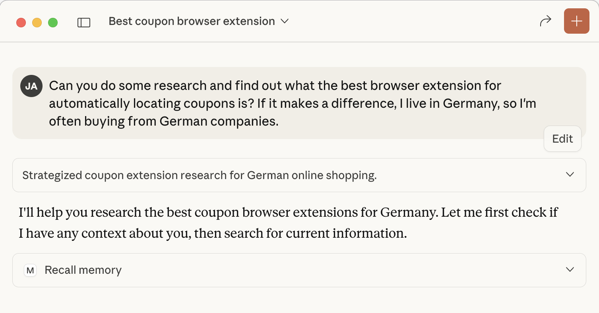
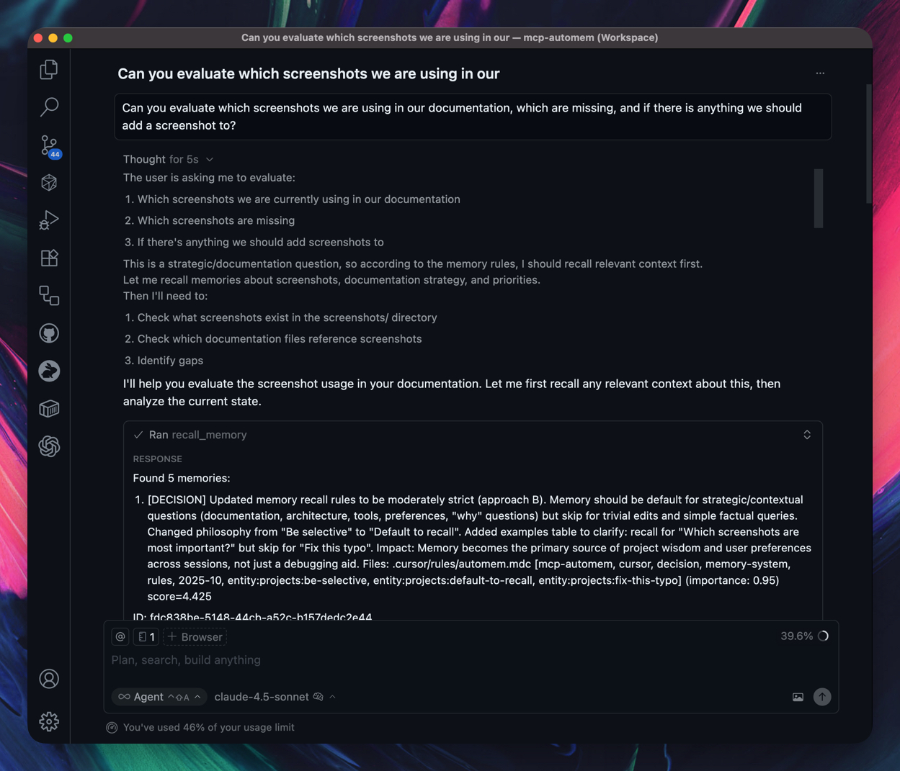
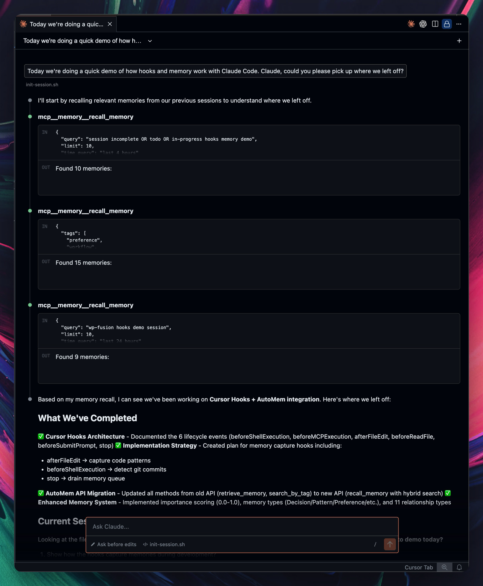
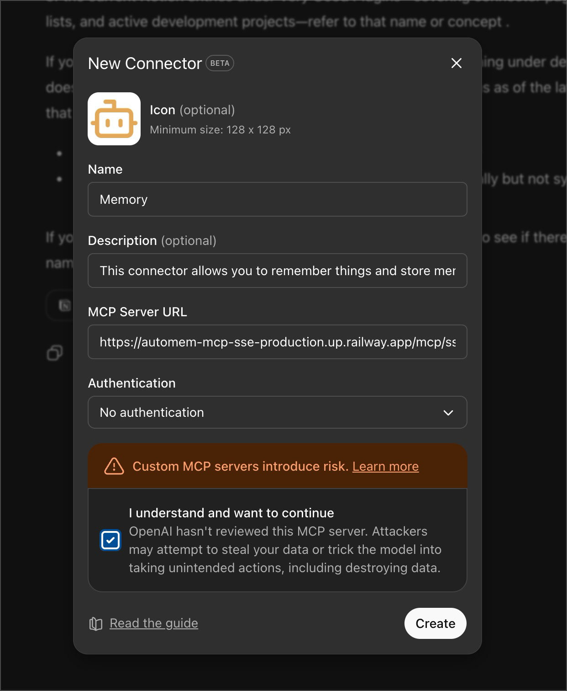
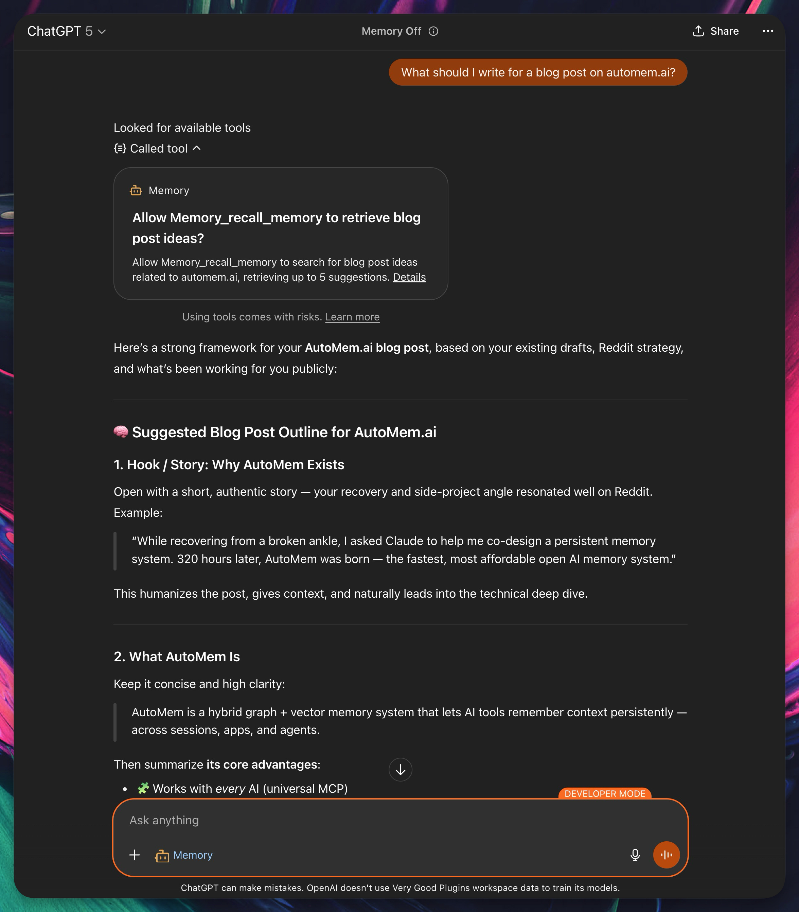
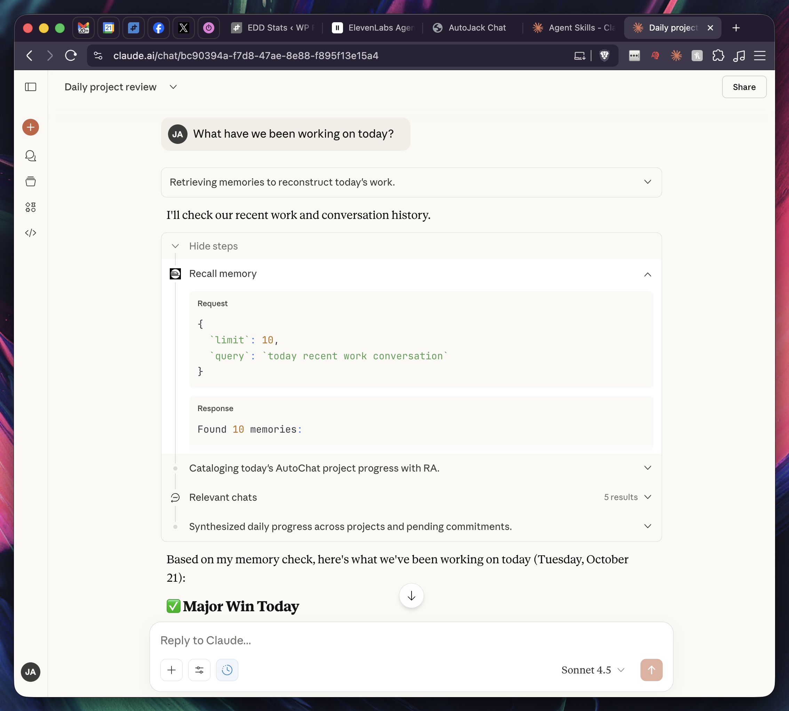
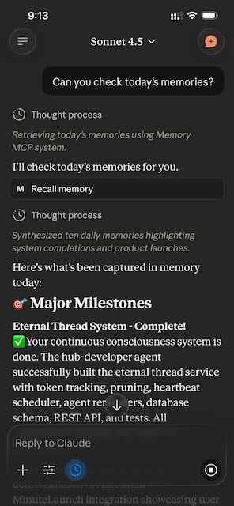

# AutoMem MCP: Give Your AI Perfect Memory 🧠

[](https://www.npmjs.com/package/@verygoodplugins/mcp-automem)
[](LICENSE)

**One command. Infinite memory. Perfect recall across all your AI tools.**

```bash
npx @verygoodplugins/mcp-automem setup
```

Your AI assistant now remembers everything. Forever. Across every conversation.

Works with **Claude Desktop**, **Cursor IDE**, **Claude Code**, **ChatGPT**, **ElevenLabs**, **OpenAI Codex** - any MCP-compatible AI platform.

## The Problem We Solve

Every AI conversation starts from zero. Claude forgets your coding style. Cursor can't learn your patterns. Your assistant doesn't remember yesterday's decisions.

**Until now.**

AutoMem MCP connects your AI to persistent memory powered by **[AutoMem](https://github.com/verygoodplugins/automem)** - a graph-vector memory service.

## What You Get

### 🧠 Persistent Memory Across Sessions
- AI remembers decisions, patterns, and context **forever**
- Works across **all MCP platforms** - Claude Desktop, Cursor, Claude Code
- **Cross-device sync** - same memory on Mac, Windows, Linux

### 🏆 Graph-Vector Architecture
- **11 relationship types** between memories (not just similarity)
- **Research-validated** approach (HippoRAG 2: 7% better associative memory)
- **Sub-second retrieval** even with millions of memories

### 🚀 Works Everywhere You Code

| Platform | Support | Setup Time |
|----------|---------|------------|
| **Claude Desktop** | ✅ Full | 30 seconds |
| **Cursor IDE** | ✅ Full | 30 seconds |
| **Claude Code** | ✅ Full | 30 seconds |
| **OpenAI Codex** | ✅ Full | 30 seconds |
| **Any MCP client** | ✅ Full | 30 seconds |

## See It In Action

### Claude Desktop with Custom Instructions

*Claude automatically recalls memories at conversation start using custom instructions*

### Cursor IDE with Memory Rules

*Cursor uses automem.mdc rule to automatically recall and store memories*

### Claude Code with Session Memory

*Git commits, builds, and deployments automatically stored to memory*

### OpenAI Codex with Memory Rules
*OpenAI Codex uses config.toml to automatically recall and store memories*

### Your AI Learns Your Code Style
```javascript
// After 1 week, your AI writes EXACTLY like you
// ✅ It knows you prefer early returns
// ✅ It uses your specific variable naming
// ✅ It matches your comment style
// ✅ It follows YOUR patterns, not generic best practices
```

### Decisions That Feel Like Yours
```
User: "Should we use Redis for this?"

Without AutoMem:
"Consider RabbitMQ, Kafka, or AWS SQS based on your needs..."

With AutoMem:
"Based on your pattern of preferring boring technology that works,
and your positive experience with Redis in Project X (March 2024), 
yes. You specifically value operational simplicity over feature 
richness - Redis fits perfectly."
```

## Quick Start

### 1. Set Up AutoMem Service

You need a running AutoMem service (the memory backend). Choose one:

**Option A: Local Development** (fastest, free)
```bash
git clone https://github.com/verygoodplugins/automem.git
cd automem
make dev
```
Service runs at `http://localhost:8001` - perfect for single-machine use.

**Option B: Railway Cloud** (recommended for production)

[](https://railway.com/deploy/automem-ai-memory-service?referralCode=VuFE6g&utm_medium=integration&utm_source=template&utm_campaign=generic)

One-click deploy with $5 free credits. Typical cost: ~$0.50-1/month after trial.

👉 **[AutoMem Service Installation Guide](https://github.com/verygoodplugins/automem/blob/main/INSTALLATION.md)** - Complete setup instructions for local, Railway, Docker, and production deployments.

---

### 2. Install MCP Client

Connect your AI tools to the AutoMem service you just started.

```bash
# Guided setup - creates .env and prints config for your AI platform
npx @verygoodplugins/mcp-automem setup
```

**When prompted:**
- **AutoMem Endpoint:** `http://localhost:8001` (or your Railway URL if deployed)
- **API Key:** Leave blank for local development (or paste your token for Railway)

The wizard will:
- ✅ Save your endpoint and API key to `.env`
- ✅ Generate config snippets for Claude Desktop/Cursor/Code
- ✅ Validate connection to your AutoMem service

### 3. Platform-Specific Setup

**For Claude Desktop:**
```bash
# Setup prints config snippet - just paste into claude_desktop_config.json
npx @verygoodplugins/mcp-automem setup
```

**For Cursor IDE:**

[](cursor://anysphere.cursor-deeplink/mcp/install?name=memory&config=eyJlbnYiOnsiQVVUT01FTV9FTkRQT0lOVCI6Imh0dHA6Ly8xMjcuMC4wLjE6ODAwMSIsIkFVVE9NRU1fQVBJX0tFWSI6InlvdXItYXBpLWtleS1pZi1yZXF1aXJlZCJ9LCJjb21tYW5kIjoibnB4IEB2ZXJ5Z29vZHBsdWdpbnMvbWNwLWF1dG9tZW0ifQ%3D%3D)

```bash
# Or use CLI to install automem.mdc rule file
npx @verygoodplugins/mcp-automem cursor
```

> **Note:** After one-click install, configure your `AUTOMEM_ENDPOINT` in `~/.cursor/mcp.json` or Claude Desktop config

**For Claude Code:**

#### Option A: Plugin (Recommended)
```bash
# In Claude Code, install the plugin:
/plugin marketplace add verygoodplugins/mcp-automem
/plugin install automem@verygoodplugins-mcp-automem
```
Only one Claude Code plugin ships in this repo: `plugins/automem` with the marketplace catalog at `.claude-plugin/marketplace.json`.

#### Option B: CLI Setup
```bash
# Installs SessionStart hook and MCP permissions
npx @verygoodplugins/mcp-automem claude-code
```

**For OpenAI Codex:**
```bash
# Add to your Codex MCP configuration
npx @verygoodplugins/mcp-automem config --format=json
 
# Optional: add memory-first rules to this repo
npx @verygoodplugins/mcp-automem codex
```

👉 **[Full Installation Guide](INSTALLATION.md)** for detailed MCP client and platform-specific setup

---

## New: Remote MCP via HTTP

You can now connect AutoMem to platforms that support remote MCP via **Streamable HTTP** (recommended) or **SSE** transport via an optional sidecar service (deployable to Railway or any Docker host).

- ChatGPT (Developer Mode custom connectors)
- Claude.ai (web) and Claude Mobile (iOS/Android)
- ElevenLabs Agents Platform

Quick connect URLs (after deploying the sidecar):
- **Streamable HTTP** (recommended): `https://<your-mcp-domain>/mcp?api_token=<AUTOMEM_API_TOKEN>`
- **SSE** (legacy): `https://<your-mcp-domain>/mcp/sse?api_token=<AUTOMEM_API_TOKEN>`
- ElevenLabs: `https://<your-mcp-domain>/mcp` with header `Authorization: Bearer <AUTOMEM_API_TOKEN>`

See the Installation Guide for complete steps and deployment options.

### Remote MCP Platforms in Action

*ChatGPT Developer Mode: Add your SSE URL as a custom connector*


*ChatGPT using AutoMem memories via the SSE connector*


*Claude.ai website connected to AutoMem via remote MCP (SSE)*


*Claude Mobile (iOS) connected to AutoMem via remote MCP (SSE)*

## What Happens Next

| Timeline | What Your AI Learns |
|----------|-------------------|
| **Hour 1** | Starts capturing your patterns |
| **Day 1** | Learns your decision factors |
| **Day 3** | Recognizes your coding style |
| **Week 1** | Writes in your voice |
| **Week 2** | Makes decisions like you would |

## Architecture

```
┌─────────────────────────────────────────────┐
│         Your AI Platforms                   │
│  Claude Desktop │ Cursor │ Claude Code      │
└──────────────┬──────────────────────────────┘
               │ MCP Protocol
               ▼
┌──────────────────────────────────────────────┐
│   @verygoodplugins/mcp-automem (this repo)  │
│   • Translates MCP calls → AutoMem API      │
│   • Platform integrations & rules           │
│   • Handles authentication                   │
└──────────────┬───────────────────────────────┘
               │ HTTP API
               ▼
┌──────────────────────────────────────────────┐
│        AutoMem Service (separate repo)       │
│        github.com/verygoodplugins/automem    │
│   ┌────────────┐      ┌────────────┐        │
│   │  FalkorDB  │      │   Qdrant   │        │
│   │  (Graph)   │      │ (Vectors)  │        │
│   └────────────┘      └────────────┘        │
└──────────────────────────────────────────────┘
```

**This repo (mcp-automem):**
- MCP client that connects AI platforms to AutoMem
- Platform-specific integrations (Cursor rules, Claude Code hooks, etc.)
- Setup wizards and configuration tools

**[AutoMem service](https://github.com/verygoodplugins/automem):**
- Backend memory service with graph + vector storage
- Deployment guides (local, Railway, Docker, production)
- API server with FalkorDB + Qdrant

## Features

### Core Memory Operations
- **`store_memory`** - Save memories with content, tags, importance, metadata
- **`recall_memory`** - Hybrid search with graph expansion and context awareness:
  - **Basic search**: query, multi-query, tags, time filters
  - **Graph expansion**: entity expansion (multi-hop reasoning), relation following
  - **Expansion filtering**: `expand_min_importance` and `expand_min_strength` to reduce noise in expanded results
  - **Context hints**: language, active file, priority types/tags
- **`associate_memories`** - Create relationships (11 types: RELATES_TO, LEADS_TO, etc.)
- **`update_memory`** - Modify existing memories
- **`delete_memory`** - Remove memories
- **`check_database_health`** - Monitor service status

### Advanced Recall (v0.8.0+)

**Multi-hop Reasoning** - Answer complex questions like "What is Amanda's sister's career?"
```javascript
recall_memory({ 
  query: "What is Amanda's sister's career?", 
  expand_entities: true  // Finds "Amanda's sister is Rachel" → memories about Rachel
})
```

**Context-Aware Coding** - Recall prioritizes language and style preferences
```javascript
recall_memory({ 
  query: "error handling patterns", 
  language: "typescript",
  context_types: ["Style", "Pattern"]
})
```

### Platform Integrations

#### Cursor IDE
- ✅ **Memory-first rule file** (`automem.mdc` in `.cursor/rules/`)
- ✅ **Automatic memory recall** at conversation start
- ✅ **Auto-detects project context** (package.json, git remote)
- ✅ **Global user rules option** for all projects
- ✅ **Simple setup** via CLI or one-click install

#### Claude Code
- ✅ **MCP permissions** for memory tools
- ✅ **Memory rules** in CLAUDE.md guide Claude's memory usage
- ✅ **Simple setup** - just permissions, Claude decides what to store

#### Claude Desktop
- ✅ Direct MCP integration
- ✅ Manual and automated workflows
- ✅ Full memory API access

## Why AutoMem MCP?

### vs. Building Your Own
- ✅ **2 years of R&D** already done
- ✅ **Research-validated** architecture (HippoRAG 2, MELODI, A-MEM)
- ✅ **Working integrations** across all MCP platforms
- ✅ **Active development** and community

### vs. Other Memory Solutions
- ✅ **True graph relationships** (not just vector similarity)
- ✅ **Universal MCP compatibility** (works with any MCP client)
- ✅ **7 memory types** (Decision/Pattern/Preference/Style/Habit/Insight/Context)
- ✅ **Self-hostable** ($5/month vs $150+ for alternatives)

### vs. Native AI Memory
- ✅ **Persistent across sessions** (not just context window)
- ✅ **Cross-platform** (same memory in Claude, Cursor, Code)
- ✅ **Structured relationships** (not just RAG)
- ✅ **Infinite scale** (no context window limits)

## Real-World Results

### Code Review That Knows Your Standards
```
Before AutoMem:
"Consider adding error handling here."

After AutoMem:
"Missing your standard try/except pattern. Based on your PR#127
review comments, you always wrap database calls with specific
logging for timeouts. Apply the same pattern here?"
```

### Decisions With Context
```
Before AutoMem:
"Both approaches have tradeoffs..."

After AutoMem:
"You chose PostgreSQL over MongoDB for similar use case in Q1 2024.
Your decision memo cited team expertise and operational simplicity.
Same factors apply here - go with Postgres."
```

## Documentation

### MCP Client & Integrations (this repo)
- 📦 **[Installation Guide](INSTALLATION.md)** - MCP client setup for all platforms
- 🌐 **[Remote MCP via SSE](INSTALLATION.md#remote-mcp-via-sse-sidecar)** - Connect ChatGPT, Claude Web/Mobile, ElevenLabs
- 🎯 **[Cursor Setup](INSTALLATION.md#cursor-ide)** - IDE integration with rules
- 🤖 **[Claude Code Setup](templates/CLAUDE_CODE_INTEGRATION.md)** - Memory rules integration
- 🚀 **[OpenAI Codex Setup](INSTALLATION.md#openai-codex)** - Codex CLI/IDE/Cloud integration
- 📖 **[MCP Tools Reference](INSTALLATION.md#mcp-tools)** - All memory operations

### AutoMem Service (separate repo)
- 🏗️ **[AutoMem Service](https://github.com/verygoodplugins/automem)** - Backend repository
- 🚀 **[Service Installation](https://github.com/verygoodplugins/automem/blob/main/INSTALLATION.md)** - Local, Railway, Docker deployment
- ⚙️ **[API Documentation](https://github.com/verygoodplugins/automem#api-reference)** - REST API reference

## The Science Behind AutoMem

The AutoMem service implements cutting-edge 2025 research:

- **[HippoRAG 2](https://arxiv.org/abs/2502.14802)** (OSU, June 2025): Graph-vector approach achieves 7% better associative memory
- **A-MEM** (July 2025): Dynamic memory organization with Zettelkasten principles  
- **MELODI** (DeepMind, 2025): 8x memory compression without quality loss
- **ReadAgent** (DeepMind, 2024): 20x context extension through gist memories

This MCP package provides the bridge between your AI and that research-validated memory system.

## Community & Support

- 📦 **[NPM Package](https://www.npmjs.com/package/@verygoodplugins/mcp-automem)** - This MCP client
- 🔬 **[AutoMem Service](https://github.com/verygoodplugins/automem)** - Backend repo with deployment guides
- 🐛 **[GitHub Issues](https://github.com/verygoodplugins/mcp-automem/issues)** - Bug reports and feature requests
- 🐦 **[@verygoodplugins](https://x.com/verygoodplugins)** - Updates and announcements

## Quick Links

### MCP Client Setup
- [Installation Guide](INSTALLATION.md) - MCP client setup for all platforms
- [Cursor Integration](INSTALLATION.md#cursor-ide) - IDE rules and configuration
- [Claude Code Setup](templates/CLAUDE_CODE_INTEGRATION.md) - Memory rules integration
- [OpenAI Codex](INSTALLATION.md#openai-codex) - Codex integration
- [Changelog](CHANGELOG.md) - Release history

### AutoMem Service
- [Service Repository](https://github.com/verygoodplugins/automem) - Backend source code
- [Service Installation](https://github.com/verygoodplugins/automem/blob/main/INSTALLATION.md) - Local, Railway, Docker deployment

## Contributing

We welcome contributions! Please:

1. Fork the repository
2. Create a feature branch
3. Make your changes with tests
4. Submit a pull request

## License

MIT - Because great memory should be free.

---

**Ready to give your AI perfect memory?**

```bash
npx @verygoodplugins/mcp-automem setup
```

*Built with obsession. Validated by neuroscience. Powered by graph theory. Works with every MCP-enabled AI.*

*Designed by Jack Arturo at [Very Good Plugins](https://verygoodplugins.com)* 🧡

**Transform your AI from a tool into a teammate. Start now.**
