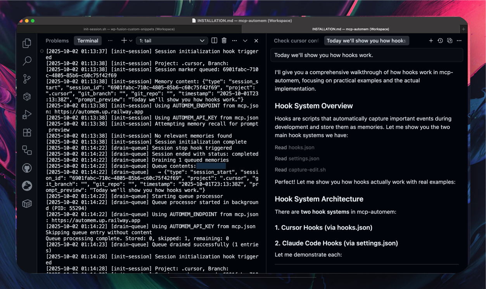

# AutoMem MCP: Give Your AI Perfect Memory 🧠

[](https://www.npmjs.com/package/@verygoodplugins/mcp-automem)
[](LICENSE)

**One command. Infinite memory. Perfect recall across all your AI tools.**

```bash
npx @verygoodplugins/mcp-automem setup
```

Your AI assistant now remembers everything. Forever. Across every conversation.

Works with **Claude Desktop**, **Cursor IDE**, **Claude Code** - any MCP-compatible AI platform.

---

## The Problem We Solve

Every AI conversation starts from zero. Claude forgets your coding style. Cursor can't learn your patterns. Your assistant doesn't remember yesterday's decisions.

**Until now.**

AutoMem MCP connects your AI to persistent memory powered by **[AutoMem](https://github.com/verygoodplugins/automem)** - a graph-vector memory service validated by cutting-edge research (HippoRAG 2, A-MEM, MELODI).

## What You Get

### 🧠 Persistent Memory Across Sessions
- AI remembers decisions, patterns, and context **forever**
- Works across **all MCP platforms** - Claude Desktop, Cursor, Claude Code
- **Cross-device sync** - same memory on Mac, Windows, Linux

### 🏆 Graph-Vector Architecture
- **11 relationship types** between memories (not just similarity)
- **Research-validated** approach (HippoRAG 2: 7% better associative memory)
- **Sub-second retrieval** even with millions of memories

### 🚀 Works Everywhere You Code

| Platform | Support | Setup Time |
|----------|---------|------------|
| **Claude Desktop** | ✅ Full | 30 seconds |
| **Cursor IDE** | ✅ Full + Auto-capture hooks | 1 minute |
| **Claude Code** | ✅ Full + Auto-capture hooks | 1 minute |
| **Warp Terminal** | ✅ Full + Context-aware | 30 seconds |
| **OpenAI Codex** | ✅ Full | 30 seconds |
| **Any MCP client** | ✅ Full | 30 seconds |

## See It In Action

### Cursor IDE with Auto-Capture Hooks

*Automatic memory capture at session start, file edits, and shell commands*

### Claude Code with Session Memory

*Git commits, builds, and deployments automatically stored to memory*

### Your AI Learns Your Code Style
```javascript
// After 1 week, your AI writes EXACTLY like you
// ✅ It knows you prefer early returns
// ✅ It uses your specific variable naming
// ✅ It matches your comment style
// ✅ It follows YOUR patterns, not generic best practices
```

### Decisions That Feel Like Yours
```
User: "Should we use Redis for this?"

Without AutoMem:
"Consider RabbitMQ, Kafka, or AWS SQS based on your needs..."

With AutoMem:
"Based on your pattern of preferring boring technology that works,
and your positive experience with Redis in Project X (March 2024), 
yes. You specifically value operational simplicity over feature 
richness - Redis fits perfectly."
```

## Quick Start

### 1. Set Up Memory Service

AutoMem MCP connects to the **[AutoMem service](https://github.com/verygoodplugins/automem)** (graph + vector storage).

**Deploy your own instance** (required):

```bash
# Option 1: Railway (one-click deploy)
# See https://automem.ai for deployment guide

# Option 2: Docker (local or cloud)
docker-compose up -d
export AUTOMEM_ENDPOINT=http://localhost:8001

# Option 3: Self-hosted cloud
# Deploy to your preferred provider
export AUTOMEM_ENDPOINT=https://your-automem-instance.railway.app
```

👉 **[Deployment Guide](https://github.com/verygoodplugins/automem#deployment)** for AutoMem service setup

### 2. Install MCP Client

```bash
# Guided setup - creates .env and prints config for your AI platform
npx @verygoodplugins/mcp-automem setup
```

The wizard will:
- ✅ Configure your AutoMem endpoint
- ✅ Generate config snippets for Claude Desktop/Cursor/Code
- ✅ Set up authentication (if using private instance)

### 3. Platform-Specific Setup

**For Claude Desktop:**
```bash
# Setup prints config snippet - just paste into claude_desktop_config.json
npx @verygoodplugins/mcp-automem setup
```

**For Cursor IDE:**

<a href="cursor://anysphere.cursor-deeplink/mcp/install?name=automem&config=eyJjb21tYW5kIjoibnB4IiwiYXJncyI6WyJAdmVyeWdvb2RwbHVnaW5zL21jcC1hdXRvbWVtIl0sImVudiI6eyJBVVRPTUVNX0VORFBPSU5UIjoiaHR0cHM6Ly95b3VyLWF1dG9tZW0taW5zdGFuY2UucmFpbHdheS5hcHAiLCJBVVRPTUVNX0FQSV9LRVkiOiJ5b3VyLWFwaS1rZXktaWYtcmVxdWlyZWQifX0=">
  
</a>

```bash
# Or use CLI for full setup with memory-first agent rules
npx @verygoodplugins/mcp-automem cursor
```

> **Note:** After one-click install, configure your `AUTOMEM_ENDPOINT` in Claude Desktop config

**For Claude Code:**
```bash
# Installs automation hooks that capture memories automatically
npx @verygoodplugins/mcp-automem claude-code
```

**For Warp Terminal:**
```bash
# Auto-configures Warp with memory-first terminal assistance
npx @verygoodplugins/mcp-automem warp
```

**For OpenAI Codex:**
```bash
# Add to your Codex MCP configuration
npx @verygoodplugins/mcp-automem config --format=json
```

👉 **[Full Installation Guide](INSTALLATION.md)** for detailed setup instructions

## What Happens Next

| Timeline | What Your AI Learns |
|----------|-------------------|
| **Hour 1** | Starts capturing your patterns |
| **Day 1** | Learns your decision factors |
| **Day 3** | Recognizes your coding style |
| **Week 1** | Writes in your voice |
| **Week 2** | Makes decisions like you would |

## Architecture

```
┌─────────────────────────────────────────────┐
│         Your AI Platforms                   │
│  Claude Desktop │ Cursor │ Claude Code      │
└──────────────┬──────────────────────────────┘
               │ MCP Protocol
               ▼
┌──────────────────────────────────────────────┐
│   @verygoodplugins/mcp-automem (this pkg)   │
│   • Translates MCP calls → AutoMem API      │
│   • Handles authentication                   │
│   • Manages memory lifecycle                 │
└──────────────┬───────────────────────────────┘
               │ HTTP API
               ▼
┌──────────────────────────────────────────────┐
│        AutoMem Service                       │
│        github.com/verygoodplugins/automem    │
│   ┌────────────┐      ┌────────────┐        │
│   │  FalkorDB  │      │   Qdrant   │        │
│   │  (Graph)   │      │ (Vectors)  │        │
│   └────────────┘      └────────────┘        │
└──────────────────────────────────────────────┘
```

**This package** = MCP client that connects your AI to AutoMem  
**[AutoMem service](https://github.com/verygoodplugins/automem)** = Backend with FalkorDB + Qdrant

## Features

### Core Memory Operations
- **`store_memory`** - Save memories with content, tags, importance, metadata
- **`recall_memory`** - Hybrid search (vector + keyword + tags + time)
- **`associate_memories`** - Create relationships (RELATES_TO, LEADS_TO, etc.)
- **`update_memory`** - Modify existing memories
- **`delete_memory`** - Remove memories
- **`check_database_health`** - Monitor service status

### Platform Integrations

#### Cursor IDE
- ✅ **Automation hooks** (beforeSubmitPrompt, afterFileEdit, stop)
- ✅ **Memory-first agent rules** (`.cursor/rules/`)
- ✅ **Automatic memory recall** at session start with context injection
- ✅ **Smart filtering** (skips lock files, node_modules, trivial changes)
- ✅ **Auto-detects project context** (package.json, git remote)
- ✅ **Global user rules option** for all projects
- ✅ **Migration tools** for existing projects

#### Claude Code
- ✅ **Automatic session capture** (git commits, builds, errors, deploys)
- ✅ **Queue-based processing** (non-blocking)
- ✅ **Configurable profiles** (lean/extras)
- ✅ **Relationship tracking** between memories
- ✅ **Smart notifications** (ntfy.sh integration)

#### Claude Desktop
- ✅ Direct MCP integration
- ✅ Manual and automated workflows
- ✅ Full memory API access

#### Warp Terminal
- ✅ Project context auto-detection
- ✅ Memory-first terminal assistance
- ✅ Smart recall on directory changes
- ✅ Command history with context

## Why AutoMem MCP?

### vs. Building Your Own
- ✅ **2 years of R&D** already done
- ✅ **Research-validated** architecture (HippoRAG 2, MELODI, A-MEM)
- ✅ **Working integrations** across all MCP platforms
- ✅ **Active development** and community

### vs. Other Memory Solutions
- ✅ **True graph relationships** (not just vector similarity)
- ✅ **Universal MCP compatibility** (works with any MCP client)
- ✅ **7 memory types** (Decision/Pattern/Preference/Style/Habit/Insight/Context)
- ✅ **Self-hostable** ($5/month vs $150+ for alternatives)

### vs. Native AI Memory
- ✅ **Persistent across sessions** (not just context window)
- ✅ **Cross-platform** (same memory in Claude, Cursor, Code)
- ✅ **Structured relationships** (not just RAG)
- ✅ **Infinite scale** (no context window limits)

## Real-World Results

### Code Review That Knows Your Standards
```
Before AutoMem:
"Consider adding error handling here."

After AutoMem:
"Missing your standard try/except pattern. Based on your PR#127
review comments, you always wrap database calls with specific
logging for timeouts. Apply the same pattern here?"
```

### Decisions With Context
```
Before AutoMem:
"Both approaches have tradeoffs..."

After AutoMem:
"You chose PostgreSQL over MongoDB for similar use case in Q1 2024.
Your decision memo cited team expertise and operational simplicity.
Same factors apply here - go with Postgres."
```

## Documentation

- 📦 **[Installation Guide](INSTALLATION.md)** - Detailed setup for all platforms
- 🔧 **[Configuration](INSTALLATION.md#configuration)** - Environment variables, advanced options
- 🎯 **[Cursor Setup](INSTALLATION.md#cursor-ide)** - IDE integration guide
- 🤖 **[Claude Code Hooks](templates/CLAUDE_CODE_INTEGRATION.md)** - Automation setup
- 💻 **[Warp Terminal Setup](INSTALLATION.md#warp-terminal)** - Terminal integration guide
- 🚀 **[OpenAI Codex Setup](INSTALLATION.md#openai-codex)** - Codex CLI/IDE/Cloud agent integration
- 📖 **[API Reference](INSTALLATION.md#mcp-tools)** - All memory operations
- 🏗️ **[AutoMem Service](https://github.com/verygoodplugins/automem)** - Backend deployment
- 🌐 **[automem.ai](https://automem.ai)** - Official website and guides

## The Science Behind AutoMem

The AutoMem service implements cutting-edge 2025 research:

- **[HippoRAG 2](https://arxiv.org/abs/2502.14802)** (OSU, June 2025): Graph-vector approach achieves 7% better associative memory
- **A-MEM** (July 2025): Dynamic memory organization with Zettelkasten principles  
- **MELODI** (DeepMind, 2025): 8x memory compression without quality loss
- **ReadAgent** (DeepMind, 2024): 20x context extension through gist memories

This MCP package provides the bridge between your AI and that research-validated memory system.

## Community & Support

- 🌐 **[automem.ai](https://automem.ai)** - Official website and deployment guides
- 📦 **[NPM Package](https://www.npmjs.com/package/@verygoodplugins/mcp-automem)** - This MCP client
- 🔬 **[AutoMem Service](https://github.com/verygoodplugins/automem)** - Backend repo
- 🐛 **[GitHub Issues](https://github.com/verygoodplugins/mcp-automem/issues)** - Bug reports

## Quick Links

- [Installation Guide](INSTALLATION.md) - Complete setup instructions
- [Cursor Setup](INSTALLATION.md#cursor-ide) - IDE integration
- [Claude Code Integration](templates/CLAUDE_CODE_INTEGRATION.md) - Automation hooks
- [Warp Terminal Setup](INSTALLATION.md#warp-terminal) - Terminal integration
- [OpenAI Codex Setup](INSTALLATION.md#openai-codex) - Codex integration
- [AutoMem Service Deployment](https://github.com/verygoodplugins/automem#deployment) - Backend setup
- [Changelog](CHANGELOG.md) - Release history

## Contributing

We welcome contributions! Please:

1. Fork the repository
2. Create a feature branch
3. Make your changes with tests
4. Submit a pull request

## License

MIT - Because great memory should be free.

---

**Ready to give your AI perfect memory?**

```bash
npx @verygoodplugins/mcp-automem setup
```

*Built with obsession. Validated by neuroscience. Powered by graph theory. Works with every MCP-enabled AI.*

**Transform your AI from a tool into a teammate. Start now.**

