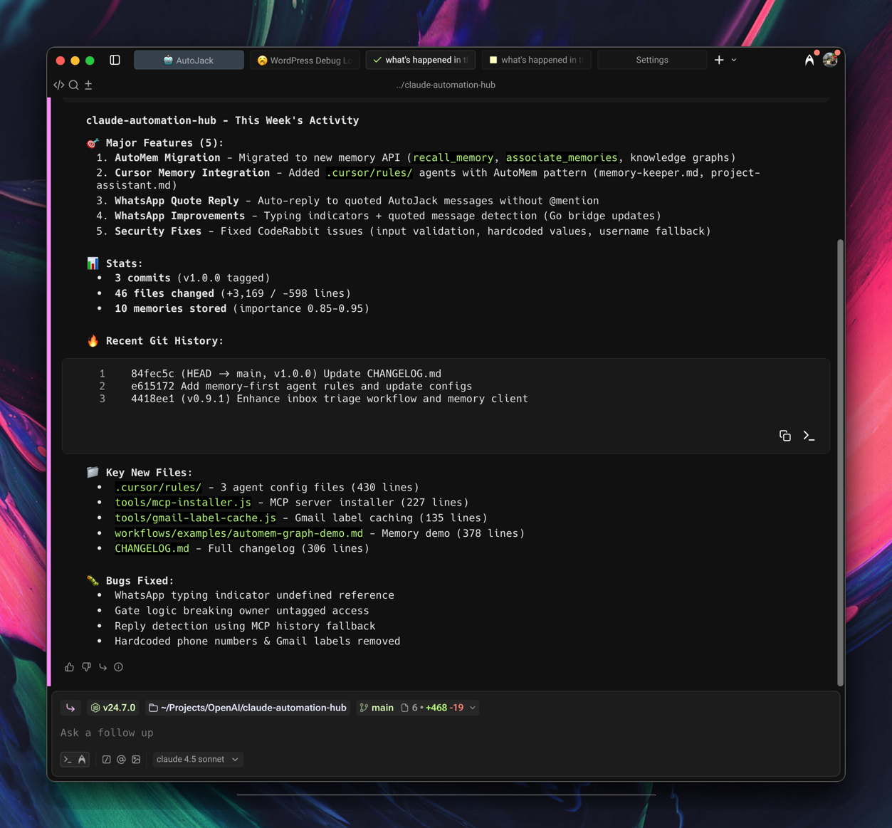

# AutoMem MCP: Give Your AI Perfect Memory 🧠

[](https://www.npmjs.com/package/@verygoodplugins/mcp-automem)
[](LICENSE)

> **⚠️ Beta Notice:** The MCP server and AutoMem cloud service are stable and production-ready. However, platform-specific integrations (Cursor hooks, Claude Code automation, etc.) are actively evolving as we optimize based on new LLM capabilities and real-world usage. Expect frequent updates and improvements.

**One command. Infinite memory. Perfect recall across all your AI tools.**

```bash
npx @verygoodplugins/mcp-automem setup
```

Your AI assistant now remembers everything. Forever. Across every conversation.

Works with **Claude Desktop**, **Cursor IDE**, **Claude Code** - any MCP-compatible AI platform.

---

## The Problem We Solve

Every AI conversation starts from zero. Claude forgets your coding style. Cursor can't learn your patterns. Your assistant doesn't remember yesterday's decisions.

**Until now.**

AutoMem MCP connects your AI to persistent memory powered by **[AutoMem](https://github.com/verygoodplugins/automem)** - a graph-vector memory service validated by cutting-edge research (HippoRAG 2, A-MEM, MELODI).

## What You Get

### 🧠 Persistent Memory Across Sessions
- AI remembers decisions, patterns, and context **forever**
- Works across **all MCP platforms** - Claude Desktop, Cursor, Claude Code
- **Cross-device sync** - same memory on Mac, Windows, Linux

### 🏆 Graph-Vector Architecture
- **11 relationship types** between memories (not just similarity)
- **Research-validated** approach (HippoRAG 2: 7% better associative memory)
- **Sub-second retrieval** even with millions of memories

### 🚀 Works Everywhere You Code

| Platform | Support | Setup Time |
|----------|---------|------------|
| **Claude Desktop** | ✅ Full | 30 seconds |
| **Cursor IDE** | ✅ Full | 30 seconds |
| **Claude Code** | ⚠️ Experimental + Auto-capture hooks | 1 minute |
| **Warp Terminal** | ✅ Full + Context-aware | 30 seconds |
| **OpenAI Codex** | ✅ Full | 30 seconds |
| **Any MCP client** | ✅ Full | 30 seconds |

## See It In Action

### Claude Desktop with Custom Instructions

*Claude automatically recalls memories at conversation start using custom instructions*

### Cursor IDE with Memory Rules

*Cursor uses automem.mdc rule to automatically recall and store memories*

### Claude Code with Session Memory

*Git commits, builds, and deployments automatically stored to memory*

### OpenAI Codex with Memory Rules
*OpenAI Codex uses config.toml to automatically recall and store memories*

### Warp Terminal with Memory Rules

*Warp Terminal uses memory rules to automatically recall and store context*

### Your AI Learns Your Code Style
```javascript
// After 1 week, your AI writes EXACTLY like you
// ✅ It knows you prefer early returns
// ✅ It uses your specific variable naming
// ✅ It matches your comment style
// ✅ It follows YOUR patterns, not generic best practices
```

### Decisions That Feel Like Yours
```
User: "Should we use Redis for this?"

Without AutoMem:
"Consider RabbitMQ, Kafka, or AWS SQS based on your needs..."

With AutoMem:
"Based on your pattern of preferring boring technology that works,
and your positive experience with Redis in Project X (March 2024), 
yes. You specifically value operational simplicity over feature 
richness - Redis fits perfectly."
```

## Quick Start

### 1. Run AutoMem Service Locally

**Best for:** Getting started, development, testing, or if you don't need cross-device sync.

```bash
# Clone AutoMem service repository
git clone https://github.com/verygoodplugins/automem.git
cd automem

# Start all services (API + FalkorDB + Qdrant)
make dev
```

**What just happened?** Docker Compose started three containers:
- **AutoMem API** at `http://localhost:8001` - Memory storage/retrieval service
- **FalkorDB** at `localhost:6379` - Graph database for memory relationships
- **Qdrant** at `localhost:6333` - Vector database for semantic search

**Verify it's running:**
```bash
curl http://localhost:8001/health
# Expected: {"status": "healthy", "falkordb": "connected"}
```

**Default credentials (local only):**
- No API token required for local development
- Service listens on `127.0.0.1` only (not accessible from network)

**Persistent storage:**
- Memories stored in Docker volumes (survive container restarts)
- To reset: `make clean` (⚠️ deletes all memories)

👉 **[Full Local Setup Guide](https://github.com/verygoodplugins/automem/blob/main/INSTALLATION.md)** for advanced configuration

---

### 2. Install MCP Client

Connect your AI tools to the AutoMem service you just started.

```bash
# Guided setup - creates .env and prints config for your AI platform
npx @verygoodplugins/mcp-automem setup
```

**When prompted:**
- **AutoMem Endpoint:** `http://localhost:8001` (or your Railway URL if deployed)
- **API Key:** Leave blank for local development (or paste your token for Railway)

The wizard will:
- ✅ Save your endpoint and API key to `.env`
- ✅ Generate config snippets for Claude Desktop/Cursor/Code
- ✅ Validate connection to your AutoMem service

### 3. Platform-Specific Setup

**For Claude Desktop:**
```bash
# Setup prints config snippet - just paste into claude_desktop_config.json
npx @verygoodplugins/mcp-automem setup
```

**For Cursor IDE:**

[](cursor://anysphere.cursor-deeplink/mcp/install?name=memory&config=eyJlbnYiOnsiQVVUT01FTV9FTkRQT0lOVCI6Imh0dHA6Ly8xMjcuMC4wLjE6ODAwMSIsIkFVVE9NRU1fQVBJX0tFWSI6InlvdXItYXBpLWtleS1pZi1yZXF1aXJlZCJ9LCJjb21tYW5kIjoibnB4IEB2ZXJ5Z29vZHBsdWdpbnMvbWNwLWF1dG9tZW0ifQ%3D%3D)

```bash
# Or use CLI to install automem.mdc rule file
npx @verygoodplugins/mcp-automem cursor
```

> **Note:** After one-click install, configure your `AUTOMEM_ENDPOINT` in `~/.cursor/mcp.json` or Claude Desktop config

**For Claude Code:**
```bash
# Installs automation hooks that capture memories automatically
npx @verygoodplugins/mcp-automem claude-code
```

**For Warp Terminal:**
See the Warp setup guide and add the MCP configuration from `templates/warp/mcp.json` to your `~/.warp/mcp.json`.
Follow usage rules in `templates/warp/warp-rules.md`.

**For OpenAI Codex:**
```bash
# Add to your Codex MCP configuration
npx @verygoodplugins/mcp-automem config --format=json
 
# Optional: add memory-first rules to this repo
npx @verygoodplugins/mcp-automem codex
```

👉 **[Full Installation Guide](INSTALLATION.md)** for detailed setup instructions

---

## Optional: Deploy to Railway

**Should you deploy to Railway?** It depends on your use case:

### ✅ Deploy to Railway if you:
- **Use multiple devices** - Access same memories from laptop, desktop, mobile
- **Collaborate with a team** - Share memories across team members
- **Want always-on availability** - Don't want to start Docker containers daily
- **Need remote access** - Use Claude on a tablet/phone without local services
- **Value simplicity** - Set it once, forget about it ($5/month hands-off)

### 🏠 Stick with local if you:
- **Work on one machine** - Don't need cross-device sync
- **Privacy first** - Keep all memories on your hardware
- **Have Docker skills** - Comfortable managing local services
- **Prefer zero cost** - No cloud bills, just local compute
- **Developing/testing** - Local is faster for iteration

---

### Railway Deployment Guide

**What is Railway?** Cloud hosting platform - like Heroku but modern. Your AutoMem service runs 24/7 in a container.

**Cost breakdown:**
- ✅ **$5 free credits** for 30-day trial (no credit card)
- ✅ **~$0.50/month** typical AutoMem usage after trial
- ✅ **$1/month minimum** if you use less

---

#### Option A: One-Click Deploy ⭐ (Recommended)

[](https://railway.com/deploy/yD_u9d?referralCode=VuFE6g&utm_medium=integration&utm_source=template&utm_campaign=generic)

**What this does:**
- Creates AutoMem API + FalkorDB services automatically
- Sets up persistent storage
- Generates secure API tokens
- Configures networking

**After clicking:**
1. Sign in with GitHub (if not logged in)
2. (Optional) Add `OPENAI_API_KEY` for real embeddings
3. Click **"Deploy"**
4. Wait 60 seconds → Done! ✅

Then jump to [Step 3: Get Your AutoMem URL](#step-3-get-your-automem-url-1-minute) below.

---

#### Option B: Manual Setup

<details>
<summary><b>Prefer manual control? Click to expand manual setup steps</b></summary>

#### Step 1: Create Railway Account (2 minutes)

1. Go to **[railway.app](https://railway.app)**
2. Click **"Start a New Project"** or **"Login"**
3. Sign in with GitHub (create GitHub account first if needed)

---

#### Step 2: Deploy AutoMem Service (5 minutes)

AutoMem runs as **two services** on Railway: the API and FalkorDB database.

**2a. Create New Project**

1. After logging in, click **"New Project"**
2. Choose **"Deploy from GitHub repo"**

**2b. Connect GitHub Repository**

1. Click **"Configure GitHub App"**
2. Install Railway app to your GitHub account
3. Fork **[verygoodplugins/automem](https://github.com/verygoodplugins/automem)** (top right, click "Fork")
4. Back in Railway, select **your fork** of automem
5. Click **"Deploy Now"**

**2c. Add FalkorDB Database**

Railway will deploy the AutoMem API automatically. Now add the database:

1. In your project, click **"+ New"** → **"Empty Service"**
2. In the new service settings:
   - **Name:** `falkordb`
   - **Source:** Docker image
   - **Image:** `falkordb/falkordb:latest`
3. Click **"Deploy"**

**2d. Configure AutoMem API Environment Variables**

1. Click on your **automem** service (not falkordb)
2. Go to **"Variables"** tab
3. Click **"+ New Variable"** and add these:

| Variable | Value | Description |
|----------|-------|-------------|
| `AUTOMEM_API_TOKEN` | Generate a random string* | Auth token for API calls |
| `ADMIN_API_TOKEN` | Generate another random string* | Admin-only operations |
| `FALKORDB_HOST` | `falkordb.railway.internal` | Internal FalkorDB hostname |
| `FALKORDB_PORT` | `6379` | FalkorDB port |
| `OPENAI_API_KEY` | Your OpenAI API key (optional) | Enables real embeddings |

**Generate random strings:* Use `openssl rand -base64 32` in terminal or any password generator.

**Optional:** Add `QDRANT_URL` and `QDRANT_API_KEY` if using Qdrant Cloud for vector search.

4. Click **"Deploy"** to restart with new variables

---

#### Step 3: Get Your AutoMem URL (1 minute)

1. Click on your **automem** service (the API, not falkordb)
2. Go to **"Settings"** tab
3. Scroll to **"Networking"** → **"Public Networking"**
4. Click **"Generate Domain"**
5. **Copy the URL** - looks like: `automem-production-abc123.up.railway.app`

**✅ Save this URL!** You'll need it when you run `npx @verygoodplugins/mcp-automem setup`

---

#### Step 4: Verify Deployment (30 seconds)

Test that everything works:

```bash
# Replace with YOUR Railway URL
curl https://automem-production-abc123.up.railway.app/health
```

**Expected response:**
```json
{"status": "healthy", "falkordb": "connected"}
```

**Got an error?**
- `503 Service Unavailable` = FalkorDB can't connect. Check:
  - `FALKORDB_HOST` is set to `falkordb.railway.internal`
  - FalkorDB service is running (green dot in Railway dashboard)
  - Volume is mounted at `/data`
- `401 Unauthorized` = You're trying a protected endpoint. `/health` should work without auth.

---

#### Step 5: Update MCP Client Configuration

Now point your MCP client to Railway instead of localhost:

```bash
# Re-run setup with your Railway URL
npx @verygoodplugins/mcp-automem setup
```

**When prompted:**
- **AutoMem Endpoint:** `https://automem-production-abc123.up.railway.app` (your URL)
- **API Key:** Paste your `AUTOMEM_API_TOKEN` from Step 2e

That's it! Your AI tools now connect to Railway instead of localhost.

</details>

---

#### What You Just Built

```
┌─────────────────────────────────────┐
│  Railway Cloud (Your Free Tier)    │
│                                     │
│  ┌────────────────┐  ┌───────────┐ │
│  │  AutoMem API   │  │ FalkorDB  │ │
│  │  (Flask)       │──│ (Graph DB)│ │
│  │  Port: 443     │  │ +Volume   │ │
│  └────────────────┘  └───────────┘ │
│         ▲                           │
│         │ HTTPS                     │
│         │ (your-url.railway.app)    │
└─────────┼───────────────────────────┘
          │
          ▼
   Your AI Tools
   (any device, anywhere)
```

👉 **[Full Railway Deployment Guide](RAILWAY_TEMPLATE_GUIDE.md)** for advanced configuration and troubleshooting

---

## What Happens Next

| Timeline | What Your AI Learns |
|----------|-------------------|
| **Hour 1** | Starts capturing your patterns |
| **Day 1** | Learns your decision factors |
| **Day 3** | Recognizes your coding style |
| **Week 1** | Writes in your voice |
| **Week 2** | Makes decisions like you would |

## Architecture

```
┌─────────────────────────────────────────────┐
│         Your AI Platforms                   │
│  Claude Desktop │ Cursor │ Claude Code      │
└──────────────┬──────────────────────────────┘
               │ MCP Protocol
               ▼
┌──────────────────────────────────────────────┐
│   @verygoodplugins/mcp-automem (this pkg)   │
│   • Translates MCP calls → AutoMem API      │
│   • Handles authentication                   │
│   • Manages memory lifecycle                 │
└──────────────┬───────────────────────────────┘
               │ HTTP API
               ▼
┌──────────────────────────────────────────────┐
│        AutoMem Service                       │
│        github.com/verygoodplugins/automem    │
│   ┌────────────┐      ┌────────────┐        │
│   │  FalkorDB  │      │   Qdrant   │        │
│   │  (Graph)   │      │ (Vectors)  │        │
│   └────────────┘      └────────────┘        │
└──────────────────────────────────────────────┘
```

**This package** = MCP client that connects your AI to AutoMem  
**[AutoMem service](https://github.com/verygoodplugins/automem)** = Backend with FalkorDB + Qdrant

## Features

### Core Memory Operations
- **`store_memory`** - Save memories with content, tags, importance, metadata
- **`recall_memory`** - Hybrid search (vector + keyword + tags + time)
- **`associate_memories`** - Create relationships (RELATES_TO, LEADS_TO, etc.)
- **`update_memory`** - Modify existing memories
- **`delete_memory`** - Remove memories
- **`check_database_health`** - Monitor service status

### Platform Integrations

#### Cursor IDE
- ✅ **Memory-first rule file** (`automem.mdc` in `.cursor/rules/`)
- ✅ **Automatic memory recall** at conversation start
- ✅ **Auto-detects project context** (package.json, git remote)
- ✅ **Global user rules option** for all projects
- ✅ **Simple setup** via CLI or one-click install

#### Claude Code
- ✅ **Automatic session capture** (git commits, builds, tests, deploys)
- ✅ **Queue-based processing** with deduplication (non-blocking)
- ✅ **Smart filtering** (skips trivial files, lock files, build artifacts)
- ✅ **Configurable profiles** (lean/extras)
- ✅ **Relationship tracking** between memories
- ✅ **Efficient defaults** (~1-2 captures/session, high signal-to-noise)

#### Claude Desktop
- ✅ Direct MCP integration
- ✅ Manual and automated workflows
- ✅ Full memory API access

#### Warp Terminal
- ✅ Project context auto-detection
- ✅ Memory-first terminal assistance
- ✅ Smart recall on directory changes
- ✅ Command history with context

## Why AutoMem MCP?

### vs. Building Your Own
- ✅ **2 years of R&D** already done
- ✅ **Research-validated** architecture (HippoRAG 2, MELODI, A-MEM)
- ✅ **Working integrations** across all MCP platforms
- ✅ **Active development** and community

### vs. Other Memory Solutions
- ✅ **True graph relationships** (not just vector similarity)
- ✅ **Universal MCP compatibility** (works with any MCP client)
- ✅ **7 memory types** (Decision/Pattern/Preference/Style/Habit/Insight/Context)
- ✅ **Self-hostable** ($5/month vs $150+ for alternatives)

### vs. Native AI Memory
- ✅ **Persistent across sessions** (not just context window)
- ✅ **Cross-platform** (same memory in Claude, Cursor, Code)
- ✅ **Structured relationships** (not just RAG)
- ✅ **Infinite scale** (no context window limits)

## Real-World Results

### Code Review That Knows Your Standards
```
Before AutoMem:
"Consider adding error handling here."

After AutoMem:
"Missing your standard try/except pattern. Based on your PR#127
review comments, you always wrap database calls with specific
logging for timeouts. Apply the same pattern here?"
```

### Decisions With Context
```
Before AutoMem:
"Both approaches have tradeoffs..."

After AutoMem:
"You chose PostgreSQL over MongoDB for similar use case in Q1 2024.
Your decision memo cited team expertise and operational simplicity.
Same factors apply here - go with Postgres."
```

## Documentation

- 📦 **[Installation Guide](INSTALLATION.md)** - Detailed setup for all platforms
- 🔧 **[Configuration](INSTALLATION.md#configuration)** - Environment variables, advanced options
- 🎯 **[Cursor Setup](INSTALLATION.md#cursor-ide)** - IDE integration guide
- 🤖 **[Claude Code Hooks](templates/CLAUDE_CODE_INTEGRATION.md)** - Automation setup
- 💻 **[Warp Terminal Setup](INSTALLATION.md#warp-terminal)** - Terminal integration guide
- 🚀 **[OpenAI Codex Setup](INSTALLATION.md#openai-codex)** - Codex CLI/IDE/Cloud agent integration
- 📖 **[API Reference](INSTALLATION.md#mcp-tools)** - All memory operations
- 🏗️ **[AutoMem Service](https://github.com/verygoodplugins/automem)** - Backend deployment

## The Science Behind AutoMem

The AutoMem service implements cutting-edge 2025 research:

- **[HippoRAG 2](https://arxiv.org/abs/2502.14802)** (OSU, June 2025): Graph-vector approach achieves 7% better associative memory
- **A-MEM** (July 2025): Dynamic memory organization with Zettelkasten principles  
- **MELODI** (DeepMind, 2025): 8x memory compression without quality loss
- **ReadAgent** (DeepMind, 2024): 20x context extension through gist memories

This MCP package provides the bridge between your AI and that research-validated memory system.

## Community & Support

- 📦 **[NPM Package](https://www.npmjs.com/package/@verygoodplugins/mcp-automem)** - This MCP client
- 🔬 **[AutoMem Service](https://github.com/verygoodplugins/automem)** - Backend repo with deployment guides
- 🐛 **[GitHub Issues](https://github.com/verygoodplugins/mcp-automem/issues)** - Bug reports and feature requests
- 🐦 **[@verygoodplugins](https://x.com/verygoodplugins)** - Updates and announcements

## Quick Links

- [Installation Guide](INSTALLATION.md) - Complete setup instructions
- [Cursor Setup](INSTALLATION.md#cursor-ide) - IDE integration
- [Claude Code Integration](templates/CLAUDE_CODE_INTEGRATION.md) - Automation hooks
- [Warp Terminal Setup](INSTALLATION.md#warp-terminal) - Terminal integration
- [OpenAI Codex Setup](INSTALLATION.md#openai-codex) - Codex integration
- [AutoMem Service Deployment](https://github.com/verygoodplugins/automem#deployment) - Backend setup
- [Changelog](CHANGELOG.md) - Release history

## Contributing

We welcome contributions! Please:

1. Fork the repository
2. Create a feature branch
3. Make your changes with tests
4. Submit a pull request

## License

MIT - Because great memory should be free.

---

**Ready to give your AI perfect memory?**

```bash
npx @verygoodplugins/mcp-automem setup
```

*Built with obsession. Validated by neuroscience. Powered by graph theory. Works with every MCP-enabled AI.*

*Designed by Jack Arturo at [Very Good Plugins](https://verygoodplugins.com)* 🧡

**Transform your AI from a tool into a teammate. Start now.**
