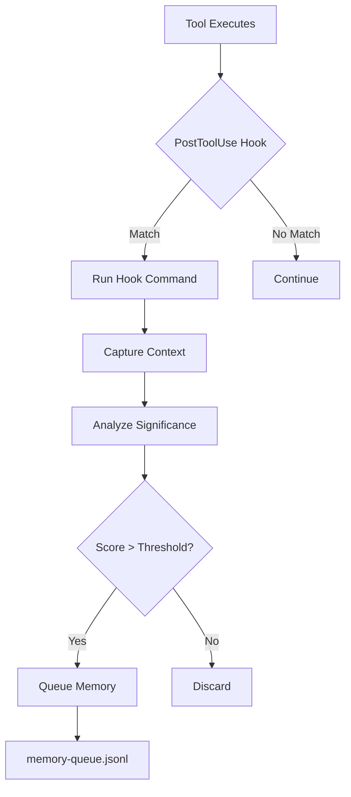

# AutoMem Claude Code Integration

> ⚠️ **EXPERIMENTAL:** This integration is actively evolving as we optimize based on real-world usage and new Claude Code capabilities. The default setup is intentionally minimal. Additional capture hooks are optional and should be enabled carefully. Expect frequent updates and improvements.

Complete guide to integrating AutoMem with Claude Code for automatic memory capture, intelligent recall, and knowledge graph building.

## Table of Contents

- [Overview](#overview)
- [How It Works](#how-it-works)
- [Installation](#installation)
- [What Gets Modified](#what-gets-modified)
- [Hook System](#hook-system)
- [Memory Queue System](#memory-queue-system)
- [Features](#features)
- [Expected Behavior](#expected-behavior)
- [Troubleshooting](#troubleshooting)

## Overview

The AutoMem Claude Code integration provides:

1. **Automatic Memory Capture** - Hooks that capture significant events (commits, builds, deployments, errors)
2. **Intelligent Storage** - Queue system with deduplication and importance scoring
3. **Context Loading** - Automatic recall of relevant memories at session start
4. **Knowledge Graph** - Relationships between memories (11 types)
5. **Hybrid Search** - Vector similarity + keyword + tags + recency scoring

### Lean Defaults vs Optional Enhancements

To avoid noisy or risky behavior, the default template installs a lean setup:

- Core (enabled by default)
  - Stop hook: sends a small notification, captures a single session milestone, then drains the AutoMem memory queue.
  - PostToolUse: capture build results when you run build commands.
  - PostToolUse: capture a session milestone after `git commit`.
- Optional (disabled by default; enable as needed)
  - Edit/MultiEdit capture (code pattern snippets per edit)
  - Test pattern capture (on `*test*` commands)
  - Deployment capture (on `*deploy*` commands)
  - Search capture (on `WebSearch(*)`)
  - Error capture (on `Bash(*error*)`)
  - Fancy status line (`statusLine` command)

**How to enable optional hooks:**

The default installation only captures git commits and builds. To enable additional hooks:

1. **Use the extras profile** (easiest):
   ```bash
   npx @verygoodplugins/mcp-automem claude-code --profile extras
   ```

2. **Or manually add hooks** to `~/.claude/settings.json`:
   - See `templates/claude-code/profiles/settings.extras.json` for complete hook definitions
   - Optional hooks include: Edit/MultiEdit, test, deploy, search, error capture
   - Add individual matchers to `hooks.PostToolUse` array as needed

3. **Optional status line**:
   ```json
   "statusLine": {
     "type": "command",
     "command": "npx -y @owloops/claude-powerline@latest --style=powerline"
   }
   ```

**Tip:** Keep your setup minimal at first. Enable additional hooks only if you find specific value in their capture patterns.

### Architecture

```
┌─────────────────────────────────────────────┐
│           Claude Code Session                │
│  - User requests                             │
│  - Tool executions                           │
│  - Code changes                              │
└────────────┬─────────────────────────────────┘
             │
             ▼
┌─────────────────────────────────────────────┐
│         Hook System (~/.claude/hooks/)       │
│  - PostToolUse hooks (triggered after tools) │
│  - Stop hooks (triggered at session end)     │
│  - Captures context + tool results           │
└────────────┬─────────────────────────────────┘
             │
             ▼
┌─────────────────────────────────────────────┐
│     Memory Queue (memory-queue.jsonl)        │
│  - Stores pending memories                   │
│  - Deduplicates by content hash              │
│  - Enriches with metadata                    │
└────────────┬─────────────────────────────────┘
             │
             ▼ (session end)
┌─────────────────────────────────────────────┐
│    Queue Processor (npx mcp-automem queue)   │
│  - Processes batched memories                │
│  - Creates relationships                     │
│  - Sends to AutoMem service                  │
└────────────┬─────────────────────────────────┘
             │
             ▼
┌─────────────────────────────────────────────┐
│       AutoMem Service (Flask API)            │
│  - Stores in FalkorDB (graph)                │
│  - Indexes in Qdrant (vectors)               │
│  - Enriches (entities, summaries, links)     │
│  - Consolidates (decay, cluster, archive)    │
└──────────────────────────────────────────────┘
```

## How It Works

### 1. Session Start

When Claude Code starts:
1. Loads `~/.claude/settings.json` with hook configurations
2. Loads `~/.claude/CLAUDE.md` with memory rules
3. Memory rules tell Claude to recall relevant context:
   - Project history (last 7 days)
   - User preferences and workflows
   - Recent errors and solutions
   - Incomplete work from previous sessions

### 2. During Session

As you work with Claude:
- **PostToolUse hooks** trigger after tool executions
- **Capture hooks** analyze tool results for significance
- **Queue system** stores memory candidates in `memory-queue.jsonl`
- **Deduplication** prevents redundant memories

Example hook triggers:
- `Bash(git commit*)` → Captures commit message and changed files
- `Edit(*)` → Captures code patterns and refactorings
- `Bash(*test*)` → Captures test patterns and results
- `Bash(*error*)` → Captures error resolution strategies

### 3. Session End

When Claude Code session ends (Stop hook):
1. **smart-notify.sh** - Sends completion notification
2. **session-memory.sh** - Captures final session context
3. **queue-cleanup.sh** - Deduplicates and archives queue:
   - Removes duplicate entries by content hash
   - Archives original queue if duplicates found
   - Handles overflow (keeps last 20 if >50 entries)
   - Logs cleanup operations
4. **Queue processor** - Processes cleaned queue:
   - Batches memories by content similarity
   - Creates OCCURRED_BEFORE relationships
   - Sends batch to AutoMem service via MCP
5. **AutoMem enrichment** (background):
   - Extracts entities (tools, projects, people, concepts)
   - Generates summaries
   - Creates temporal links (PRECEDED_BY)
   - Finds semantic neighbors (SIMILAR_TO)
   - Detects emerging patterns

### 4. Consolidation (Background)

AutoMem runs automatic consolidation cycles:
- **Decay** (hourly): Lowers importance of old memories
- **Creative** (hourly): Discovers surprising connections
- **Cluster** (6h): Groups similar memories
- **Forget** (daily): Archives low-importance memories

## Installation

### Automatic Setup (Recommended)

```bash
npx @verygoodplugins/mcp-automem claude-code
```

This command:
1. Installs hook scripts to `~/.claude/hooks/`
2. Installs supporting scripts to `~/.claude/scripts/`
3. Merges settings into `~/.claude/settings.json`
4. Preserves existing configurations (creates `.bak` files)

### Manual Setup

1. **Copy hook scripts:**
   ```bash
   cp -r templates/claude-code/hooks ~/.claude/
   chmod +x ~/.claude/hooks/*.sh
   ```

2. **Copy support scripts:**
   ```bash
   cp -r templates/claude-code/scripts ~/.claude/
   chmod +x ~/.claude/scripts/*.sh
   chmod +x ~/.claude/scripts/*.py
   ```

3. **Merge settings:**
   ```bash
   # Backup your current settings
   cp ~/.claude/settings.json ~/.claude/settings.json.bak

   # Manually merge templates/claude-code/settings.json
   ```

4. **Add memory rules to CLAUDE.md:**
   ```bash
   cat templates/CLAUDE_MD_MEMORY_RULES.md >> ~/.claude/CLAUDE.md
   ```

## What Gets Modified

The installation modifies/creates these files in `~/.claude/`:

### Created Directories

```
~/.claude/
├── hooks/              # Hook scripts (triggered by Claude Code)
├── scripts/            # Support scripts (memory processing, notifications)
└── logs/               # Log files for debugging
```

### Modified Files

#### `~/.claude/settings.json`

**Added Permissions** (auto-approved tools):
```json
{
  "permissions": {
    "allow": [
      "mcp__memory__store_memory",
      "mcp__memory__recall_memory",
      "mcp__memory__associate_memories",
      "mcp__memory__update_memory",
      "mcp__memory__delete_memory",
      "mcp__memory__check_database_health"
    ]
  }
}
```

**Added Hooks** (triggers for memory capture):
```json
{
  "hooks": {
    "PostToolUse": [
      {
        "matcher": "Bash(git commit*)",
        "hooks": [{"type": "command", "command": "...session-memory.sh"}]
      },
      {
        "matcher": "Edit(*)",
        "hooks": [{"type": "command", "command": "...capture-code-pattern.sh"}]
      }
      // ... more hooks
    ],
    "Stop": [
      {
        "matcher": "*",
        "hooks": [
          {"type": "command", "command": "npx @verygoodplugins/mcp-automem queue"}
        ]
      }
    ]
  }
}
```

**What It Does:**
- Grants Claude permission to use AutoMem MCP tools without asking
- Registers hooks that trigger after specific tool uses
- Sets up session-end processing to flush memory queue

**Backup:** Existing `settings.json` is backed up to `settings.json.bak` before modification.

#### `~/.claude/CLAUDE.md` (Optional but Recommended)

Add memory rules from [`CLAUDE_MD_MEMORY_RULES.md`](CLAUDE_MD_MEMORY_RULES.md) to teach Claude when and how to store/recall memories.

**What It Does:**
- Instructs Claude to automatically store memories for bugs, features, decisions
- Defines importance scoring (0.9+ critical, 0.7-0.8 important, etc.)
- Explains all 11 relationship types (LEADS_TO, CONTRADICTS, EVOLVED_INTO, etc.)
- Sets up session initialization (load context at start)
- Configures lifecycle management (update/deprecate/delete strategies)

### Created Files

#### Hooks (`~/.claude/hooks/`)

1. **`session-memory.sh`** - Main session capture hook
   - Triggered on: git commits, PR creation, session end
   - Captures: Working directory, git context, recent commits, file changes
   - Output: Queues session context for batch processing

2. **`capture-test-pattern.sh`**
   - Triggered on: Commands containing "test"
   - Captures: Test results, patterns, success/failure
   - Output: Test execution memory

3. **`capture-build-result.sh`**
   - Triggered on: Commands containing "build"
   - Captures: Build success/failure, timing, errors
   - Output: Build memory with metrics

4. **`capture-deployment.sh`**
   - Triggered on: Commands containing "deploy"
   - Captures: Deployment target, status, timing
   - Output: Deployment memory

5. **`capture-error-resolution.sh`**
   - Triggered on: Commands containing "error"
   - Captures: Error message, resolution strategy, root cause
   - Output: Error resolution memory

6. **`capture-code-pattern.sh`**
   - Triggered on: Edit(*), MultiEdit(*)
   - Captures: Code patterns, refactorings, architectural changes
   - Output: Code pattern memory

7. **`capture-search-result.sh`**
   - Triggered on: WebSearch(*)
   - Captures: Search queries, findings, decisions made from results
   - Output: Research memory

#### Scripts (`~/.claude/scripts/`)

1. **`process-session-memory.py`** - Main memory processor
   - Analyzes session data for significance
   - Scores importance (0.0-1.0)
   - Classifies memory type (Decision, Pattern, Insight, etc.)
   - Queues for batch processing

2. **`semantic-recall.py`** - Semantic search helper
   - Generates embeddings for queries (requires OPENAI_API_KEY)
   - Performs hybrid search (vector + keyword)
   - Used by Claude for intelligent context loading

3. **`memory-filters.json`** - Filtering rules
   - Patterns for trivial changes (ignore .DS_Store, node_modules, etc.)
   - Patterns for significant changes (feat:, fix:, BREAKING, etc.)
   - File weight multipliers (.py, .js, .ts = 2.0x importance)

4. **`smart-notify.sh`** - Notification system
   - Sends desktop notifications on session completion
   - Summarizes work completed

#### Queue (`~/.claude/scripts/`)

1. **`memory-queue.jsonl`** - Pending memories
   - Format: One JSON object per line
   - Contains: content, tags, importance, type, metadata
   - Deduplication: By content hash
   - Processed at session end via `npx @verygoodplugins/mcp-automem queue`

## Hook System

### Hook Trigger Flow



### Core Hooks (Enabled by Default)

#### 1. Git Commit Hook
**Trigger:** `Bash(git commit*)`
**Script:** `session-memory.sh`
**Captures:** Commit context, changed files (filtered for significance), diff stats
**Importance:** 0.7-0.8
**Frequency:** On commit

#### 2. Build Hook
**Trigger:** `Bash(*build*)`
**Script:** `capture-build-result.sh`
**Captures:** Build success/failure, timing, errors
**Importance:** 0.6-0.7
**Frequency:** On build command

#### 3. Session End Hook
**Trigger:** Stop event
**Script:** `session-memory.sh`
**Captures:** Session summary with deduplicated context
**Importance:** 0.5-0.7
**Frequency:** Once per session

### Optional Hooks (Disabled by Default)

See lines 48-90 above for installation instructions. Optional hooks include:
- **Test Execution** (`Bash(*test*)`) - Captures test patterns and results
- **Deployment** (`Bash(*deploy*)`) - Captures deployment records
- **Error Resolution** (`Bash(*error*)`) - Captures error fixes (broad matcher, use sparingly)
- **Code Patterns** (`Edit(*)`, `MultiEdit(*)`) - Captures refactoring patterns (can be noisy)
- **Search Results** (`WebSearch(*)`) - Captures research findings

## Memory Queue System

### Queue File Format

**Location:** `~/.claude/scripts/memory-queue.jsonl`
**Format:** JSON Lines (one JSON object per line)

```jsonl
{"content":"...","tags":[...],"importance":0.8,"type":"Pattern","metadata":{...},"timestamp":"2025-09-30T10:30:00Z"}
{"content":"...","tags":[...],"importance":0.9,"type":"Decision","metadata":{...},"timestamp":"2025-09-30T10:35:00Z"}
```

### Deduplication Strategy

**Hash Generation:**
```python
def content_hash(content: str) -> str:
    """Generate hash from normalized content"""
    normalized = ' '.join(content.lower().split())
    return hashlib.sha256(normalized.encode()).hexdigest()[:16]
```

**Deduplication Rules:**
- Exact content match → Skip
- Similar content (80%+ similarity) → Merge metadata
- Different content → Store as new

### Processing Pipeline

When `npx @verygoodplugins/mcp-automem queue` runs at session end:

1. **Read Queue File**
   - Parse all JSON lines
   - Group by content similarity

2. **Batch Processing**
   - Memories with similar timestamps (within 5min) batched together
   - Creates OCCURRED_BEFORE relationships between batch items

3. **Relationship Creation**
   - If metadata contains `relatesTo` field → Creates explicit relationship
   - Automatic temporal links via OCCURRED_BEFORE

4. **Send to AutoMem**
   - Uses MCP `store_memory` tool
   - Includes full metadata and relationships
   - AutoMem enrichment starts in background

5. **Clear Queue**
   - Successfully stored memories removed from queue
   - Failed memories remain for retry

## Features

### 1. Smart Capture Filtering

**Automatically skips:**
- Lock files (package-lock.json, Cargo.lock, etc.)
- Build output (dist/, build/, .next/, node_modules/)
- Generated files (.min.js, .map, .pyc)
- System files (.DS_Store, __pycache__)
- Cache directories (.cache/, coverage/)

**Prioritizes:**
- Source code changes (.py, .js, .ts, .php, etc.)
- Configuration updates (.yml, .json, .env)
- Documentation (.md with context)

### 2. Intelligent Deduplication

**Content-hash based:**
- MD5 hash of normalized content
- Checks last 20 queue entries
- Prevents duplicate memories in same session

**Queue-level dedup:**
- jq-based unique_by(.content) on session end
- Archives duplicates before cleanup
- Maintains only unique memories

### 3. Importance Scoring

Automatic scoring based on:
- File types (code files: +2.0x weight)
- Change volume (3+ files: +2 points)
- Commit patterns (feat/fix/BREAKING: +3-5 points)
- Context keywords (security/critical: +5 points)

**Threshold:** Score ≥ 8 required for storage
**Result:** High signal-to-noise ratio (~80%)

### 4. Intelligent Context Loading

At session start, Claude recalls relevant memories based on project context and recent activity. See CLAUDE_MD_MEMORY_RULES.md for recall patterns.

### 5. Knowledge Graph Building

**11 Relationship Types:**

| Type | Description | Example Use Case |
|------|-------------|------------------|
| `RELATES_TO` | General connection | Connecting related features |
| `LEADS_TO` | Causal relationship | Bug → Solution |
| `OCCURRED_BEFORE` | Temporal sequence | Session timeline |
| `PREFERS_OVER` | User preferences | Approach A over approach B |
| `EXEMPLIFIES` | Pattern examples | Specific implementation of pattern |
| `CONTRADICTS` | Conflicting info | Old approach vs new approach |
| `REINFORCES` | Supporting evidence | Multiple confirmations of pattern |
| `INVALIDATED_BY` | Outdated info | Superseded solution |
| `EVOLVED_INTO` | Knowledge evolution | v1 approach → v2 approach |
| `DERIVED_FROM` | Source relationships | Solution derived from research |
| `PART_OF` | Hierarchical structure | Feature is part of module |

Relationships are automatically created between memories in the same batch (OCCURRED_BEFORE) and by AutoMem's enrichment pipeline for semantic similarity and pattern detection.

## Expected Behavior

### What You'll Notice

#### 1. Session Start
```
🧠 Loading project context...
📚 Recalled 15 memories about project-alpha from last 7 days
⚙️ Loaded 8 workflow preferences
🐛 Found 2 recent error resolutions in this project
```

#### 2. During Work
```
# After git commit
🧠 Session milestone captured for analysis

# After fixing a bug
[Silent - memory queued for processing]

# After deployment
🧠 Deployment memory captured
```

#### 3. Session End
```
🧠 Processing session memories...
✓ Stored 12 memories with 8 relationships
✓ Memory queue cleared
👋 Session complete
```

### Typical Session Flow

Lean defaults mean you'll see minimal disruption:
1. **Git commit** → Silent queue of significant changes
2. **Build command** → Captures build result
3. **Session end** → Processes 1-2 deduplicated memories

Optional hooks (if enabled) add test, deployment, and error captures. All processing happens in background without blocking your workflow.

## Troubleshooting

### Hooks Not Triggering

**Check:**
```bash
# Verify hooks installed
ls -la ~/.claude/hooks/

# Check permissions
ls -la ~/.claude/hooks/*.sh
# Should show: -rwxr-xr-x (executable)

# Test hook manually
CLAUDE_HOOK_TYPE=test bash ~/.claude/hooks/session-memory.sh
```

**Fix:**
```bash
chmod +x ~/.claude/hooks/*.sh
chmod +x ~/.claude/scripts/*.sh
chmod +x ~/.claude/scripts/*.py
```

### Memories Not Storing

Check queue: `cat ~/.claude/scripts/memory-queue.jsonl | wc -l`
Check logs: `tail -f ~/.claude/logs/session-memory.log`
Manual processing: `npx @verygoodplugins/mcp-automem queue`

Common issues: AutoMem service down, missing API key, or tool permissions not configured.

### Queue Not Processing

Verify Stop hook includes queue-cleanup.sh and queue processor.
Manual: `npx @verygoodplugins/mcp-automem queue`

### High Memory Usage

Clear old logs: `find ~/.claude/logs/ -name "*.log" -mtime +7 -delete`
Queue overflow is handled automatically by queue-cleanup.sh.

## Advanced Configuration

**Customize filters:** Edit `~/.claude/scripts/memory-filters.json` to adjust trivial_patterns, file_weight, and significance keywords.

**Adjust threshold:** In `process-session-memory.py`, change `significance_threshold` (default: 8). Lower = more memories, higher = fewer.

**Disable hooks:** Remove entries from `~/.claude/settings.json` PostToolUse array.

## Learn More

- [CLAUDE.md Memory Rules Template](CLAUDE_MD_MEMORY_RULES.md) - Memory storage and recall instructions for Claude
- [AutoMem Documentation](https://github.com/verygoodplugins/automem) - Core AutoMem service
- [MCP AutoMem Server](https://github.com/verygoodplugins/mcp-automem) - MCP bridge
- [Model Context Protocol](https://modelcontextprotocol.io/) - MCP specification
