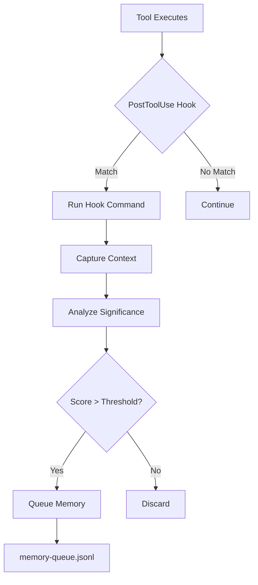

# AutoMem Claude Code Integration

Complete guide to integrating AutoMem with Claude Code for automatic memory capture, intelligent recall, and knowledge graph building.

## Table of Contents

- [Overview](#overview)
- [How It Works](#how-it-works)
- [Installation](#installation)
- [What Gets Modified](#what-gets-modified)
- [Hook System](#hook-system)
- [Memory Queue System](#memory-queue-system)
- [Features](#features)
- [Expected Behavior](#expected-behavior)
- [Troubleshooting](#troubleshooting)

## Overview

The AutoMem Claude Code integration provides:

1. **Automatic Memory Capture** - Hooks that capture significant events (commits, builds, deployments, errors)
2. **Intelligent Storage** - Queue system with deduplication and importance scoring
3. **Context Loading** - Automatic recall of relevant memories at session start
4. **Knowledge Graph** - Relationships between memories (11 types)
5. **Hybrid Search** - Vector similarity + keyword + tags + recency scoring

### Lean Defaults vs Optional Enhancements

To avoid noisy or risky behavior, the default template installs a lean setup:

- Core (enabled by default)
  - Stop hook: sends a small notification, captures a single session milestone, then drains the AutoMem memory queue.
  - PostToolUse: capture build results when you run build commands.
  - PostToolUse: capture a session milestone after `git commit`.
- Optional (disabled by default; enable as needed)
  - Edit/MultiEdit capture (code pattern snippets per edit)
  - Test pattern capture (on `*test*` commands)
  - Deployment capture (on `*deploy*` commands)
  - Search capture (on `WebSearch(*)`)
  - Error capture (on `Bash(*error*)`)
  - Fancy status line (`statusLine` command)

How to enable optional hooks

1) Open `~/.claude/settings.json` (or the target settings file you applied from `templates/claude-code/settings.json`).
2) Under `hooks.PostToolUse`, add any of the blocks below:

```jsonc
// Edit/MultiEdit capture
{
  "matcher": "Edit(*)",
  "hooks": [
    { "type": "command", "command": "CLAUDE_HOOK_TYPE=code_edit bash \"$HOME/.claude/hooks/capture-code-pattern.sh\"" }
  ]
},
{
  "matcher": "MultiEdit(*)",
  "hooks": [
    { "type": "command", "command": "CLAUDE_HOOK_TYPE=code_edit bash \"$HOME/.claude/hooks/capture-code-pattern.sh\"" }
  ]
},
// Tests
{
  "matcher": "Bash(*test*)",
  "hooks": [
    { "type": "command", "command": "CLAUDE_HOOK_TYPE=test_run bash \"$HOME/.claude/hooks/capture-test-pattern.sh\"" }
  ]
},
// Deployment
{
  "matcher": "Bash(*deploy*)",
  "hooks": [
    { "type": "command", "command": "CLAUDE_HOOK_TYPE=deploy bash \"$HOME/.claude/hooks/capture-deployment.sh\"" }
  ]
},
// Search results (if your Claude build supports WebSearch events)
{
  "matcher": "WebSearch(*)",
  "hooks": [
    { "type": "command", "command": "CLAUDE_HOOK_TYPE=search bash \"$HOME/.claude/hooks/capture-search-result.sh\"" }
  ]
},
// Error capture (broad matcher; enable only if useful)
{
  "matcher": "Bash(*error*)",
  "hooks": [
    { "type": "command", "command": "CLAUDE_HOOK_TYPE=error bash \"$HOME/.claude/hooks/capture-error-resolution.sh\"" }
  ]
}
```

3) Optional status line (runs an external command each session):

```jsonc
"statusLine": {
  "type": "command",
  "command": "npx -y @owloops/claude-powerline@latest --style=powerline"
}
```

Tip: Keep your setup quiet at first; enable only what you find valuable.

### Architecture

```
┌─────────────────────────────────────────────┐
│           Claude Code Session                │
│  - User requests                             │
│  - Tool executions                           │
│  - Code changes                              │
└────────────┬─────────────────────────────────┘
             │
             ▼
┌─────────────────────────────────────────────┐
│         Hook System (~/.claude/hooks/)       │
│  - PostToolUse hooks (triggered after tools) │
│  - Stop hooks (triggered at session end)     │
│  - Captures context + tool results           │
└────────────┬─────────────────────────────────┘
             │
             ▼
┌─────────────────────────────────────────────┐
│     Memory Queue (memory-queue.jsonl)        │
│  - Stores pending memories                   │
│  - Deduplicates by content hash              │
│  - Enriches with metadata                    │
└────────────┬─────────────────────────────────┘
             │
             ▼ (session end)
┌─────────────────────────────────────────────┐
│    Queue Processor (npx mcp-automem queue)   │
│  - Processes batched memories                │
│  - Creates relationships                     │
│  - Sends to AutoMem service                  │
└────────────┬─────────────────────────────────┘
             │
             ▼
┌─────────────────────────────────────────────┐
│       AutoMem Service (Flask API)            │
│  - Stores in FalkorDB (graph)                │
│  - Indexes in Qdrant (vectors)               │
│  - Enriches (entities, summaries, links)     │
│  - Consolidates (decay, cluster, archive)    │
└──────────────────────────────────────────────┘
```

## How It Works

### 1. Session Start

When Claude Code starts:
1. Loads `~/.claude/settings.json` with hook configurations
2. Loads `~/.claude/CLAUDE.md` with memory rules
3. Memory rules tell Claude to recall relevant context:
   - Project history (last 7 days)
   - User preferences and workflows
   - Recent errors and solutions
   - Incomplete work from previous sessions

### 2. During Session

As you work with Claude:
- **PostToolUse hooks** trigger after tool executions
- **Capture hooks** analyze tool results for significance
- **Queue system** stores memory candidates in `memory-queue.jsonl`
- **Deduplication** prevents redundant memories

Example hook triggers:
- `Bash(git commit*)` → Captures commit message and changed files
- `Edit(*)` → Captures code patterns and refactorings
- `Bash(*test*)` → Captures test patterns and results
- `Bash(*error*)` → Captures error resolution strategies

### 3. Session End

When Claude Code session ends (Stop hook):
1. **smart-notify.sh** - Sends completion notification
2. **session-memory.sh** - Captures final session context
3. **Queue processor** - Processes all queued memories:
   - Batches memories by content similarity
   - Creates OCCURRED_BEFORE relationships
   - Sends batch to AutoMem service via MCP
4. **AutoMem enrichment** (background):
   - Extracts entities (tools, projects, people, concepts)
   - Generates summaries
   - Creates temporal links (PRECEDED_BY)
   - Finds semantic neighbors (SIMILAR_TO)
   - Detects emerging patterns

### 4. Consolidation (Background)

AutoMem runs automatic consolidation cycles:
- **Decay** (hourly): Lowers importance of old memories
- **Creative** (hourly): Discovers surprising connections
- **Cluster** (6h): Groups similar memories
- **Forget** (daily): Archives low-importance memories

## Installation

### Automatic Setup (Recommended)

```bash
npx @verygoodplugins/mcp-automem claude-code
```

This command:
1. Installs hook scripts to `~/.claude/hooks/`
2. Installs supporting scripts to `~/.claude/scripts/`
3. Merges settings into `~/.claude/settings.json`
4. Preserves existing configurations (creates `.bak` files)

### Manual Setup

1. **Copy hook scripts:**
   ```bash
   cp -r templates/claude-code/hooks ~/.claude/
   chmod +x ~/.claude/hooks/*.sh
   ```

2. **Copy support scripts:**
   ```bash
   cp -r templates/claude-code/scripts ~/.claude/
   chmod +x ~/.claude/scripts/*.sh
   chmod +x ~/.claude/scripts/*.py
   ```

3. **Merge settings:**
   ```bash
   # Backup your current settings
   cp ~/.claude/settings.json ~/.claude/settings.json.bak

   # Manually merge templates/claude-code/settings.json
   ```

4. **Add memory rules to CLAUDE.md:**
   ```bash
   cat templates/CLAUDE_MD_MEMORY_RULES.md >> ~/.claude/CLAUDE.md
   ```

## What Gets Modified

The installation modifies/creates these files in `~/.claude/`:

### Created Directories

```
~/.claude/
├── hooks/              # Hook scripts (triggered by Claude Code)
├── scripts/            # Support scripts (memory processing, notifications)
└── logs/               # Log files for debugging
```

### Modified Files

#### `~/.claude/settings.json`

**Added Permissions** (auto-approved tools):
```json
{
  "permissions": {
    "allow": [
      "mcp__memory__store_memory",
      "mcp__memory__recall_memory",
      "mcp__memory__associate_memories",
      "mcp__memory__update_memory",
      "mcp__memory__delete_memory",
      "mcp__memory__check_database_health"
    ]
  }
}
```

**Added Hooks** (triggers for memory capture):
```json
{
  "hooks": {
    "PostToolUse": [
      {
        "matcher": "Bash(git commit*)",
        "hooks": [{"type": "command", "command": "...session-memory.sh"}]
      },
      {
        "matcher": "Edit(*)",
        "hooks": [{"type": "command", "command": "...capture-code-pattern.sh"}]
      }
      // ... more hooks
    ],
    "Stop": [
      {
        "matcher": "*",
        "hooks": [
          {"type": "command", "command": "npx @verygoodplugins/mcp-automem queue"}
        ]
      }
    ]
  }
}
```

**What It Does:**
- Grants Claude permission to use AutoMem MCP tools without asking
- Registers hooks that trigger after specific tool uses
- Sets up session-end processing to flush memory queue

**Backup:** Existing `settings.json` is backed up to `settings.json.bak` before modification.

#### `~/.claude/CLAUDE.md` (Optional but Recommended)

Add memory rules from [`CLAUDE_MD_MEMORY_RULES.md`](CLAUDE_MD_MEMORY_RULES.md) to teach Claude when and how to store/recall memories.

**What It Does:**
- Instructs Claude to automatically store memories for bugs, features, decisions
- Defines importance scoring (0.9+ critical, 0.7-0.8 important, etc.)
- Explains all 11 relationship types (LEADS_TO, CONTRADICTS, EVOLVED_INTO, etc.)
- Sets up session initialization (load context at start)
- Configures lifecycle management (update/deprecate/delete strategies)

### Created Files

#### Hooks (`~/.claude/hooks/`)

1. **`session-memory.sh`** - Main session capture hook
   - Triggered on: git commits, PR creation, session end
   - Captures: Working directory, git context, recent commits, file changes
   - Output: Queues session context for batch processing

2. **`capture-test-pattern.sh`**
   - Triggered on: Commands containing "test"
   - Captures: Test results, patterns, success/failure
   - Output: Test execution memory

3. **`capture-build-result.sh`**
   - Triggered on: Commands containing "build"
   - Captures: Build success/failure, timing, errors
   - Output: Build memory with metrics

4. **`capture-deployment.sh`**
   - Triggered on: Commands containing "deploy"
   - Captures: Deployment target, status, timing
   - Output: Deployment memory

5. **`capture-error-resolution.sh`**
   - Triggered on: Commands containing "error"
   - Captures: Error message, resolution strategy, root cause
   - Output: Error resolution memory

6. **`capture-code-pattern.sh`**
   - Triggered on: Edit(*), MultiEdit(*)
   - Captures: Code patterns, refactorings, architectural changes
   - Output: Code pattern memory

7. **`capture-search-result.sh`**
   - Triggered on: WebSearch(*)
   - Captures: Search queries, findings, decisions made from results
   - Output: Research memory

#### Scripts (`~/.claude/scripts/`)

1. **`process-session-memory.py`** - Main memory processor
   - Analyzes session data for significance
   - Scores importance (0.0-1.0)
   - Classifies memory type (Decision, Pattern, Insight, etc.)
   - Queues for batch processing

2. **`semantic-recall.py`** - Semantic search helper
   - Generates embeddings for queries (requires OPENAI_API_KEY)
   - Performs hybrid search (vector + keyword)
   - Used by Claude for intelligent context loading

3. **`memory-filters.json`** - Filtering rules
   - Patterns for trivial changes (ignore .DS_Store, node_modules, etc.)
   - Patterns for significant changes (feat:, fix:, BREAKING, etc.)
   - File weight multipliers (.py, .js, .ts = 2.0x importance)

4. **`smart-notify.sh`** - Notification system
   - Sends desktop notifications on session completion
   - Summarizes work completed

#### Queue (`~/.claude/scripts/`)

1. **`memory-queue.jsonl`** - Pending memories
   - Format: One JSON object per line
   - Contains: content, tags, importance, type, metadata
   - Deduplication: By content hash
   - Processed at session end via `npx @verygoodplugins/mcp-automem queue`

## Hook System

### Hook Trigger Flow



### Hook Categories

#### 1. Session Lifecycle Hooks

**Trigger:** Git commits, PR creation, session end
**Script:** `session-memory.sh`
**Captures:**
- Working directory and project name
- Git branch and repository
- Recent commits (last hour)
- File changes (staged + unstaged)
- Diff statistics

**Example Output:**
```json
{
  "content": "Session in project-alpha/develop: Implemented API rate limiting with exponential backoff",
  "tags": ["project-alpha", "session", "feature", "api"],
  "importance": 0.75,
  "type": "Pattern",
  "metadata": {
    "project": "project-alpha",
    "branch": "develop",
    "files_changed": 5,
    "lines_added": 150,
    "lines_removed": 20
  }
}
```

#### 2. Test Execution Hooks

**Trigger:** Commands containing "test"
**Script:** `capture-test-pattern.sh`
**Captures:**
- Test framework used
- Pass/fail status
- Execution time
- Coverage changes

**Example Output:**
```json
{
  "content": "PHPUnit test suite passed (45 tests, 0 failures) in 2.3s - Added tests for rate limiter backoff logic",
  "tags": ["testing", "phpunit", "project-alpha", "success"],
  "importance": 0.6,
  "type": "Habit",
  "metadata": {
    "test_framework": "phpunit",
    "tests_run": 45,
    "duration": 2.3
  }
}
```

#### 3. Build Result Hooks

**Trigger:** Commands containing "build"
**Script:** `capture-build-result.sh`
**Captures:**
- Build tool (webpack, gulp, npm, etc.)
- Success/failure
- Timing and size metrics
- Errors encountered

**Example Output:**
```json
{
  "content": "Build successful: Webpack bundle optimized from 2.1MB to 850KB using tree-shaking",
  "tags": ["build", "webpack", "optimization", "success"],
  "importance": 0.7,
  "type": "Insight",
  "metadata": {
    "build_tool": "webpack",
    "bundle_size_before": "2.1MB",
    "bundle_size_after": "850KB"
  }
}
```

#### 4. Deployment Hooks

**Trigger:** Commands containing "deploy"
**Script:** `capture-deployment.sh`
**Captures:**
- Deployment target (staging/production)
- Status and timing
- Git commit deployed
- Rollback status

**Example Output:**
```json
{
  "content": "Deployed project-alpha v1.2.3 to production (commit abc123) - Migration ran successfully, no errors",
  "tags": ["deployment", "production", "project-alpha", "v1.2.3"],
  "importance": 0.9,
  "type": "Context",
  "metadata": {
    "environment": "production",
    "version": "4.2.1",
    "commit": "abc123"
  }
}
```

#### 5. Error Resolution Hooks

**Trigger:** Commands containing "error"
**Script:** `capture-error-resolution.sh`
**Captures:**
- Error message/type
- Resolution strategy
- Root cause analysis
- Prevention measures

**Example Output:**
```json
{
  "content": "Error: 'Call to undefined method' - Fixed by adding use statement for trait. Root cause: Missing namespace import after refactoring",
  "tags": ["error", "php", "resolution", "refactoring"],
  "importance": 0.75,
  "type": "Insight",
  "metadata": {
    "error_type": "fatal",
    "language": "php",
    "resolution_time": "5 minutes"
  }
}
```

#### 6. Code Pattern Hooks

**Trigger:** Edit(*), MultiEdit(*)
**Script:** `capture-code-pattern.sh`
**Captures:**
- Refactoring patterns
- Architectural changes
- Code style patterns
- Design decisions

**Example Output:**
```json
{
  "content": "Pattern: Extracted API client logic into dedicated service class for better testability and separation of concerns",
  "tags": ["refactoring", "pattern", "architecture", "php"],
  "importance": 0.65,
  "type": "Pattern",
  "metadata": {
    "pattern_type": "service_extraction",
    "files_affected": 3
  }
}
```

#### 7. Research Hooks

**Trigger:** WebSearch(*)
**Script:** `capture-search-result.sh`
**Captures:**
- Search query
- Key findings
- Decisions made
- Documentation links

**Example Output:**
```json
{
  "content": "Researched WordPress hook execution order - Learned that 'init' fires before 'wp_loaded', crucial for plugin initialization sequence",
  "tags": ["research", "wordpress", "hooks", "learning"],
  "importance": 0.7,
  "type": "Insight",
  "metadata": {
    "topic": "wordpress-hooks",
    "source": "developer.wordpress.org"
  }
}
```

## Memory Queue System

### Queue File Format

**Location:** `~/.claude/scripts/memory-queue.jsonl`
**Format:** JSON Lines (one JSON object per line)

```jsonl
{"content":"...","tags":[...],"importance":0.8,"type":"Pattern","metadata":{...},"timestamp":"2025-09-30T10:30:00Z"}
{"content":"...","tags":[...],"importance":0.9,"type":"Decision","metadata":{...},"timestamp":"2025-09-30T10:35:00Z"}
```

### Deduplication Strategy

**Hash Generation:**
```python
def content_hash(content: str) -> str:
    """Generate hash from normalized content"""
    normalized = ' '.join(content.lower().split())
    return hashlib.sha256(normalized.encode()).hexdigest()[:16]
```

**Deduplication Rules:**
- Exact content match → Skip
- Similar content (80%+ similarity) → Merge metadata
- Different content → Store as new

### Processing Pipeline

When `npx @verygoodplugins/mcp-automem queue` runs at session end:

1. **Read Queue File**
   - Parse all JSON lines
   - Group by content similarity

2. **Batch Processing**
   - Memories with similar timestamps (within 5min) batched together
   - Creates OCCURRED_BEFORE relationships between batch items

3. **Relationship Creation**
   - If metadata contains `relatesTo` field → Creates explicit relationship
   - Automatic temporal links via OCCURRED_BEFORE

4. **Send to AutoMem**
   - Uses MCP `store_memory` tool
   - Includes full metadata and relationships
   - AutoMem enrichment starts in background

5. **Clear Queue**
   - Successfully stored memories removed from queue
   - Failed memories remain for retry

## Features

### 1. Automatic Memory Capture

**What Gets Captured:**
- ✅ Bug fixes with solutions and root causes
- ✅ Feature implementations with approaches
- ✅ Architectural decisions with rationale
- ✅ User preferences and corrections
- ✅ Performance optimizations with metrics
- ✅ Security issues and mitigations
- ✅ Error resolutions and prevention strategies
- ✅ Test patterns and results
- ✅ Build successes and failures
- ✅ Deployment records
- ✅ Code refactorings and patterns
- ✅ Research findings and learnings

**What Doesn't Get Captured:**
- ❌ Trivial file changes (.DS_Store, node_modules, cache files)
- ❌ Empty commits
- ❌ Duplicate or redundant information
- ❌ Temporary debug outputs
- ❌ Sensitive credentials (automatically filtered)

### 2. Intelligent Context Loading

At session start, Claude automatically recalls:

**Project Context** (last 7 days):
```python
recall_memory({
  "query": f"project: {project_name}",
  "limit": 20,
  "time_query": "last 7 days"
})
```

**User Preferences** (all time):
```python
recall_memory({
  "tags": ["preference", "workflow", "style"],
  "limit": 30
})
```

**Recent Errors** (last 24 hours):
```python
recall_memory({
  "query": f"{project_name} error OR bug OR issue",
  "tags": ["error", "solution"],
  "limit": 10,
  "time_query": "last 24 hours"
})
```

**Incomplete Work** (last 4 hours):
```python
recall_memory({
  "query": "session incomplete OR todo OR in-progress",
  "limit": 10,
  "time_query": "last 4 hours"
})
```

### 3. Knowledge Graph Building

**11 Relationship Types:**

| Type | Description | Example Use Case |
|------|-------------|------------------|
| `RELATES_TO` | General connection | Connecting related features |
| `LEADS_TO` | Causal relationship | Bug → Solution |
| `OCCURRED_BEFORE` | Temporal sequence | Session timeline |
| `PREFERS_OVER` | User preferences | Approach A over approach B |
| `EXEMPLIFIES` | Pattern examples | Specific implementation of pattern |
| `CONTRADICTS` | Conflicting info | Old approach vs new approach |
| `REINFORCES` | Supporting evidence | Multiple confirmations of pattern |
| `INVALIDATED_BY` | Outdated info | Superseded solution |
| `EVOLVED_INTO` | Knowledge evolution | v1 approach → v2 approach |
| `DERIVED_FROM` | Source relationships | Solution derived from research |
| `PART_OF` | Hierarchical structure | Feature is part of module |

**Automatic Relationship Creation:**

1. **Temporal Links** (OCCURRED_BEFORE):
   - Created between memories in same batch
   - Preserves session chronology

2. **Semantic Links** (SIMILAR_TO):
   - Created by enrichment pipeline
   - Based on vector similarity (threshold: 0.8)

3. **Pattern Links** (EXEMPLIFIES):
   - Created when code patterns detected
   - Links to abstract pattern memory

4. **Evolution Links** (EVOLVED_INTO):
   - Created when memory is updated
   - Tracks knowledge progression

### 4. Hybrid Search

AutoMem combines multiple scoring dimensions:

**Vector Similarity** (40% weight):
- Semantic meaning via embeddings
- Requires OPENAI_API_KEY
- 768-dimensional vectors

**Keyword Matching** (30% weight):
- Full-text search in FalkorDB
- Stemming and stop-word removal

**Tag Overlap** (15% weight):
- Exact tag matches
- Tag prefix matching (e.g., "slack" matches "slack/*")

**Recency** (10% weight):
- Newer memories score higher
- Exponential decay over time

**Exact Match** (5% weight):
- Bonus for exact phrase matches

### 5. Importance Scoring

**Guidelines:**

| Score | Category | Examples | Retention |
|-------|----------|----------|-----------|
| 0.9-1.0 | Critical | User preferences, security fixes, architectural decisions | Permanent |
| 0.7-0.8 | Important | Features, major bugs, optimizations | Months |
| 0.5-0.6 | Standard | Patterns, workflows, common solutions | Weeks |
| 0.3-0.4 | Minor | Style preferences, routine tasks | Days |
| 0.0-0.2 | Temporary | Debug info, transient notes | Hours |

**Automatic Scoring Factors:**

```python
score = base_score
score += file_weight * num_files_changed
score += significant_pattern_bonus  # Keywords: feat, fix, BREAKING
score += line_change_multiplier
score += test_coverage_bonus
score -= trivial_pattern_penalty
```

### 6. Memory Lifecycle

**Creation:**
- Hooks capture context
- Queue system deduplicates
- Processor scores importance
- AutoMem stores and enriches

**Evolution:**
- Update existing memories (boost importance)
- Create EVOLVED_INTO relationship
- Deprecate old version (lower importance)

**Archival:**
- Daily consolidation cycle
- Memories with importance < 0.3 archived
- Graph relationships preserved

## Expected Behavior

### What You'll Notice

#### 1. Session Start
```
🧠 Loading project context...
📚 Recalled 15 memories about project-alpha from last 7 days
⚙️ Loaded 8 workflow preferences
🐛 Found 2 recent error resolutions in this project
```

#### 2. During Work
```
# After git commit
🧠 Session milestone captured for analysis

# After fixing a bug
[Silent - memory queued for processing]

# After deployment
🧠 Deployment memory captured
```

#### 3. Session End
```
🧠 Processing session memories...
✓ Stored 12 memories with 8 relationships
✓ Memory queue cleared
👋 Session complete
```

### Example Session Flow

**User:** "Fix the rate limiting bug in the API client"

**Claude (internal):**
1. Recalls memories about API client and rate limiting
2. Finds previous rate limiting implementation
3. Identifies pattern from similar bug fix 2 weeks ago

**Claude:** "I see we had a similar issue before. Let me apply the exponential backoff pattern we used successfully..."

[Fixes the bug]

**Hook triggers** (after Edit tool):
- `capture-code-pattern.sh` queues memory about the fix

**Hook triggers** (after git commit):
- `session-memory.sh` captures commit context

**Session end:**
- Queue processor creates:
  - Memory: "Fixed rate limiting bug using exponential backoff"
  - Tags: ["bugfix", "api", "rate-limiting", "pattern"]
  - Importance: 0.75 (important bug)
  - Type: "Insight"
  - Relationship: LEADS_TO previous rate limiting pattern

**Next session:**
- Claude recalls this fix when working on similar API issues
- Pattern is reinforced in knowledge graph

## Troubleshooting

### Hooks Not Triggering

**Check:**
```bash
# Verify hooks installed
ls -la ~/.claude/hooks/

# Check permissions
ls -la ~/.claude/hooks/*.sh
# Should show: -rwxr-xr-x (executable)

# Test hook manually
CLAUDE_HOOK_TYPE=test bash ~/.claude/hooks/session-memory.sh
```

**Fix:**
```bash
chmod +x ~/.claude/hooks/*.sh
chmod +x ~/.claude/scripts/*.sh
chmod +x ~/.claude/scripts/*.py
```

### Memories Not Storing

**Check queue:**
```bash
cat ~/.claude/scripts/memory-queue.jsonl | wc -l
# Should show number of pending memories
```

**Check logs:**
```bash
tail -f ~/.claude/logs/session-memory.log
# Watch for errors during memory capture
```

**Manual queue processing:**
```bash
npx @verygoodplugins/mcp-automem queue --file ~/.claude/scripts/memory-queue.jsonl
```

**Common Issues:**
1. **AutoMem service not running** - Check health:
   ```bash
   curl https://your-automem-service.up.railway.app/health
   ```

2. **Missing API key** - Verify in MCP config:
   ```bash
   cat ~/.claude/mcp.json | grep AUTOMEM_API_KEY
   ```

3. **Permission denied** - Check MCP tool permissions:
   ```bash
   cat ~/.claude/settings.json | grep "mcp__memory__"
   ```

### Poor Recall Quality

**Enable real embeddings:**
```bash
# In AutoMem service environment
export OPENAI_API_KEY=sk-...
```

**Check FalkorDB/Qdrant connection:**
```bash
# Use Claude to check
mcp__memory__check_database_health
```

**Verify importance scoring:**
```bash
# Check recent memories
cat ~/.claude/scripts/memory-queue.jsonl | jq .importance
# Should vary between 0.3-0.9
```

### Queue Not Processing

**Check Stop hook:**
```bash
cat ~/.claude/settings.json | jq '.hooks.Stop'
# Should include: npx @verygoodplugins/mcp-automem queue
```

**Manual processing:**
```bash
# Force process queue
npx @verygoodplugins/mcp-automem queue
```

**Check for stale PIDs:**
```bash
rm -f /tmp/claude_memory_processor.pid
```

### High Memory Usage

**Clear old logs:**
```bash
find ~/.claude/logs/ -name "*.log" -mtime +7 -delete
```

**Trim queue file:**
```bash
# Backup
cp ~/.claude/scripts/memory-queue.jsonl ~/.claude/scripts/memory-queue.jsonl.bak

# Keep last 1000 lines
tail -n 1000 ~/.claude/scripts/memory-queue.jsonl > /tmp/queue-trimmed.jsonl
mv /tmp/queue-trimmed.jsonl ~/.claude/scripts/memory-queue.jsonl
```

## Advanced Configuration

### Customizing Filters

Edit `~/.claude/scripts/memory-filters.json`:

```json
{
  "trivial_patterns": [
    "^\\.DS_Store",
    "__pycache__",
    "node_modules"
  ],
  "significant_patterns": [
    "feat[:\\(]",
    "fix[:\\(]",
    "BREAKING",
    "security"
  ],
  "file_weight": {
    ".py": 2.0,
    ".js": 2.0,
    ".md": 1.2
  },
  "minimum_changes": 3,
  "minimum_lines": 10
}
```

### Adjusting Significance Threshold

Edit hook scripts to change when memories are captured:

```bash
# In ~/.claude/scripts/process-session-memory.py
self.significance_threshold = 5  # Lower = more memories, Higher = fewer
```

### Disabling Specific Hooks

Remove entries from `~/.claude/settings.json`:

```json
{
  "hooks": {
    "PostToolUse": [
      // Comment out or remove specific hooks
      // { "matcher": "Edit(*)", ... }
    ]
  }
}
```

## Learn More

- [CLAUDE.md Memory Rules Template](CLAUDE_MD_MEMORY_RULES.md) - Memory storage and recall instructions for Claude
- [AutoMem Documentation](https://github.com/verygoodplugins/automem) - Core AutoMem service
- [MCP AutoMem Server](https://github.com/verygoodplugins/mcp-automem) - MCP bridge
- [Model Context Protocol](https://modelcontextprotocol.io/) - MCP specification
