# Cursor Hooks Integration Guide

Complete guide to Cursor's automation hooks for AutoMem memory capture and recall.

## Table of Contents

- [Overview](#overview)
- [Quick Start](#quick-start)
- [Architecture](#architecture)
- [Hook System](#hook-system)
- [Hook Scripts](#hook-scripts)
- [Configuration](#configuration)
- [Troubleshooting](#troubleshooting)
- [Advanced Usage](#advanced-usage)

---

## Overview

Cursor hooks enable **automatic memory capture** throughout your coding session:

1. **Session Start** (`beforeSubmitPrompt`) - Initialize session + recall relevant memories
2. **Code Changes** (`afterFileEdit`) - Queue significant edits
3. **Shell Commands** (`beforeShellExecution`) - Audit git commits, builds, deploys
4. **Session End** (`stop`) - Drain queue to AutoMem service

### Why Hooks?

**Without hooks**: You manually call memory tools in prompts
```javascript
// You type this every time:
mcp_memory_recall_memory({ query: "authentication", tags: ["myproject"] })
```

**With hooks**: Memory capture is automatic
```bash
# You just code, hooks handle memory:
git commit -m "Add auth"  → Queued
Edit UserAuth.ts → Queued
Session ends → All memories stored
Next session starts → Relevant memories auto-recalled
```

---

## Quick Start

### Installation

```bash
# Set up project-level rules + hooks
cd /path/to/your/project
npx @verygoodplugins/mcp-automem cursor --hooks

# This creates:
# - .cursor/rules/ (agent rules for AI guidance)
# - .cursorrules (project-level memory behavior)
# - ~/.cursor/hooks.json (hook definitions)
# - ~/.cursor/hooks/*.sh (hook scripts)
# - ~/.cursor/scripts/ (filters, utilities)
```

### What Gets Installed

```
~/.cursor/
├── hooks.json                    # Hook configuration
├── hooks/
│   ├── init-session.sh          # Session initialization + memory recall
│   ├── capture-edit.sh          # File edit capture
│   ├── audit-shell.sh           # Shell command audit
│   └── drain-queue.sh           # Queue processor
├── scripts/
│   └── memory-filters.json      # Significance filters
└── logs/
    └── hooks.log                # Hook execution logs
```

### Verify Installation

1. **Check Cursor Settings**:
   - Open Cursor Settings
   - Navigate to "Hooks" tab
   - Verify 4 hooks are listed

2. **Test Hook Execution**:
   ```bash
   # Start a conversation in Cursor
   # Check logs:
   tail -f ~/.cursor/logs/hooks.log
   
   # You should see:
   # [timestamp] [init-session] Session initialization hook triggered
   # [timestamp] [init-session] Project: my-project, Branch: main
   # [timestamp] [init-session] Session initialization complete
   ```

---

## Architecture

### Hook Flow Diagram

```mermaid
graph TD
    A[User sends prompt] --> B{beforeSubmitPrompt}
    B --> C[init-session.sh]
    C --> D[Detect project context]
    D --> E[Recall relevant memories]
    E --> F[Return memory context to AI]
    F --> G[AI processes request]
    
    G --> H{afterFileEdit}
    H --> I[capture-edit.sh]
    I --> J[Filter trivial changes]
    J --> K[Queue significant edits]
    
    G --> L{beforeShellExecution}
    L --> M[audit-shell.sh]
    M --> N{Significant command?}
    N -->|Yes| O[Queue command]
    N -->|No| P[Allow, don't queue]
    
    G --> Q[Session continues...]
    
    Q --> R{stop}
    R --> S[drain-queue.sh]
    S --> T[Process queue → AutoMem]
    T --> U[Session complete]
```



### Data Flow

```
Session Start:
  User prompt → beforeSubmitPrompt
                ↓
         init-session.sh reads:
         - package.json (project name)
         - .git/config (repo, branch)
         - User prompt text
                ↓
         Recalls memories with matching tags
                ↓
         Returns context to AI:
         "📚 Context from previous sessions:
          1. You chose Redis for caching (importance: 0.8)
          2. Early returns pattern preferred (importance: 0.7)"

During Session:
  File edit → afterFileEdit
              ↓
         capture-edit.sh:
         - Counts edits, chars changed
         - Checks filters (skip lock files, node_modules)
         - Calculates importance (0.5-0.9)
         - Appends to queue.jsonl
         
  Shell command → beforeShellExecution
                  ↓
            audit-shell.sh:
            - Detects type (git, build, test, deploy)
            - Queues if significant
            - Returns { "permission": "allow" }

Session End:
  Stop event → stop hook
               ↓
          drain-queue.sh:
          - Reads queue.jsonl
          - Calls: npx @verygoodplugins/mcp-automem queue
          - AutoMem stores memories
          - Clears queue
```

---

## Hook System

### Cursor Hook Types

| Hook | Trigger | Purpose | Returns |
|------|---------|---------|---------|
| `beforeSubmitPrompt` | User sends message | Session init, recall | `{ "continue": true, "agentMessage": "..." }` |
| `afterFileEdit` | File saved after AI edit | Capture changes | None |
| `beforeShellExecution` | Before running command | Audit/gate commands | `{ "permission": "allow\|deny\|ask" }` |
| `stop` | Session ends | Drain queue | None |

### Hook Communication

**Cursor hooks use JSON over stdin/stdout:**

```bash
#!/bin/bash
# Read JSON from stdin
INPUT=$(cat)

# Parse with jq
PROMPT=$(echo "$INPUT" | jq -r '.prompt')

# Do processing...

# Return JSON to stdout
cat <<EOF
{
  "continue": true,
  "agentMessage": "Context: previous decision XYZ"
}
EOF
```

---

## Hook Scripts

### 1. `init-session.sh` (beforeSubmitPrompt)

**Purpose**: Initialize session, recall relevant memories

**Input**:
```json
{
  "prompt": "How do I add authentication?",
  "attachments": [
    { "type": "file", "file_path": "/path/to/file.ts" }
  ],
  "conversation_id": "abc123",
  "workspace_roots": ["/path/to/project"]
}
```

**Process**:
1. Detects project name (package.json → git remote → directory name)
2. Queues session start marker
3. Attempts memory recall (2s timeout to avoid blocking)
4. Returns memory context to AI

**Output**:
```json
{
  "continue": true,
  "agentMessage": "📚 Context from previous sessions:\n1. Use early returns pattern\n2. Redis for caching"
}
```

**Key Features**:
- Non-blocking (uses `timeout 2s`)
- Gracefully handles recall failures
- Auto-detects project context

---

### 2. `capture-edit.sh` (afterFileEdit)

**Purpose**: Queue significant file edits

**Input**:
```json
{
  "file_path": "/path/to/UserAuth.ts",
  "edits": [
    { "old_string": "...", "new_string": "..." }
  ],
  "conversation_id": "abc123"
}
```

**Process**:
1. Filters trivial files (lock files, node_modules)
2. Calculates significance (edit count, chars changed)
3. Determines importance score (0.5-0.9)
4. Appends to queue

**Filtering Rules** (from `memory-filters.json`):
```json
{
  "trivial_patterns": {
    "files": ["package-lock.json", "yarn.lock"],
    "directories": ["node_modules", "dist", "build"],
    "extensions": [".log", ".tmp"]
  },
  "thresholds": {
    "min_edit_count": 3,
    "min_chars_changed": 50
  }
}
```

**Queued Entry**:
```json
{
  "content": "Edited 5 section(s) in src/auth/UserAuth.ts",
  "tags": ["myproject", "cursor", "code-edit", "ts"],
  "importance": 0.7,
  "type": "code_edit",
  "timestamp": "2025-10-01T18:30:00Z",
  "metadata": {
    "file_path": "src/auth/UserAuth.ts",
    "edit_count": 5,
    "chars_changed": 342,
    "git_branch": "feature/auth"
  }
}
```

---

### 3. `audit-shell.sh` (beforeShellExecution)

**Purpose**: Audit shell commands, queue significant ones

**Input**:
```json
{
  "command": "git commit -m \"Add authentication\"",
  "cwd": "/path/to/project",
  "conversation_id": "abc123"
}
```

**Process**:
1. Detects command type (git, build, test, deploy)
2. Queues if significant
3. **Always returns "allow"** (audit-only, doesn't block)

**Significance Detection**:
```bash
case "$COMMAND" in
  *"git commit"*)    importance=0.8, type="git-commit" ;;
  *"git push"*)      importance=0.7, type="git-push" ;;
  *"deploy"*)        importance=0.9, type="deploy" ;;
  *"npm test"*)      importance=0.6, type="test" ;;
  *"docker build"*)  importance=0.7, type="docker" ;;
esac
```

**Output**:
```json
{
  "permission": "allow"
}
```

**Queued Entry** (if significant):
```json
{
  "content": "Executed: git commit -m \"Add authentication\"",
  "tags": ["myproject", "cursor", "git-commit"],
  "importance": 0.8,
  "type": "shell_execution",
  "timestamp": "2025-10-01T18:35:00Z",
  "metadata": {
    "command": "git commit -m \"Add authentication\"",
    "command_type": "git-commit"
  }
}
```

---

### 4. `drain-queue.sh` (stop)

**Purpose**: Process queued memories to AutoMem

**Input**:
```json
{
  "status": "completed",
  "conversation_id": "abc123"
}
```

**Process**:
1. Checks if `~/.cursor/memory-queue.jsonl` exists
2. Counts entries
3. Runs `npx @verygoodplugins/mcp-automem queue` in background
4. Logs results

**Key Features**:
- Non-blocking (runs in background)
- Graceful failure handling
- User notification

**Example Log Output**:
```
[2025-10-01 18:40:00] [drain-queue] Session stop hook triggered
[2025-10-01 18:40:00] [drain-queue] Session ended with status: completed
[2025-10-01 18:40:00] [drain-queue] Draining 12 queued memories
[2025-10-01 18:40:00] [drain-queue] Starting queue processor
[2025-10-01 18:40:00] [drain-queue] Queue processor started in background (PID: 54321)
```

---

## Configuration

### `hooks.json` Structure

```json
{
  "version": 1,
  "hooks": {
    "beforeSubmitPrompt": [
      { "command": "./hooks/init-session.sh" }
    ],
    "afterFileEdit": [
      { "command": "./hooks/capture-edit.sh" }
    ],
    "beforeShellExecution": [
      { "command": "./hooks/audit-shell.sh" }
    ],
    "stop": [
      { "command": "./hooks/drain-queue.sh" }
    ]
  }
}
```

### Custom Filter Configuration

Edit `~/.cursor/scripts/memory-filters.json`:

```json
{
  "trivial_patterns": {
    "files": ["package-lock.json", "your-generated-file.json"],
    "directories": ["node_modules", "your-custom-ignore-dir"],
    "extensions": [".log", ".tmp", ".your-ext"]
  },
  "thresholds": {
    "min_edit_count": 5,          // Ignore < 5 edits
    "min_chars_changed": 100,     // Ignore < 100 chars
    "high_importance_edit_count": 20,  // 20+ edits = importance 0.8+
    "high_importance_chars": 1000      // 1000+ chars = importance 0.8+
  }
}
```

---

## Troubleshooting

### Hooks Not Running

**Check Cursor Settings**:
1. Open Cursor Settings > Hooks tab
2. Verify hooks are listed
3. Check execution history

**Check Logs**:
```bash
tail -f ~/.cursor/logs/hooks.log
```

**Common Issues**:
- **Hooks not listed**: Restart Cursor
- **Permission denied**: `chmod +x ~/.cursor/hooks/*.sh`
- **Path errors**: Ensure hooks use absolute paths or `./hooks/script.sh` relative to `hooks.json`

### Memory Recall Not Working

**Check AutoMem Service**:
```bash
curl $AUTOMEM_ENDPOINT/health
# Should return: {"status": "ok"}
```

**Check Queue Processing**:
```bash
# View queue contents
cat ~/.cursor/memory-queue.jsonl

# Manual drain
npx @verygoodplugins/mcp-automem queue --file ~/.cursor/memory-queue.jsonl
```

**Common Issues**:
- **AUTOMEM_ENDPOINT not set**: Add to `.env` or shell profile
- **API key missing**: Set `AUTOMEM_API_KEY` if required
- **Timeout**: Increase timeout in `init-session.sh` (default: 2s)

### Queue Not Draining

**Check Background Process**:
```bash
# Check if processor is running
ps aux | grep mcp-automem

# Check PID file
cat /tmp/cursor_memory_processor.pid
```

**Manual Drain**:
```bash
npx @verygoodplugins/mcp-automem queue --file ~/.cursor/memory-queue.jsonl
```

**Common Issues**:
- **npx not found**: Install Node.js
- **Process killed**: Check logs for errors
- **Queue file locked**: Remove lock, retry

---

## Advanced Usage

### Custom Hook Scripts

Create your own hook in `~/.cursor/hooks/`:

```bash
#!/bin/bash
# custom-hook.sh

INPUT=$(cat)
# ... your logic ...

# Return JSON
echo '{"permission": "allow"}'
```

Add to `~/.cursor/hooks.json`:
```json
{
  "hooks": {
    "beforeShellExecution": [
      { "command": "./hooks/audit-shell.sh" },
      { "command": "./hooks/custom-hook.sh" }
    ]
  }
}
```

### Multiple Hooks per Event

Hooks execute **sequentially**:
```json
{
  "hooks": {
    "afterFileEdit": [
      { "command": "./hooks/capture-edit.sh" },
      { "command": "./hooks/run-formatter.sh" },
      { "command": "./hooks/notify-team.sh" }
    ]
  }
}
```

### Gating Risky Commands

Block dangerous commands in `beforeShellExecution`:

```bash
#!/bin/bash
INPUT=$(cat)
COMMAND=$(echo "$INPUT" | jq -r '.command')

# Block force push to main
if [[ "$COMMAND" =~ git\ push.*--force.*main ]]; then
  cat <<EOF
{
  "permission": "deny",
  "userMessage": "Force push to main is blocked",
  "agentMessage": "This operation was blocked by security policy"
}
EOF
  exit 0
fi

# Allow everything else
echo '{"permission": "allow"}'
```

---

## Integration with AutoMem Service

Hooks work seamlessly with AutoMem's enrichment pipeline:

1. **Hook queues memory** → `~/.cursor/memory-queue.jsonl`
2. **Stop hook drains queue** → AutoMem API `/memory` endpoint
3. **AutoMem enriches** → Extracts entities, creates relationships
4. **Next session** → `init-session.sh` recalls enriched memories

**Example Enrichment**:

**Queued** (from hook):
```json
{
  "content": "Edited UserAuth.ts to add JWT validation",
  "tags": ["myproject", "cursor", "code-edit"]
}
```

**Enriched** (by AutoMem):
```json
{
  "content": "Edited UserAuth.ts to add JWT validation",
  "tags": ["myproject", "cursor", "code-edit", "authentication", "security"],
  "entities": ["UserAuth", "JWT", "validation"],
  "relationships": [
    { "to": "memory_abc", "type": "RELATES_TO", "strength": 0.8 }
  ]
}
```

---

## Performance Tips

1. **Adjust recall timeout**: Increase if slow network
   ```bash
   # In init-session.sh, change:
   timeout 2s npx ...
   # To:
   timeout 5s npx ...
   ```

2. **Tune filters**: Reduce noise by tightening thresholds
   ```json
   {
     "thresholds": {
       "min_edit_count": 10,
       "min_chars_changed": 200
     }
   }
   ```

3. **Background processing**: Hooks already run in background, but you can disable queue drain for faster stops:
   ```bash
   # Comment out in drain-queue.sh:
   # npx @verygoodplugins/mcp-automem queue ...
   
   # Run manually later:
   npx @verygoodplugins/mcp-automem queue
   ```

---

## Comparison: Cursor Hooks vs Claude Code Hooks

| Feature | Cursor Hooks | Claude Code Hooks |
|---------|--------------|-------------------|
| **Config file** | `~/.cursor/hooks.json` | `~/.claude/settings.json` |
| **Communication** | JSON stdin/stdout | Env vars |
| **Hook types** | before + after | PostToolUse, Stop |
| **Blocking** | Can block (deny/ask) | Fire-and-forget |
| **Memory recall** | ✅ beforeSubmitPrompt | ❌ Manual only |
| **Session init** | ✅ Automatic | ❌ Manual |
| **Edit capture** | ✅ afterFileEdit | ✅ Edit(*) matcher |
| **Queue drain** | ✅ stop hook | ✅ Stop hook |

**Cursor hooks are more powerful** for memory integration due to `beforeSubmitPrompt` enabling automatic recall.

---

## Next Steps

- **Customize filters**: Edit `~/.cursor/scripts/memory-filters.json`
- **Add custom hooks**: Create your own in `~/.cursor/hooks/`
- **Monitor logs**: `tail -f ~/.cursor/logs/hooks.log`
- **Explore memories**: Use AutoMem web UI or API

For more information:
- [AutoMem Repository](https://github.com/verygoodplugins/automem)
- [Cursor Hooks Documentation](https://cursor.com/docs/agent/hooks)
- [MCP AutoMem Repository](https://github.com/verygoodplugins/mcp-automem)

